# Chapter 9: Collections and Generics

In this chapter, we will learn _Java Collections Framework_ classes and interfaces we 
need to know. The thread-safe collection types are discussed in Chapter 13, "Concurrency".
Lambdas, method reference and built-in functional interfaces are very used here, so, 
we need to know them very well and we cover them in Chapter 8.

We will discuss the details about Comparator and Comparable. Finally, we will cover 
how to create our own classes and methods that use generics so that the same class 
can be used with many types.

[Common Collections APIs](#using-common-collection-apis)
[Using List Interface](#using-the-list-interface)
[Using Set Interface](#using-the-set-interface)
[Queue and Dequeue Interfaces](#using-the-queue-and-deque-interfaces)
[Using Map Interface](#using-the-map-interface)
[Comparing Collection Types](#comparing-collection-types)
[Sorting Data](#sorting-data)
[Working with Generics](#working-with-generics)

## Using Common Collection APIs

A _collection_ is a group of objects contained in a single object. The _Java Collections_ 
_Framework_ is a set of classes in `java.util` for storing collections. There are four 
main interfaces in the Java Collections Framework.
- `List`: is an ordered collection of elements that allows duplicate entries and 
    are accessed by an index.
- `Set`: is a collection of objects that does not allows duplicate entries.
- `Queue`: is a collection that orders its elements in a specific order for processing.
    A `Deque` is a sub-interface of `Queue` that allows access at both ends.
- `Map`: is a collection that maps key to values, with not duplicate keys allowed. The
    elements in a map are key/value pairs, also known as **dictionary**.

The `Collection` interface, it's sub-interfaces, and some classes (rounded rect) that 
implement the interfaces (rectangles) are shown in the figure below: 

Note that `Map` doesn't implement `Collection` interface. It is considered part of 
Java Collection Framework even though it isn't technically a `Collection`. But _it_ 
_is a collection, since it contains a group of objects_. The reason they are treated 
differently is that they need different methods due to being key/value pairs.


### Using the Diamond Operator

When construction a Java Collection Framework, we need to specify the type that will 
go inside. We could write like this:
```
List<Integer> list = new ArrayList<Integer>();
```

And we might have generics that contain other generics, such this:
```
Map<Long, List<Integer>> mapOfLists = new HashMap<Long, List<Integer>>();
```

Thats a long and duplicated code. We could use the _diamond operator_ (<>) as shorthand 
notation that allows us to omit the generic type from the right side of a statement 
when the type can be inferred. So the two previous sentences can be write like this:
```
List<Integer> list = new ArrayList<>();

Map<Long, List<Integer>> mapOfLists = new HashMap<>();
```

To the compiler, both these declarations and the previous ones are equivalent, but 
the latter, beyond shorter, is easier to read.

The diamond operator cannot be used as tye type in a variable declaration. It can be 
used only on the right side of the assignment operation. This code does not compile:
```
List<> list = new ArrayList<Integer>();    // does not compile

class InvalidUse {
  void use(List<> data) {}    // does not compile
}
```

### Adding Data

The `add()` method inserts a new element int the `Collection` and returns whether it 
was successful. The method signature is this:
```
public boolean add(E element)
```

Here `E` represents the generic type that was used to create the collection. For some 
`Collection` types, `add()` always return `true`. For other types, there is logic as 
to whether the `add()` call was successful.
```
3: Collection<String> list = new ArrayList<>();
4: System.out.println(list.add("Sparrow"));    // true
5: System.out.println(list.add("Sparrow"));    // true
6:
7: Collection<String> set = new HashSet<>();
8: System.out.println(set.add("Sparrow"));    // true
9: System.out.println(set.add("Sparrow"));    // false
```

A `List` allows duplicates, making the return value `true` each time. A `Set` does not 
allow duplicates, so on line 9 Java returns `false` from the `add()` method call.

### Removing Data

The `remove()` method removes a single matching value in the `Collection` and returns 
whether it was successful. The method signature is as follows:
```
public boolean remove(Object object)
```

This time, the `boolean` return value tells us whether a match was removed. Examples:
```
3: Collection<String> birds = new ArrayList<>();
4: birds.add("hawk");                               // [hawk]
5: birds.add("hawk");                               // [hawk,hawk]
6: System.out.println(birds.remove("cardinal"));    // false
7: System.out.println(birds.remove("hawk"));        // true
8: System.out.println(birds);                       // [hawk]
```

Line 6 tries to remove an element that is not in birds. It returns `false` because 
no such element is found. Line 7 tries to remove an element that is in birds, so 
it return `true`. Notice that it removes only one match.

### Counting Elements

The `isEmpty()` and `size()` methods look at how many elements are in the `Collection`. 
The method signatures are as follows:
```
public boolean isEmpty()

public int size()
```

The following shows how t use these methods:
```
Collection<String> birds = new ArrayList<>();
System.out.println(birds.isEmpty());     // true
System.out.println(birds.size());        //  0
birds.add("hawk");     // [hawk]
birds.add("hawk");     // [hawk,hawk]
System.out.println(birds.isEmpty());     // false
System.out.println(birds.size());        // 2
``` 

At the beginning, `birds` has a size of 0 and is empty. It has capacity that is greater 
than 0. After we add elements, the size becomes positive, and it is no longer empty.


### Clearing the Collection

the `clear()` method provides an easy way to discard all elements of the `Collection`. 
The method signature is as follows:
```
public void clear()
```

The following shows how to use this method:
```
Collection<String> birds = new ArrayList<>();
birds.add("hawk");                       // [hawk]
birds.add("hawk");                       // [hawk,hawk]
System.out.println(birds.isEmpty());     // false
System.out.println(birds.size());        // 2
birds.clear();                           // []
System.out.println(birds.isEmpty());     // true
System.out.println(birds.size());        // 0
```

After calling `clear()`, `birds` is back to being an empty `ArrayList` of size 0.


### Check Contents

The `contains()` method checks whether a certain value is in the `Collection`. The 
method signature is as follows:
```
public boolean contains(Object object)
```

The following shows how to use this method:
```
Collection<String> birds = new ArrayList<>();
birds.add("hawk");     // [hawk]
System.out.println(birds.contains("hawk"));     // true
System.out.println(birds.contains("robin"));    // false
```

The `contains()` method calls `equal()` on elements of the `ArrayList` to see whether 
there are any matches.


### Removing with Conditions

The `removeIf()` method removes all elements that match a condition. We can specify 
what should be deleted using a block of code or eve a method reference. The method 
signature is this:
```
public boolean removeIf(Predicate<? super E> filter)
```

The `? super` will be explain later in this chapter. It uses a `Predicate`, which 
takes one parameter and returns a `boolean`. Let's see am example:
```
4: Collection<String> list = new ArrayList<>();
5: list.add("Magician");
6: list.add("Assistant");
7: System.out.println(list);                  // [Magician,Assistant]
8: list.removeIf(s -> s.startsWith("A"));
9: System.out.println(list);                  // [Magician]
```

Line 8 shows how to remove all of the `String` values that begin with the letter A.
This allows us to make the Assistant disappear. Let's try an example with a method 
reference:
```
11: Collection<String> set = new HashSet<>();
12: set.add("Wand");
13: set.add("");
14: set.removeIf(String::isEmpty);    // s -> s.isEmpty()
15: System.out.println(set);     // [Wand]
```

On line 14, we remove any empty `String` objects from set. The comment on that line 
shows the lambda equivalent of the method reference. Line 15 shows that the `removeIf()` 
method successfully removed one element from list.


### Iterating

There's a `forEach()` method that we can call on a `Collection` instead of writing 
a loop. It uses a `Consumer` that takes a single parameter and doesn't return anything. 
The method signature is as follows:
```
public void forEach(Consumer<? super T> action)
```

Since cats like to explore, let's use them to show the usage:
```
Collection<String> cats = List.of("Annie", "Ripley");
cats.forEach(System.out::println);
cats.forEach(c -> System.out.println(c));
```

And now the cats have discovered how to print their names!


***Other Iteration Approaches***

There are other way to iterate through a `Collection`. For example, we already saw 
how to loop through a list using a enhanced for:
```
for (String element : collection)
  System.out.println(element);
```

And there is this older approach that may appear somewhere:
```
Iterator<String> iter = coll.iterator();
while (iter.hasNext()) {
  String string = iter.next();
  System.out.println(string);
}
```

The `hasNext()` method checks whether there is a next value. In other words, it tells 
us whether `next()` will execute without throwing an exception. The `next()` method 
actually moves the `Iterator` to the next element.


### Determining Equality

There is a custom implementation of `equals()`, so we can compare two Collections to 
compare the type and contents. The implementation will vary. For example, `ArrayList` 
**checks order**, while `HashSet` does not.
```
public boolean equals(Object object)
```

The following shows us an example:
```
23: var list1 = List.of(1, 2);
24: var list2 = List.of(2, 1);
25: var set1 = Set.of(1, 2);
26: var set2 = Set.of(2, 1);
27:
28: System.out.println(list1.equals(list2));     // false
29: System.out.println(set1.equals(set2));       // true
30: System.out.println(list1.equals(set1));      // false
```

Line 28 prints "false" because the elements are in a different order, and a `List` 
cares about order. By contrast, line 29 prints "true" because a `Set` is not sensitive 
to order. Finally, line 30 prints "false" because the types are different.


***Unboxing _nulls_***

Java protects us from many problems with Collections. However, it is still possible to 
write a `NullPointerException`:
```
3: var heights = new ArrayList<Integer>();
4: heights.add(null);
5: int h = heights.get(0);    // NullPointerException
```

On line 4, we add a `null` to the list. This is legal because a `null` reference can 
be assigned to any reference variable. On line 5, we try to _unbox_ that `null` to 
an `int` primitive. Java tries to get the `int` value of `null` and trows an exception.

[back to top](#using-common-collection-apis)


## Using the _List_ Interface

We use a list when we want an ordered collection that can contain duplicate entries. 
For example, a list of names may contain duplicates, since two persons can have the 
same name. Items can be retrieved and inserted at specific positions int the list 
based on an `int` index, much like an array. Unlike an array, though, many `List` 
implementations can change in size after they are declared.

While the classes implementing the `List` interface have many methods, we new to known 
only the most common ones. conveniently, these methods are the same for all of the 
implementations. The main thing all `List` implementation hav in common is that they 
are ordered and allow duplicates. Beyond that, the each offer different functionality.
We will look at the most used implementations in this chapter

**We have to be aware to which names are classes and which are interfaces, since known** 
**what is the best class or which is the best interface for a given task is a must.**


### Comparing List Implementations

An `ArrayList` is like a resizable array. When elements are added, the `ArrayList` 
automatically grows. When we aren't sure which collection to use, we have to choose 
an `ArrayList`.

Thee main benefit of an `ArrayList` is that we can _look up_  any element in constant 
time. Adding or removing an element is slower that accessing an element. This makes 
an `ArrayList` a good choice when we are reading more often than (or the same amount 
as) writing to the `ArrayList`.

A `LinkedList` is special because it implement both `List` and `Deque`.  It has all 
method of a list. It also has additional methods to facilitate adding or removing 
from the beginning and/or end of the list.

The main benefits of a `LinkedList` are that we can _access, add to, and remove from_ 
_the beginning and end of the list in constant time_. This makes a `LinkedList` a good 
choice when we need use a `Deque`. The figure 9.1 shows that a `LinkedList` implements 
both, the `List` and `Deque` interfaces.

**Figure 9.1 - Collections Framework**


### Creating a _List_  with a Factory Method

When we create a `List` of tye `ArrayList` or `LinkedList`, we known the type. There 
are a few special methods where we get a `List` but don't know the type. These methods 
lew us create a `List`, including data, in on line using a _factory method_. This is 
convenient, especially when testing. Some of these methods return an immutable object. 

**Table 9.1 - Factory methods to create list**


Let's take a look at an example of these three methods
```
16: String[] array = new String[]{"a", "b", "c"};
17: List<String> asList = Arrays.asList(array);     // [a, b, c]
18: List<String> of = List.of(array);               // [a, b, c]
19: List<String> copy = List.copyOf(asList);        //  [a, b, c]
20: 
21: array[0] = "z";
22: 
23: System.out.println(asList);     // [z, b, c]
24: System.out.println(of);         // [a, b, c]
25: System.out.println(copy);       // [a, b, c]
26: 
27: asList.set(0, "x");
28: System.out.println(Arrays.toString(array));    // [x, b, c]
29: 
30: copy.add("y");     // UnsupportedOperationException
```

Line 17 creates a `List` that is backed by an array. Line 21 changes the array, and 
line 23 reflects that change. Lines 27 and 28 show the other direction where changing 
the `List` updates the underlying array. Lines 18 and 19 create an immutable `List`. 
Line 30 shows it is immutable by throwing an exception when trying to add a value. 
All three list would throw an exception when adding or removing a value. The `of` 
and `copy` lists would also throw on on trying to update an element.


### Creating a _List_ with a Constructor

Most collections have two constructors that we need to know, the following code shows 
then for `LinkedList`:
```
var linked1 = new LinkedList<String>();
var linked2 = new LinkedList<String>(linked1);
```

The first says to create an empty `LinkedList` containing all the default. The second 
tells Java that we want to make a copy of another `LinkedList`. Since `linked1` is
empty in this example, nothing particularly interesting is happening.

`ArrayList` has an extra constructor we need to know, let's see all three:
```
var list1 = new ArrayList<String>();
var list2 = new ArrayList<String>(list1);
var list3 = new ArrayList<String>(10);
```

The first two are the common constructors we need to know for all collections. The 
final example says to create an `ArrayList` containing a specific number of slots, 
but again not to assign any. We can think of this as the size of the underlying array.

#### Using _var_ with _ArrayList_ 

Consider this code, which mixes `var` and _generics_:
```
var strings = new ArrayList<String>();
strings.add("a");
for (String s : strings){ // do something }
```

The type of `strings` is `ArrayList<String>`. This means we can add a `String` or 
loop through the `strings` object. What if we use the _diamond operator_ with `var`?
```
var list = new ArrayList<>();
```

The code compiles and the type of the `list` object is `ArrayList<Object>`. Since 
there isn't a type specified for the generic, Java has to assume the ultimate super-
class, `Object`. This is a bit silly and we don't have to write code like this, but 
this could appear in the exam, and now we know what expect.

What is happening here:
```
var list = new ArrayList<>();
list.add("a");
for (String s : list) { // do something }    // does not compile
```

Tye type of `list` is `ArrayList<Object>`. Since there isn't at type in the diamond 
operator, Java hast to assume the most generic option it can. Therefore, it picks 
`Object`, adding a `String` to the list is fine. We can add any subclass of `Object`. 
However, in the loop, we are forced to use the `Object` type rather than `String`.


### Working with _List_ Methods

The methods in the `List` interface are for working with indexes. In addition to the 
inherited `Collection` methods, the other methods signatures that we need to know are 
in the table 9.2.

**Table 9.2 - methods of _List_**
<pre>
<b>Method</b>                                <b>Description</b>

public boolean add(E element)        Adds elements to the end (available on all Collection API).

public void add(int index, E elem)   Adds element at index and moves the rest toward the end.

public E get(int index)              Return element at index.

public E remove(int index)           Removes element at index and moves the rest toward the front.

public default void                  Replaces each element in list with result of operator
  replaceAll(UnaryOperator<E> op)

public E set(int index, E e)         Replaces element at `index` and returns original. Throws 
                                       IndexOutOfBoundsException if index is invalid

public default void                  Sorts list. This will be cover later in a specific chapter
  sort(Comparator<? super E> c)      
</pre>

The following statements demonstrate most of these methods for working with a `List`:
```
 3: List<String> list = new ArrayList<>();
 4: list.add("SD");                      // [SD]
 5: list.add(0, "NY");                   // [NY,SD]
 6: list.set(1, "FL");                   // [NY,FL]
 7: System.out.println(list.get(0));     // NY
 8: list.remove("NY");                   // [FL]
 9: list.remove(0);                      // []
10: list.set(0, "?");                    // IndexOutOfBoundsException
```

On line 3, `list` starts out empty. Line 4 adds on element to the end of the list 
object. Line 5 add an element at index 0 that bumps the original index 0 to index 1. 
Notice how the `ArrayList` is now automatically one larger. Line 6 replaces the 
element at index 1 with a new value.
Line 7 user the `get()` method to print the element at a specific index. Line 8 
removes the element matching NY. Finally, line 9 removes the element at index 0, 
and list is empty again.
Line 10 throws an `IndexOutOfBoundsException` because there are no elements in the 
`List`. Since there are no elements to replace, even index 0 isn't allowed. If line 
10 were moved up between lines 4 and 5, the call would succeed.

The output would be the same if we tried theses examples with `LinkedList`, Although 
the code would be less efficient, it wouldn't be noticeable until we had a very large 
list.

The `replaceAll()` method uses a `UnaryOperator` that takes one parameter and returns 
a value of the same type:
```
var numbers = Arrays.asList(1, 2, 3);
numbers.replaceAll( x -> x*2);
System.out.println(numbers);     // [2, 4, 6]
```

This lambda doubles the value of each element in the list. The `replaceAll()` method 
call the lambda on each element of the list and replaces the value at that index.


#### Overloaded _remove()_ Methods

We've seen  two overloaded `remove()` methods. The one from `Collection` removes an 
object that matches the parameter. By contrast, the one from `List` removes an element 
at a specified index.

This gets tricky when we have an `Integer` type. What this code prints?
```
31: var list = new LinkedList<Integer>();
32: list.add(3);
33: list.add(2);
34: list.add(1);
15: list.remove(2);
36: list.remove(Integer.valueOf(2));
37: System.out.println(list);
```

The answer is 3, let's go se why. At the end of line 34, we have [3, 2, 1]. Line 35 
passes a primitive, which means we are requesting deletion of element at index 2. 
This leaves us with [3, 2]. Then, line 36 passes an `Integer` object, which means we 
are deleting the value 2. That brings us to [3].

Since calling `remove()` with an `int` uses the index, an index that doesn't exist will 
thrown an exception. For example, `list.remove(100)` throws an `IndexOutOfBoundsException`.


### Converting from _List_ to an _Array_

Since an array can be passed as a `vararg` (as shown on table 9.1), we also need to 
known how to do the reverse. Let's start with turning a `List` into an array.
```
13: List<String> list = new ArrayList<>();
14: list.add("hawk");
15: list.add("robin");
16: Object[] objectArray = list.toArray();
17: String[] stringArray = list.toArray(new String[0]);
18: list.clear();
19: System.out.println(objectArray.length);     // 2
20: System.out.println(stringArray.length);     // 2
```

Line 16 shows that a `List` knows how to convert itself to an array. The only problem 
is that it defaults to an array of class `Object`. This isn't usually what we want. 
Line 17 specifies the type of the array and does what we want. The advantage of 
specifying a size of 0 for the parameter, `new String[0]`, is that Java will create 
a new array of the proper size for the return value. I we like, we can suggest a larger 
array to be used instead. If the `List` fits in that array, it will be returned. 
Otherwise, a new array will be created.

We also have to notice that on line 18 we clear the original `List`. This does not 
affect either array. The array is a newly created object with no relationship to the 
origin `List`. It is simply a copy.

[back to top](#chapter-9-collection-and-generics)


## Using the _Set_ Interface

We use a `Set` when we don't want to allow duplicate entries. For example, we might 
want to keep track of the unique animals that we want to see at the zoo. We aren't 
concerned with the order in which we are see these animals, bute there ins't time to 
see them more than once. 

The main thing that all `Set` implementation have in common is that they do not allow 
duplicates. We will look at each implementation that we need to know to write code.

**Figure 9.3 - Set**


### Comparing _Set_ Implementations

A `HashSet` stores its elements in a _hash table_, which means the keys are a hash 
and the values are an `Object`. This means that the `HashSet` uses the `hashCode()` 
method of the object ot retrieve them more efficiently. A valid `hashCode()` doesn't 
mean every object will get a unique value, but the method is often written in a way 
that hashed values are spread out over a large range to reduce collisions.

The main benefit it that adding element and checking whether an element is in the set 
both have constant time. The trade-off is that we lose the order in which we inserted 
the elements. Most of the time, we aren't concerned with this in a `Set` anyway, 
making the `HashSet` the most common set.

A `TreeSet` stores its elements in a sorted tree structure. The main benefit is that 
the set is always in sorted order. The trade-off is that adding and checking whether 
an element exists takes longer that with a `HashSet`, especially as the tree grows 
larger.

**Figure 9.4 - an representation of the structure of the two types of set**


### Working with _Set_ Methods

Like a List, we can create an immutable Set in on line or make a copy of an existing 
one.
```
Set<Character> letters = Sef.of("z", "o", "o");
Set<Character> copy = Set.copyOf(letters);
```

These two are the only `Set` specific methods that we need to know. The other methods 
came from `Collection` and the sets behave like the other structures that implements 
this interface. Let's explore a bit more the differences between tye types of sets, 
stating with `HashSet`:
```
3: Set<Integer> set = new HashSet<>();
4: boolean b1 = set.add(66);    // true
5: boolean b2 = set.add(10);    // true
6: boolean b3 = set.add(66);    // false
7: boolean b4 = set.add(8);     // true
8: set.forEach(System.out::println);
```
This code prints three lines:
66
8
10

The `add()` method calls is straightforward. The return `true` unless the `Integer` 
already in the set. Line 6 returns `false`, because we already have 66 in the set, and 
a se must preserve uniqueness. Line 8 prints the elements of th set in an _arbitrary_ 
order. In this case, it happens not to be sorted order or the order in which we added 
the elements.

The `equals()` method of the object is used to determine equality. The `hashCode()` 
method of the object is used to know in which bucket of a set to look in, so that Java 
doesn't have to look through the whole set to find out whether an object is there. The 
best case is that hash codes are unique and Java has to call `equals()` on only one 
object. The worst case is that all implementations of `hashCode()` return the same 
value and Java has to call `equals()` on every element ot the set. 

Now let's look at the same example with `TreeSet`:
```
3: Set<Integer> set = new TreeSet<>();
4: boolean b1 = set.add(66);    // true
5: boolean b2 = set.add(10);    // true
6: boolean b3 = set.add(66);    // false
7: boolean b4 = set.add(8);     // true
8: set.forEach(System.out.println);
```

This time the code prints:
8
10
66

The elements are printed out in this natural sorted order. Numbers implement the 
`Comparable` interface, whish is used for sorting. Later in this chapter we'll see 
how to create our own `Comparable` objects.

[back to top](#chapter-9-collection-and-generics)


## Using the _Queue_ and _Deque_ Interfaces

We use a `Queue` when elements area added and removed in a specific order. We can 
think of a queue as a line. For example, when we want to enter a stadium and someone 
is writing in line, we get in line behind that person. The first person to arrive is 
the first to get out of the line, this originates the "FIFO", first-in, first-out, 
queue.

A `Deque` (double-ended queue), is different from a regular queue in a way that we 
can insert and remove elements from both the front (head) and back (tail) of the queue.
A `LinkedList`, in addition to being a `List` it is also a `Deque`, since it implements 
both interfaces. The trade-off is that it isn't as efficient as a "pure" queue. We can 
use the `ArrayDeque` class is we don't need the `List` methods.

### Working with _Queue_ and _Deque_ Methods

The `Queue` interface contains six methods, shown in Table 9.3. There are three pieces 
of functionality and version of the methods that throw an exception or use the return 
type, such as `null`, for all information. The bolded methods thrown an exception in 
case something goes wrong.

**Table 9.3 - Queue Methods**

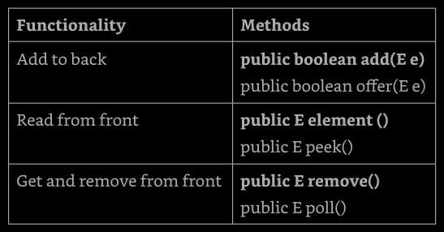

Let's show a simple example
```
4: Queue<Integer> queue = new LinkedList<>();
5: queue.add(10);
6: queue.add(4);
7: System.out.println(queue.remove());    // 10
8: System.out.println(queue.peek());      // 4
```

Line 5 and 6 add elements to the queue. Line 7 asks the first element waiting the 
longest to come off the queue. Line 8 checks for the next entry in the queue while 
leaving it in place.


The `Deque` interface supports double-ended queues, it inherits all `Queue` methods 
and adds more so, it is clear if we are working with the from or back of the queue.

**Table 9.4 - Deque Methods**

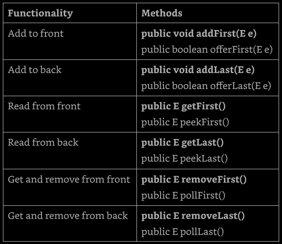


Let's see a deque example:
```
12: Deque<Integer> deque new LinkedList<>();
13: deque.offerFirst(10);    // true   10<-
14: deque.offerLast(4);      // true   10<-->4<-
15: deque.peekFirst();       // 10    10<-->4<-
16: deque.pollFirst();       // 10     4<-
17: deque.pollLast();        // 4
18: deque.pollFirst();       // null
19: deque.peakFirst();       // null
```

Line 12 show that we use the same class, `LinkedList` to create a `Deque` or a `Queue`, 
this is a great example of "coding for an interface", _since the reference variable_ 
_is a Deque_, we create a `Deque` object.

Lines 13 and 14 successfully add an element to the from and back of the queue. Some 
queue are limited in size, which would cause offering an element to the queue to fail. 
Line 15 looks at the first element in the queue, but it does not remove it. Lines 16 
and 17 remove the elements from the queue, one from each end. This results in an empty 
queue. Lines 18 and 19 try to look ate the first element of the queue, resulting in 
`null`.


In addition to FIFO queues, there are LIFO (last-in, first-out) queues, which are 
commonly referred to as _stacks_, like a stack of plates. We always add or remove 
from the top of the stack to avoid a mess. We can use the same double-ended queue 
implementation, _we just change the methods used_!

**Table 9.5 - Using Deque as a stack**

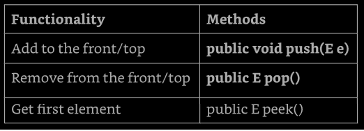

Using the `Deque` as an stack:
```
12: Deque<Integer> stack = new ArrayDeque<>();
13: stack.push(10);   //      ->10
14: stack.push(4);    //      ->4-->10
15: stack.peek();     //  4   ->4-->10
16: stack.poll();     //  4   ->10
17: stack.poll();     //  10  
18: stack.peek();     //  null
```

Lines 13 and 14 successfully put an element on the front/top of the stack. The remaining 
code looks at the front as well.

When using a `Deque`, it is really important to determine if it is being used as a FIFO 
queue, a LIFO stack, or a double-ended queue.

[back to top](#chapter-9-collection-and-generics)


## Using the _Map_ Interface

We use a `Map` when we want to identify values by a key. For example, when we use the 
contact list of our phone, we look up for a name, rather than to a number. A map is 
also known as a dictionary in other programming languages.

**Figure 9.8 - Map**
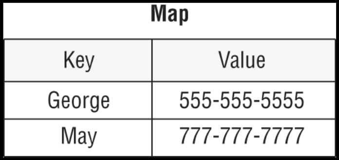

The main thins that all `Map` class have in common is that they have keys and values. 
Beyond that, they each offer different functionality, for example, a `TreeMap` is 
sorted. We will look at each of them.

#### _Map.of()_ and _Map.copyOf()_
Just like `List` and `Set`, there is a factory method to create a `Map`. We pass any 
number of pairs of keys and values.
```
Map.of("key1", "value1", "key2", "value2");
```

This is less than ideal since passing k`eys and values is harder to read, because we 
have to keep track of which parameter is which. The is a better way, `Map` also provides 
a method that let us supply key/value pairs.
```
Map.ofEntries(
  Map.entry("key1", "value1"),
  Map.entry("key2", "value2")
);
```

Now we can't forget to pass a value. If we leave out a parameter, the `entry()` method 
won't compile. Conveniently, `Map.copyOf(map)` works just like the `List` and `Set` 
interface `copyOf()` methods.


### Comparing _Map_ Implementations

A `HashMap` stores the keys in a hash table. This means that it uses the `hashCode()` 
method of the keys, normally a `String`, to retrieve their values more efficiently.

The main benefit is that adding elements and retrieving the elements by key, both have 
constant time. The trade-off is that we lose the order in which the elements were 
inserted. Most of time, we aren't concerned with this in a map. If we were, we could 
use `LinkedHashMap`.

A `TreeMap` stores the key in a sorted tree structure. The main benefit is that the 
keys are always in sorted order. Like `TreeSet`, the trade-off is that adding and 
checking whether a key is present takes longer as the tree grows larger.


### Working with _Map_ Methods

Given that `Map` doesn't extend `Collection`, more methods are specified on the `Map` 
interface. Since there are both keys and values, we need generic type parameters for 
both. The class uses `K` for key and `V` for value. The most common methods are shown 
on Table 9.6. Some of the method signatures are simplified to make them easier to 
understand.

**Table 9.6 - Map methods**
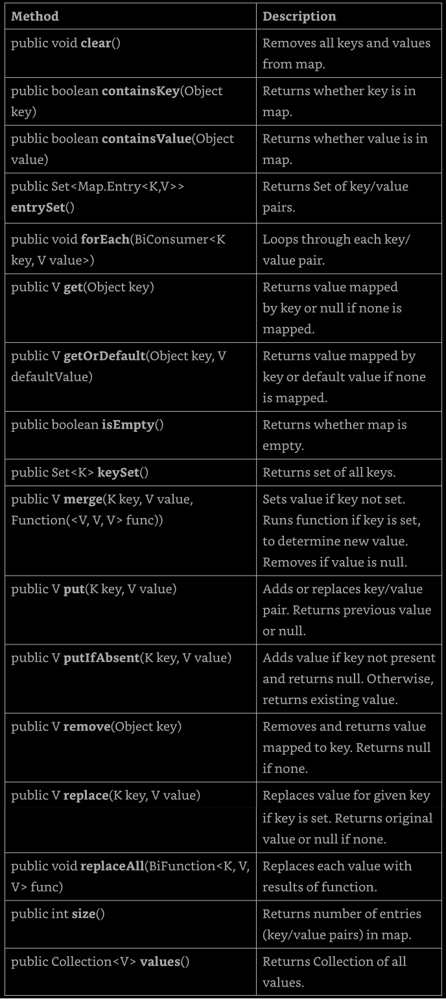

While the table is a pretty long list of methods, many of the names are straightforward. 
Also, many exist as a convenience. For example, `containsKey()` can be replaced with 
`get()` call that check if result is `null`.


### Calling Basic Methods

Let's start comparing the same code with two `Map` types, the first is `HashMap`:
```
Map<String, String> map = new HashMap<>();
map.put("koala", "bamboo");
map.put("lion", "meat");
map.put("giraffe", "leaf");
String food = map.get("koala");     // bamboo
for (String key : map.keySet())
  System.out.print(key + ", ");     // koala,giraffe,lion,
```

Here we use the `put()` method to add key/value pairs to the map and `get()` to get 
a value given a key. We also use the `keySet()` method to get all the keys.

Java uses the `hashCode()` of the key, in this case a `String`, to determine the order. 
the order here happens not to be sorted order or the order in which we typed the values.

Now let's look at `TreeMap`:
```
Map<String, String> map = new treeMap<>();
map.put("koala", "bamboo");
map.put("lion", "meet");
map.put("giraffe", "leaf");;
String food = map.get("koala");     // bamboo
for (String key : map.keySet())
  System.out.print(key + ",");      // giraffe,koala,lion
```

`TreeMap` sorts the keys as we would expect. If we called `values()` instead of 
`keySet()`, the order of the values would correspond to the order of the keys.

With the same map, we can try some boolean checks:
```
System.out.println(map.contains("lion"));          // does not compile
System.out.println(map.containsKey("lion"));       // true
System.out.println(map.containsValue("lion"));     // false
System.out.println(map.size());                    // 3
map.clear();
System.out.println(map.size());                    // 0
System.out.println(map.isEmpty());                 // true
```

The first line is a little tricky. The `contains()` method is on the `Collection` 
interface, but not on the `Map` interface. The next two lines show that keys and 
values are checked separately. We can see that there are three key/value pairs in 
our map. Then we clear out the contents of the map and see that there are zero 
elements and it is empty.


### Iterating through a _Map_

We already set the `forEach()` methods earlier in the chapter. Note that it works a 
little differently on a `Map`. This time, the lambda used by the `forEach()` method 
has two parameters: the key and the value. Let's look at an example:
```
Map<Integer, Character> map = new HashMap<>();
map.put(1, 'a');
map.put(2, 'b');
map.put(3, 'c');
map.forEach( (k, v) -> System.out.println(v) );
```

The lambda has bot the key and value as parameters. It happens to print only the value, 
but it could do anything with the key and/or value. Interestingly, since we don't care 
about the key, this particular code could have been written with the `values()` method 
and a method reference instead.
```
map.values().forEach(System.out::println);
```

Another wa of going through all the data in a map is to get the key/value paris in a 
`Set`. Java has a static interface inside `Map` called `Entry`. It provides methods 
to get the key and value of each pair.
```
map.entrySet().forEach( e ->
  System.out.println( e.getKey() + " " + e.getValue() )
);
```


### Getting Values Safely

The `get()` method returns `null` if the requested key in not in the map. Sometimes 
we prefer to have a different value returned. Luckily, the `getOrDefault()` method 
makes this easy. Let's compare the two methods:
```
3: Map<Character, String> dict = new HashMap<>();
4: dict.put('x', "spot");
5: System.out.println("X marks the " + dict.get('x'));
6: System.out.println("X marks the " + dict.getOrDefault('x', ""));
7: System.out.println("Y marks the " + dict.get('y'));
8: System.out.println("Y marks the " + dict.getOrDefault('y', ""));
```

This code prints the following:
```
X marks the spot
X marks the spot
Y marks the null
Y marks the 
```

As we can see, line 5 and 6 have the same output because `get()` and `getOrDefault()` 
behave the same way when the key is present. They return the value mapped by that key. 
Lines 7 and 8 give different output, showing that `get()` returns `null` when the key 
is not present. By contrast, `getOrDefault()` returns the empty string we passed as 
a parameter.


### Replacing Values

These methods are similar to the `List` version, except a key is involved:
```
21: Map<Integer, Integer> map = new HashMap<>();
22: map.put(1, 2);
23: map.put(2, 4);
24: Integer original = map.replace(2, 10);      // 4
25: System.out.println(map);                    // {1=2, 2=10}
26: map.replaceAll( (k, v) -> k + v );
27: System.out.println(map);                    // {1=3, 2=12}
```

Line 24 replaces the values for key 2 and returns the original value. Line 26 
calls a function and sets the value of each element of the map ot the result of 
that function. In out case, we added the key and value together.


### Putting if Absent

The `putIfAbsent()` method sets a value in the map but skips it if the value is 
already set to a non-null value.
```
Map<String, String> favorites = new HashMap<>();
favorites.put("Jenny", "Bus Tour");
favorites.put("Tom", null);
favorites.putIfAbsent("Jenny", "Tram");
favorites.putIfAbsent("Sam", "Tram");
favorites.putIfAbsent("Tom", "Tram");
System.out.println(favorites);     // {Tom=Tram, Jenny=Bus Tour, Sam=Tram}
``` 

As we can see, Jenny's value is not updated because on was already present. Sam 
wasn't there at all, so he was added. Tom was present as a key, but had a `null` 
value. Therefore, he was set to a non-null value.


### Merging Data

The `merge()` method adds logic of what to choose. Suppose we want to choose the 
ride with the longest name. We can write code to express this by passing a mapping 
function to the `merge()` method.
```
11: BiFunction<String, String, String> mapper = 
12:     (v1, v2) -> v1.length() > v2.length() ? v1 : v2;
13:
14: Map<String, String> favorites = new HashMap<>();
15: favorites.put("Jenny", "City Bus Tour");
16: favorites.put("Tom", "Tram");
17:
18: String jenny = favorites.merge("Jenny", "Sky-ride", mapper);
19: String tom = favorites.merge("Tom", "Sky-ride", mapper);
20:
21: System.out.println(favorites);     // {Tom=Sky-ride, Jenny=City Bus Tour}
22: System.out.println(jenny);         // City Bus Tour
23: System.out.println(tom);           // Sky-ride 
```

The code on lines 11 and 12 takes two parameters and returns a value. In this case, 
our implementation returns the one with the longest name. Line 18 call this mapping 
function, and it sees that "City Bus Tour" is long than "Sky-ride", so it leaves 
the values as "City Bus Tour". Line 19 call this mapping function again. This time 
"Tram" is shorter than "Sky-ride", so the map is updated. Line 21 prints out the 
new map contents. Lines 22 and 23 show that the result is returned from `merge()`.

The `merge()` method also has logic for what happens if `null` values or missing 
keys are involved. In this case, id doesn't call the `BiFunction` at all, and it 
simply user the new value.
```
BiFunction<String, String, String> mapper = 
      (v1, v2) -> v1.length() > v2.length() ? v1 : v2;
Map<String, String> favorites = new HashMap<>();
favorites.put("Sam", null);
favorites.merge("Tom", "Sky-ride", mapper);
favorites.merge("Sam", "Sky-ride", mapper);
System.out.println(favorites);    // {Tom=Sky-ride, Sam=Sky-ride}
```

Notice that the mapping function isn't called. If it were, a `NullPointerException` 
have been raised. The mapping function is used only when there are two actual value 
to decide between.

The final thing to know about `merge()` is what happens when the mapping function 
is called and returns `null`. The key is removed from the map when this happens:
```
BiFunction<String, String, String> mapper = (v1, v2) -> null;
Map<String, String> favorites = new HashMap<>();
favorites.put("Jenny", "Bus Tour");
favorites.put("Tom", "Bus Tour");

favorites.merge("Jenny", "Sky-ride", mapper);
favorites.merge("Sam", "Sky-ride", mapper);

System.out.println(favorites);    // {Tom=Bus Tour, Sam=Sky-ride}
```

"Tom" as left alone since there was no `merge()` call for that key. "Sam" was added 
since  that key was no in the original list. "Jenny" was removed because the mapping 
function returned `null`.

**Table 9.7 - Behavior of merge() method**
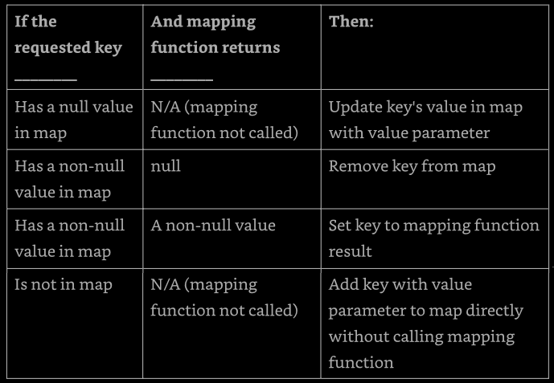

[back to to](#chapter-9-collection-and-generics)


## Comparing Collection Types

Here a review of all the collection classes, we need to memorize this table, since 
it is short and this will help us a lot when programming.

**Table 9.8 - Java Collections Framework types**

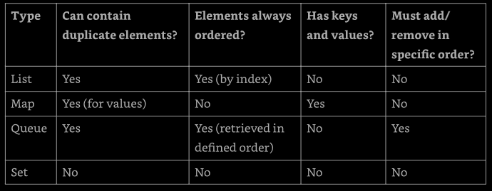

Additionally, we have be capable to describe the types in table 9.9

**Table 9.9 - Collections attributes**

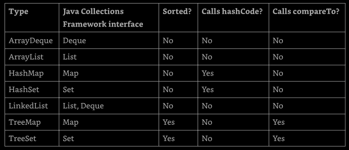

We have to be capable of distinguish which data structure allow `null` values. The 
data structures that involve sorting don no allow null values.

We also need to be able to choose the right collection type given a description of 
a problem. I this case, first thing to do is to identify which type of collection 
the question is asking about. Figure out whether we are looking for a list, map, 
queue or set help us to choose the right answer.

### Older Collections

There are a few collections that are no longer on the exam but that we might come 
across in older code. All three were early Java data structures we could use with 
threads:
* `Vector`: implements `List`
* `Hashtable`: Implements `Map`
* `Stack`: implements `Queue`

These classes are rarely use anymore, as there are much better concurrent alternatives 
that will be cover in Chapter 13.


[back to top](#chapter-9-collection-and-generics)


## Sorting Data

We discussed "order" for the `TreeSet` and `TreeMap` classes. For number, order is 
obvious -- it is numerical order. For `String` objects, order is defined according 
to the Unicode character mapping. 

_Numbers before letters, and uppercase letters before lowercase letters_

We use `Collections.sort()` to sort any type of collection involving the this data 
types Tt return void because is the method parameter that is what get sorted. 

We can also sort objects that we create. Java provides an interface called `Comparable`, 
if out class implements `Comparable`, it can be used in data structures that requires 
comparison. There is also a class called `Comparator`, which is used to specify that 
we want to use a different order than the object itself provides.

### Creating a _Comparable_ Class

The `Comparable` interface has only one method. In fact, this it the entire interface: 
```
public interface Comparable<T> {
  int compareTo(T o);
}
```

The generic `T` let us implement this method and specify the type of our object. 
This lets us avoid a cast when implementing `compareTo()`. Any object can be 
comparable. For example, whe have a bunch of ducks and want to sort them by name. 
First, we update the class declaration to inherit `Comparable<Duck>`, and then we 
implement the `compareTo()` method.
```
import java.util.*;
public class Duck implements Comparable<Duck> {
  private String name;

  public Duck(String name) {
    this.name = name;
  }

  public String toString() {     // need to be something readable
    return name;
  }

  public int compareTo(Duck other){
    return name.compareTo(other.name);        // sorts ascending by name
  }

  public static void main(String[] args) {
    var ducks = new ArrayList<Duck>();
    ducks.add(new Duck("Quack"));
    ducks.add(new Duck("Puddles"));
    Collections.sort(ducks);                  // sort by name
    System.out.println(ducks);                // [Puddles, Quack]
  }
}
```

Without implementing that interface, all we have is a method named `compareTo()`, but 
it wouldn't be a `Comparable` object. We could also implement `Comparable<Object>` or 
some other class for `T`, but this wouldn't be as useful for sorting a group of `Duck` 
objects.

Finally, the `Duck` class implements `compareTo()`. Since `Duck` is comparing objects 
ot type `String` and the `String`  class already has a `compareTo()` method, it can 
just delegate.

We still need to know what the `compareTo()` method returns so that we can write our 
own implementation. There are three rules to know:
- the number 0 is return when  the current object is equivalent to the other
- a negative number is returned when the current object is smaller than the other
- a positive number is returned when the current object is larger than the other

Let's look at an implementation of `compareTo()` that compares numbers instead of 
String objects:
```
01: public class Animal implements Comparable<Animal> {
02:   private int id;
03:
04:   public int compareTo(Animal a) {
05:     return id - a.id;      // sorts ascending by id
06:   }
07:
08:   public static void main(String[] args) {
09:     var a1 = new Animal();
10:     var a2 = new Animal();
11:
12:     a1.id = 5;
13:     a2.id = 7;
14: 
15:     System.out.println(a1.compareTo(a2));     // -2
16:     System.out.println(a1.compareTo(a1));     // 0
17:     System.out.println(a2.compareTo(a1));     // 2
18:   }
19: }
```

Lines 9 and 10 creates two `Animal` objects. Lines 12 and 13 set their `id` 
values. Lines 4 to 6 shows on way to compare two `int` values. We could have 
used `Integer.compare(id, a.id)` instead. Is good to know recognizes the two 
approaches.

Lines 15 to 17 confirm that we've implemented `compareTo()` correctly. Line 15 
compares a smaller `id` to a larger one, and therefore it prints a negative number. 
Line 16 compares animals with the same `id`, and therefore it prints 0. line 17 
compares a larger `id` to a smaller one, and therefore it return a positive number.


### Casting the _compareTo()_ Argument

When dealing with legacy code or dcode that does not use generics, the `compareTo()` 
method requires a cast, since the argument is passed as an `Object`.
```
public class LegacyDuck implements Comparable {
  private String name;
  public int compareTo(Object other) {
    LegacyDuck d = (LegacyDuck) other;     // cast because no generics
    return name.compareTo(d.name);
  }
}
```

Since we don't specify a generic type for `Comparable`, Java assumes that we want 
an `Object`, which means that we have to cast to `LegacyDuck` before accessing the 
instance variables on it.


### Checking for _null_

When working witn `Comparable` and `Comparator`, until now, we tend to assume the 
data has values, but this is not always the case. Whe writing our own compare methods, 
we should check the data before comparing it if it is not validated ahead of time.
```
public class MissingDuck implements Comparable<MissingDuck> {
  private String name;
  public int compareTo(MissingDuck quack) {
    if (quack == null)
      throw new IllegalArgumentException("Poorly formed duck!");
    if (this.name == null && quack.name == null)
      return 0;
    else if (this.name == null) return -1;
    else if (quack.name == null) return 1;
    else return name.compareTo(quack.name);
  }
}
```

This method throws an exception if it is passed a `null` `MissingDuck` object. What 
about the ordering? If t`he `name` of a duck is `null`, it's sorted first.


### Keeping _compareTo()_ and _equals()_ Consistent

If we write a class that implements `Comparable`, we introduce new business logic 
for determining equality. The `compareTo()` method returns `0` if two objects are 
equal, while our `equals()` method returns `true` if two objects are equal. A 
_natural ordering_ that uses `compareTo()` is said to be _consistent with equals_ 
if, and only if, `x.equals(y)` is `true` whenenver `x.compareTo(y)` equals `0`.

Similarly, `x.equals(y)` must be `false` whenenver `x.compareTo(y)` is not `0`. We 
are strongly encouraged to make our `Comparable` classes consistent with `equals` 
because not all collection classes behave predictably if the `compareTo()` and 
`equals()` methods are not consistent.

For example, the flollowing `Product` class defines a `compareTo()` method that is 
not ocnsistent with `equals()`:
```
public class Product implements Comparable<Product> {
  private int id;
  private String name;

  public int hashCode() { return id; }

  public boolean equals(Object obj) {
    if (!(obj instanceof Product)) return false
    var other = (Product) obj;
    return this.id == other.id
  }

  public int compareTo(Product obj) {
    return this.name.compareTo(obj.name);
  }
}
```

We might be sorting `Product` objects by name, but names are not unique. The 
`compareTo()` method does not have be be consistent with `equals()`. One way to 
fix  that is to use a `Comparator` to define the sort elsewhere.


### Comparing Data with a _Comparator_

Sometimes we want to sort an object that did not implement `Comparable`, or we want 
to sort object in different ways at different times. Suppose that we add weight to 
our `Duck` class. We now have the following:
```
01: import java.util.ArrayList;
02: import java.util.Collections;
03: import java.util.Comparator;
04:
05: public class Duck implements Comparable<Duck> {
06:   private String name;
07:   private int weight;
08:
09:   // assume getters, setters and constructors are provided
10:
11:   public string toString() { return name; }
12:
13:   public int compareTo(Duck d) {
14:     return name.compareTo(d.name);
15:   }
16:
17:   public static void main(String[] args) {
18:     Comparator<Duck> byWeight = new Comparator<Duck>() {
19:       public int compare(Duck d1, Duck d2) {
20:         return d1.getWeight() - d2.getWeight();
21:       }
22:     };
23:
24:     var ducks = new ArrayList<Duck>();
25:     ducks.add(new Duck("Quack", 7));
26:     ducks.add(new Duck("Puddles", 10));
27:     Collections.sort(ducks);
28:     System.out.println(ducks);     // [Puddles, Quack]
29:     Collections.sort(ducks, byWeight);
30:     System.out.println(ducks);     // [Quack, Puddles]
31:   }
32: }
```

First, note that `Comparator` is in a different package than `Comparable`, and we 
find `Comparable` in `java.lang` and `Comparator` not, meaning we can use `Comparable` 
without an import statement.

The `Duck` class itself can define only one `compareTo()` method. In this case, `name` 
was chosen. If we want to sort by something else, we have to define that sort order 
outside the `compareTo()` method using a separate class or lambda expression.

Lines 18 to 22 of the `main()` method show how to define a `Comparator` using an inner 
class. On lines 27 to 30, we sort without the `Comparator` and then with the `Comparator` 
to see the difference in the output.

`Comparator` is a functional interface since there is only one abstract method to 
implement. This means that we can rewrite the `Comparator` on lines 18 to 22 using 
a lambda expression, as shown below:
```
Comparator<Duck> byWeight = (d1, d2) -> d1.getWeight - d2.getWight();
```

Alternatively, we can use a method reference and a helper method to specify that we 
want to sort by weight.
```
Comparator<Duck> byWeight = Comparator.comparing(Duck::getWeight);
```

In this example, `Comparator.comparing()` is a static interface method that creates 
a `Comparator` given a lambda expression or method reference. This is a convenience 
that Java gives us.


#### Is _Comparable_ a Functional Interface?

Was said that `Comparator` is a functional interface because it has a single abstract 
method. `Comparable` is also a functional interface since it also has a single abstract 
method. However, using a lambda for `Comparable` would be silly. The point of `Comparable` 
is to implement it inside the object being compared.


### Comparing _Comparable_ and _Comparator_

There are several differences between `Comparable` and `Comparator`, the Table 9.10 
listed them for us:

**Table 9.10 - Comparable x Comparator**
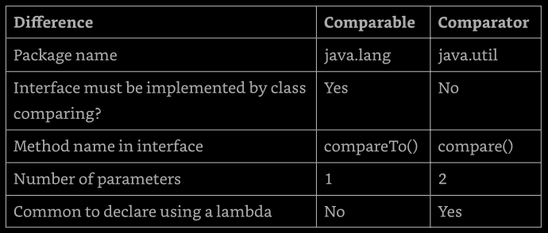

As always, memorize this table is a must. Let's try to see why this doesn't compile:
```
var byWeight = new Comparator<Duck>() {     // does not compile
  public int compareTo(Duck d1, Duck d2) {
    return d1.getWeight() - d2.getWeight();
  }
}
```

The method name is wrong. A `Comparator` must implement a method named `compare()`. 
We must pay special attention to method names and the number of parameters when we 
see `Comparator` and `Comparator` being used.


### Comparing Multiple Fields

When writing a `Comparator` that compares multiple instance variables, the code gets 
a little messy. Suppose that we have a `Squirrel` class, as shown:
```
public class Squirrel {
  private int weight;
  private String species;

  // assume getters, setters, and constructors
}
```

We want to write a `Comparator` to sort by species name. If two squirrels are from 
the same species, we want to sort the on the weights the least first. We could do 
this with code that looks like this:
```
public class MultiFieldComparator implements Comparator<Squirrel> {
  public compare(Squirrel s1, Squirrel s2) {
    int result = s1.getSpecies().compareTo(s2.getSpecies());
    if (result != 0) return result;
    return s1.getWeight() - s2.getWeight();
  }
}
```

This works assuming no `species` attribute are `null`. It checks on field, If they 
don't match, we are finished sorting. If the do match, it looks at the next field.
This isn't easy to read, though. It is also easy to get wrong. Changing `!=` to `==` 
breaks the sort completely.

Alternatively, we can use method references and build the `Comparator`. This code 
represent logic for the same comparison:
```
Comparator<Squirrel> c = Comparator.comparing(Squirrel::getSpecies)
    .thenComparingInt(Squirrel::getWeight);
```

This time, we chain the methods. First we create a `Comparator` on `species` ascending. 
Then, if there is a tie, we sort by weight. We can also sort in descending order. 
Some methods on `Comparator`, like `thenComparingInt()`, are default methods.

Suppose we want to sort in descending order by species:
```
var c = Comparator.comparing(Squirrel::getSpecies).reversed();
```

Table 9.11 shows the helper methods that we should know for building a `Comparator`. 
The parameters types are omitted to help us focus on the methods. They use many of 
the functional interfaces that we learned in the previous chapter.

**Table 9.11 - Helper static methods for building a Comparator**
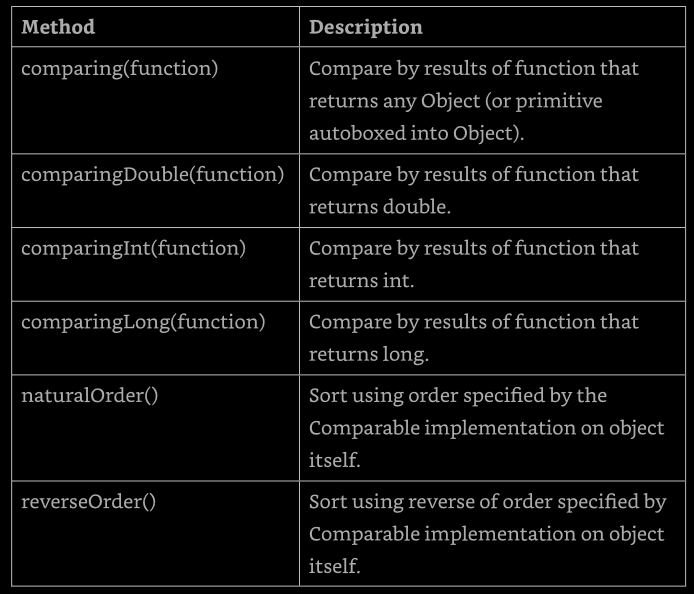


**Table 9.12 - Helper default methods for building a Comparator**
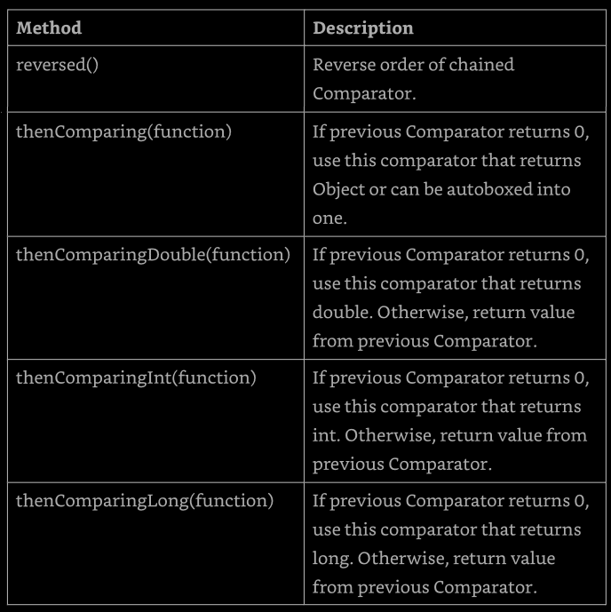


In the examples so far we often ignore `null` values in checking equality and comparing 
objects. In the real world, though, things aren't so neat. We will have to decide how 
to handle `null` values or prevent them from being in our object.


### Sorting and Searching

Now that we've learned all about Comparable and Comparator, we can finally do something 
useful with them, like sorting. The `Collections.sort()` method uses the `compareTo()`
method to sort. It expects the object to be sorted to be `Comparable`.
```
05: public static SortRabbits {
06:   static record Rabbit(int id) {}
07:   public static void main(String[] args) {
08:     List<Rabbit> rabbits new ArrayList<>();
09:     rabbits.add(new Rabbit(3));
10:     rabbits.add(new Rabbit(1));
11:     Collection.sort(rabbits);     // does not compile
12:   }
13: }
``` 

Java knows that the `Rabbit` record is not `Comparable`. It knows sorting will fails, 
so it doesn't even let the code compile. We can fix this by passing a `Comparator` 
to `sort()`. Remembering that a `Comparator` is useful when we want to specify sort 
order without using a `compareTo()` method.
```
11:   Comparator<Rabbit> c = (r1, r1) -> d1.id - r2.id;
12:   Collections.sort(rabbits, c);
13:   System.out.println(rabbits);     // [Rabbit[id=1], Rabbit[id=3]]
```

If we want to sort the rabbits in descending order, we could change the `Comparator` 
to `r2.id - r1.id`. Alternatively, we could reverse the contents of the list after-
ward:
```
11:   Comparator<Rabbit> c = (r1, r2) -> r1.id - d2.id;
12:   Collections.sort(rabbits, c);
13:   Collections.reverse(rabbits);
14:   System.out.println(rabbits);     // [Rabbit[id=3], Rabbit[id=1]]
```

The `sort()` and `binarySearch()` methods allow us to pass in a `Comparator` object 
whe we don't want to use the natural order.

---
#### Reviewing _binarySearch()_

The `binarySearch()` method requires a sorted `List`.
```
11: List<Integer> list = Arrays.asList(6, 9, 1, 8);
12: Collections.sort(list);    // [1, 6, 8, 9]
13: System.out.println(Collections.binarySearch(list, 6));    // 1
14: System.out.println(Collections.binarySearch(list, 3));    // -2
```

Line 12 sorts the `List` so we can call binary search properly. Line 13 prints the 
index at which a match is found. Line 14 prints on les than the negated index of where 
the requested value would need to be inserted. The number 3 would need to be inserted 
at index 1 (after the number 1 but before number 6). Negating that gives us -1, and 
subtracting 1 gives us -2.

---

There is a trick in working with `binarySearch()`. What will be the output of de code:
```
3: var names = Arrays.asList("Fluffy", "Hoppy");
4: Comparator<String> c = Comparator.reverseOrder();
5: var index = Collection.binarySearch(name, "Hoppy", c);
6: System.out.println(index);
```

The answer happens to be -1. We don't need to know that the answer is -1. We need to 
know that _the answer is not defined_. Line 3 create a list, [Fluffy, Hoppy]. This 
list happens to be sorted in ascending order. Line 4 creates a Comparator that reverses 
the natural order. Line 5 requests a binary search in descending order. Since the list 
is not in that order, we don't meet the precondition for doing a search.

While the result of calling `binarySearch()` on an improperly sorted list is undefined, 
sometimes we can get lucky. For example, search starts in a middle of an odd-numbered 
list. If we happen to ask for the middle element, the returned index will be what we 
expect.

Earlier in this chapter we saw collection that require classes to implement `Comparable`. 
Unlike sorting, they don't check that we have implemented `Comparable` at compile time.

Going back to the `Rabbit` that does not implement `Comparable`, we try to add it to 
a `TreeSet`:
```
02: public class UseTreeSet{
03:   static class Rabbit{ int id; }
04:   public static void main(String[] args) {
05:     Set<Duck> ducks = new TreeSet<>();
06:     ducks.add(new Duck("Puddles"));
07:
08:     Set<Rabbit> rabbits = new TreeSet<>();
09:     rabbits.add(new Rabbit());     // ClassCastException
10:   }
11: }
```

Line 6 is fine. `Duck` does implement `Comparable`. `TreeSet` is able to sort it into 
the proper position in the set. Line 9 is a problem. When `TreeSet` tries to sort it, 
Java discovers the fact that `Rabbit` does not implement `Comparable`. Java throws an 
exception like this:
```
Exception in thread "main" java.lang.ClassCastException:
  class Rabbit cannot be cast to class java.lang.Comparable
```

It may seem weird for this exception to be thrown when the first object is added to 
the set. After all, there is nothing to compare yet. Is a matter of consistency that 
Java works this way. 

Just like searching and sorting, we can tell collection that require sorting that we 
want to use a specific `Comparator`. For example:
```
08:     Set<Rabbit> rabbits = new TreeSet<>( (r1, r2) -> r1.id - r2.id);
09:     rabbits.add(new Rabbit())
```

Now Java knows that we want to sort by id, and all is very well. A `Comparator` is a 
helpful object. It lets us separate sort order from the object to be sorted. Notice 
that the line 9 in both of the previous examples is the same. It's the declaration of 
the `TreeSet` that has changed.


### Sorting a list

While we can call `Collections.sort(list)`, we can also sort directly on the list object:
```
3: List<String> bunnies = new ArrayList<>();
4: bunnies.add("long ear");
5: bunnies.add("floppy");
6: bunnies.add("hoppy");
7: System.out.println(bunnies);     // [long ear, floppy, hoppy]
8: bunnies.sort( (b1, b2) -> b1.compareTo(b2));
9: System.out.println(bunnies);     // [floppy, hoppy, long ear]
```

On line 8, we sort the list alphabetically. The `sort()` method takes a `Comparator` 
that provides the sort order. Remembering that `Comparator` takes two parameters and 
return an `int`.

There is not a sort method on `Set` or `Map`. Both of those types are unordered, so 
it wouldn't make sense to sort them.

[back to top](#chapter-9-collection-and-generics)


## Working with Generics

Why do we need generics? Imagine if we weren't specifying the type of the list and 
merely hoped the caller didn't pub in something that we didn't expect. The following 
does just that:
```
14: static void printNames(List lit) {
15:   for (int i = 0; i < list.size(); i++) {
16:     String name = (String) list.get(i);     // ClassCastException
17:     System.out.println(name);
18:   }
19: }
20: public static void main(String[] args) {
21:   List names = new ArrayList();
22:   names.add(new StringBuilder("Webby"));
23:   printNames(names);
24: } 
```

This code throws a `ClassCastException`. Line 22 adds a `StringBuilder` to `names`. 
This is legal because a non-generic list can contain anything. However, line 16 is 
written to expect a specific class to be in there. It casts to a `String`, reflecting 
this assumption. Since the assumption is incorrect, the code throws a exception that 
`java.lang.StringBuilder` cannot be cast to `java.lang.String`.

Generics fix this by allowing we to write and use parameterized types. Since we specify 
that we want an `ArrayList` of `String` objects, the compiles has enough information to 
prevent this problem in the first place.
```
List<String> names = new ArrayList<String>();
names.add(new StringBuilder("Webby"));     // does not compile
```

Getting a compiler error id good. We will know right away that something is wrong rather 
than hoping to discover it later.


### Creating Generic Classes

We can introduce generics into our own classes. The syntax for introducing a generic 
is to declare a _formal type parameter_ in angle brackets, `<>`, or diamond operator.
The following class named `Transport` has a generic type variable declared after the 
name of the class:
```
public class Transport<U> {
  private U contents;
  public U lookInTransport() {
    return contents;
  }
  public void packTransport(U content) {
    this.contents = content;
  }
}
```

The generic type `U` is available anywhere within the `Transport` class. When we 
instantiate the class, we tell the compiler what `U` should be for that particular 
instance.

---
**Naming Conventions for Generics**

A type parameter can be named anything we want. The convention is to use single upper 
case letter to make it obvious that the aren't real class names. The following are 
common letter to use:
- E for an element
- K for a map key
- V for a map value
- N for a number
- T for a generic data type
- S, U, V, ... for multiple generic types

---

Suppose an `Elephant` class exist and we are moving our elephant to a new and larger 
enclosure area:
```
Elephant elephant = new Elephant();
Transport<Elephant> transportForElephant = new Transport<>();
transportForElephant.packTransport(elephant);
Elephant inNewHome = transportForElephant.lookInTransport();
```

What if we wanted to transport another animal?
```
Transport<Zebra> transportForZebra = new Transport<>();
```

And if we have a robot?
```
Robot joeBot = new Robot();
Transport<Robot> robotTransport = new Transport<>();
robotTransport.packTransport(joeBot);

// ship for a far away land
Robot atDestination = robotTransport.lookInTransport();
```

Generic class become useful when the classes used as tye type parameter can have 
absolutely nothing to do with each other. The `Transport` class works with any type 
of class. Before generics, we would have needed `Transport` to use the `Object` class 
for its instance variable, which would have put the burden on the caller to cast the 
object it receives on emptying the transport.

In addition to `Transport` not needing to know about the objects that go into it, 
those objects don't need to know about `Transport`. We aren't requiring the objects 
to implement an interface named Transportable or something like. A class can be put 
in the `Transport` without any changes at all.

Generic class aren't limited to having a single type parameter, This class show two 
generic parameters:
```
public class SizeLimitedTransport<T, U> {
  private T contents;
  private U sizeLimit;
  public SizeLimitedTransport(T contents, U sizeLimit) {
    this.contents = contents;
    this.sizeLimit = sizeLimit;
  }
}
```

`T` represents the type that we are transporting. `U` represents the unit that we are 
using to measure the maximum size for the transport. To use this generic class, we can 
write the following:
```
Elephant elephant = new Elephant();
Integer pounds = 15_000;
SizeLimitedTransport<Elephant, Integer> t1 = new SizeLimitedTransport<>(elephant, pounds);
```

Here we specify that tye type is `Elephant`, and the unit is `Integer`. We also throw 
in a reminder that numeric literals can contain underscores.


### Understanding Type Erasure

Specifying a generic type allows the compiler to enforce proper use of the generic 
type. For example, specifying the generic type fo `Transport` as `Robot` is like 
replacing the `U` in the `Transport` class with `Robot`. However, this is just for 
compile time.

Behind the scenes, the compiler replaces all references to `U` in `Transport` with 
`Object`. In other words, after the code compiles, our generics are just `Object` 
types. The `Transport` class looks like the following at runtime:
```
public class Transport {
  private Object contents;
  public Object lookInTransport() {
    return contents;
  }
  public void packTransport(Object content) {
    this.contents = content;
  }
}
```

This means there is only one class file. There aren't different copies for different 
parameterized types. This process of removing he generics syntax from our code is 
referred to as _type erasure_. Type erasure allows our code to be compatible with 
older version of Java that do not contain generics.

The compiler add the relevant cast for our code to work with this type of erased class.
For example, we type the following:
```
Robot r = transp.lookInTransport();
```

The compiler turns it into the following:
```
Robot r = (Robot) transp.lookInTransport();
```

In the next sections the implications of generics for method declarations are discussed.


### Overloading a Generic Method

Only one of these tow methods is allowed in a class because type erasure will reduce 
both sets of arguments to (`List input`):
```
public class LongTailAnimal {
  protected void chew(List<Object> input) {}
  protected void chew(List<Double> input) {}     // does not compile
}
```

For the same reason, we also can't overload a generic method from a parent class.
```
public class LongTailAnimal {
  protected void chew(List<Object> input) {}
}

public class Anteater extends LongTailAnimal {
  protected void chew(List<Double> input) {}     // does not compile
}
```

Both of these examples fail to compile because of type erasure. In the compiled form, 
the generic type is dropped, and it appears as an invalid overloaded method. Now an
intriguing example:
```
public class Anteater extends LongTailAnimal {
  protected void chew(List<Object> input) {}
  protected void chew(ArrayList<Double> input) {}
}
```

The first `chew()` method compiles because it uses the same generic type in the 
overridden method as the one defined in the parent class. The second `chew()` 
method compiles as well. However, it is an overloaded method because on of the 
method arguments is a `List` and the other is an `ArrayList`. When working with 
generic methods, it's important to consider the underlying type.


### Returning Generic Types

When we are working with overridden methods that return generics, the return values 
must be covariant. In terms of generics, this means that the return type of the class 
or interface declared in the overriding method must be a subtype of the class defined 
in the parent class. The generic parameter type must match its parent's type exactly.

Given the following declaration for the `Mammal` class, which of the two subclasses, 
`Monkey` or `Goat`, compile?
```
public class Mammal {
  public List<CharSequence> play() { ... }
  public CharSequence sleep() { ... }
}

public class Monkey extends Mammal {
  public ArrayList<CharSequence> play() { ... }
}

public class Goat extends Mammal {
  public List<String> play() { ... }      // does not compile
  public String sleep() { ... }
}
```

The `Monkey` class compiles because `ArrayList` is a subtype of `List`. The `play()` 
method in the `Goat` class does not compile, though. For the return types to be 
covariant, the generic type parameter must match. Even though `String` is a subtype 
of `CharSequence`, it does not exactly match the generic type defined in the `Mammal` 
class. Therefore, this is considered an invalid override.

The `sleep()` method in the `Goat` class does compile since `String` is a subtype of 
`CharSequence`. This example shows that covariance applies to tye return type, just 
not the generic parameter type.

It might be helpful for us to apply type erasure to question involving generics to 
ensure that the compile properly. Once we've determined which methods are overridden 
and which are being overloaded, we should work backward, making sure the generic 
types match for overridden methods. And remembering, generic methods cannot be 
overloaded by changing the generic parameter type only.


### Implementing Generic Interfaces

Just like a class, an interface can declare a formal type parameter. For example, the 
following `Shippable` interface uses a generic type as the argument to its `ship()` 
method:
```
public interface Shippable<T> {
  void ship(T t);
}
```

There are three ways a class can approach implementing this interface. The first is 
to specify the generic type in the class. The following concrete class says that it 
deals  only with robots. This lets it declare the `ship()` method with a `Robot` 
parameter:
```
class ShippableRobotTransport implements Shippable<Robot> {
  public void ship(Robot t) { }
}
```

The next way is to create a generic class. The following concrete class allows the 
caller to specify the type of the generic:
```
class ShippableAbstractTransport<U> implements Shippable<U> {
  public void ship(U t) { }
}
```

The final way is to not use generics at all. This is the old way of writing code. 
It generates a compiler warning about `Shippable` being a _raw type_, but it does 
compile. Here the `ship()` method has an `Object` parameter since the generic type 
is not defined:
```
class ShippableTransport implements Shippable {
  public void ship(Object t) { }
}
```

---
**What We Can't Do with Generic Type**

There ara some limitation on what we can do with a generic type. Most of the limitations 
are due to type erasure. Oracle refers to type whose information is fully available at 
runtime as _reifiable_ (capable of being reified, i.e., treated or made real from an 
abstract idea). Reifiable types can do anything that Java allows. Non-reifiable types 
have some limitations.

Here are the things that we can't do with generics (and by "can't" we mean without 
resorting to contortions like passing in a class object):
- **Call a constructor**: writing `new T()` is not allowed because at runtime, it would 
  be `new Object()`.
- **Create an array of that generic type**: this is the most annoying, but it makes 
  sense becaus we'd be creating an array of `Object` values.
- **Call instanceof**: this is not allowed because at runtime `List<Integer>` and 
  `List<String>` look the same to Java, because of of type erasure.
- **Use a primitive type as a generic type parameter**: this isn't a big deal because we 
  can use the wrapper class instead. If we want a type of `int`, we just use `Integer`.
- **Create a static variable as a generic type parameter**: this is not allowed because 
  the type is linked to the instance of the class.
---

### Writing Generic Methods

Up until this point, we've seen formal type parameter declared on the class or interface 
level. It is also possible to declare them on the method level. This is often useful for 
static methods since they aren't part of an instance that can declare the type. However, 
it is also allowed on non-static methods.

In this example, both methods use a generic parameter:
```
public class Handler {
  public static <T> void prepare(T t) {
    System.out.println("Preparing " + t);
  }
  public static <T> Transport<T> ship(T t) {
    System.out.println("Shipping " + t);
    return new Transport<T>();
  }
}
```

The method parameter is the generic type `T`. Before the return type, we declare the 
_formal type parameter_ with `<T>`. In the `ship()` method, we show how we can use the 
generic parameter in the return type, `Transport<T>`, for the method. 

Unless a method is obtaining the generic formal type parameter from the class/interface, 
it is specified immediately before the return type of the method, to be clear:
```
                       ;-- formal parameter
                      /
  public     static  <T>   Transport<T>      ship(T t)
/________/  /_____/       /____________/  /____________/
    /         /                /                /
access     optional       return type    method name and
modifier   specifier                       parameters

```

This can lead to some interesting-looking code!
```
2: public class More {
3:   public static <T> void sink(T t) { }
4:   public static <T> T identity(T t) { return t; }
5:   public static T noGood(T t) { return t; }     // does not compile  
6: }
```

Line 3 shows the formal parameter type immediately before the return type of `void`. 
Line 4 shows the return type being the formal parameter type. It looks weird, but is 
correct. Line 5 omits the formal parameter type and therefore does not compile.

---
**Optional Syntax for Invoking a Generic Method**

We can call a generic method normally, and the compiler will try to figure out which 
one we want. Alternatively, we can specify the type explicitly to make it obvious what 
the type is:
```
Box.<String>ship("package");
Box.<String[]>ship(args);
```

It is up to us whether this makes things clearer. We should at least be aware that 
this syntax exists.
---

When we have a method that declare a  generic parameter type, it is independent of 
the class generics. Let's take a look at this class that declares a generic `T` at 
both levels:
```
1: public class TrickyTransport<T> {
2:   public <T> T tricky(T t) {
3:     return t;
4:   }
5: }
```

Is possible figure out the type of `T` on lines 1 and 2 when we call the `TrickTransport` 
class in this code:
```
10: public static String createName() {
11:   TrickTransport<Robot> transp = new TrickTransport<>();
12:   return transp.tricky("bot"); 
13: }
```

On line 1, `T` is `Robot` because that is what gets referenced when constructing a 
`Transport`. On line 2, `T` is `String` because that is what is passed to the method. 
Whe we see code like this, we have to take a deep breath and write down what is 
happening so we don't get confused.


### Creating a Generic Record

Generics can also be used with records. This record takes a single generic type 
parameter:
```
public record CreateRecord<T>(T contents) {
  @Override
  public T contents() {
    if (contents == null)
      throw new IllegalStateException("missing contents");
    return contents;
  }
}
```

This works the same way as classes. We can create a record or the robot!
```
Robot robot = new Robot();
CreateRecord<Robot> record = new CreateRecord<>(robot);
```

This is convenient. Now we have an immutable, generic record!


### Bounding Generic Types

By now, we might think that generics don't seem particularly useful since they are 
treated as `Object` and, therefore, don't have many methods available. Bounded 
wildcards solve this by restricting what types can be used in a generic. A _bounded_ 
_parameter type_ is a generic type that specifies a bound for the generic.

A _wildcard generic type_  is an unknown generic type represented with a question 
mark (?). We can use generic wildcards in three ways, as shown in Table 9.13.

**Table 9.13: Types of bounds**

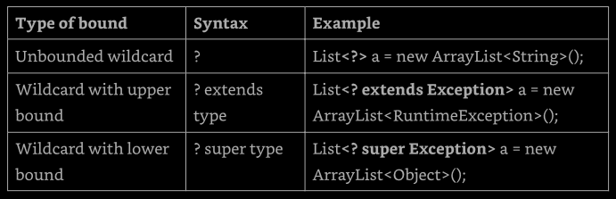

This section looks at each of these three wildcard types.


#### Creating Unbounded Wildcards

An unbounded wildcard represents any data type. We use `?` when we want to specify 
that any type is okay with the method. Let's suppose that we want to write a method 
that looks through a list of any type.
```
public static void printList(List<Object> list) {
  for (Object x : list)
    System.out.println(x);
}

public static void main(String[] args) {
  List<String> keywords = new ArrayList<>();
  keywords.add("java");
  printList(keywords);     // does not compile
}
```

What's wrong? A `String` is a subclass of an `Object`, this is true. However, 
`List<String>` cannot be assigned to `List<Object>`. It doesn't sound logical. 
Java is trying to protect us from ourselves with this. Imagine if we could write 
code like this:
```
4: List<Integer> numbers = new ArrayList<>();
5: numbers.add(Integer.valueOf(42));
6: List<Object> objects = numbers;    // does not compile
7: objects.add("forty two");
8: System.out.println(number.get(1));
```

On line 4, the compiler promises us that only integer objects will appear in `numbers`. 
If line 6 compiles, line 7 would break that promise by putting a `String` in there, 
since `numbers` and `objects` are references to the same object. Good thing that the 
compiler prevents this.

We cannot assign a `List<String>` to a `List<Object>`, this is fine, since we don't 
want a `List<Object>`. What we really need is a list of "whatever". That's what 
`List<?>` is. The following code does what we expect:
```
public static void printList(List<?> list) {
  for (Object x : list)
    System.out.println(x);
}

public static void main(String[] args) {
  List<String> keywords = new ArrayList<>();
  keyword.add("java");
  printList(keywords);
}
```

The `printList()` method takes any type of list as a parameter. The `keywords` variable 
is of type `List<String>`. We have a match! `List<String>` is a list of anything. This 
"anything" just happens to be a `String` in this case.

Finally, let's look at the impact of `var`. This two statements are equivalent?
```
List<?> x1 = new ArrayList<>();
var x2 = new ArrayList<>();
```

They are not. There are two key differences. First, `x1` is of type `List`, while `x2` 
is ot type `ArrayList`. Additionally, we can only assign `x2` to a `List<Object>`. 
These two variables do have on thing in common. Both return type `Object` when calling 
the `get()` method.


#### Creating Upper-Bounded Wildcards

Let's try to write a method that adds up the total of a list of numbers. We've 
established that a generic type can't just use a subclass.
```
ArrayList<Number> list = new ArrayList<Integer>();     // does not compile
```

Instead, we need to use a wildcard:
```
List<? extends Number> list = new ArrayList<Integer>();
```

The upper-bounded wildcard says that any class that extends `Number` or `Number` 
itself can be used as the forma parameter type:
```
public static long total(List<? extends Number> list) {
  long count = 0;
  for (Number number : list) {
    count += number.longValue();
  }
  return count;
}
```

Since type erasure makes Java think that a generic type is an `Object`, this still 
happening here. Java converts the previous code to something like the following:
```
public static long total(List list) {
  long count = 0;
  for (Object obj : list) {
    Number number = (Number) obj;
    count += number.longValue();
  }
  return count;
}
```

Something interesting happens when we work with upper bounds or unbounded wildcards. 
The list becomes logically immutable and therefore cannot be modified. Technically, 
we can remove elements from the list, but this is beyond our current scope. **Upper** 
**bounded lists are mainly for reading purpose**.
```
2: static class Sparrow extends Bird {}
3: static class Bird {}
4:
5: public static void main(String[] args) {
6:   List<? extends Bird> birds = new ArrayList<Bird>();
7:   birds.add(new Sparrow());     // does not compile
8:   birds.add(new Bird());     // does not compile
9: }
```

The problem stems from the fact that Java doesn't know what type `List<? extends Bird>` 
really is. It could be a `List<Bird>` or `List<Sparrow>` or some other generic type 
that hasn't even been written yet. Line 7 doesn't compile because we can't add a 
`Sparrow` to `List<? extends Bird>`, and line 8 doesn't compile because we can't add 
a `Bird` to `List<Sparrow>`. From Java's point of view, both scenarios are equally 
possible, so neither is allowed.

Now let's try an example with an interface. Whe have an interface and two classes 
that implement it and two methods that use it.
```
interface Flyer { void fly(); }
class HangGlider implements Flyer { public void fly() {} }
class Goose implements Flyer { public void fly() {} }

---
private void anyFlyer(List<Flyer> flyers) {}
private void groupOfFlyers(List<? extends Flyer> flyers) {}
```

Note that, on the methods implementation, we used the keyword `extends` rather 
than `implements`. Upper bounds are like anonymous classes in that they use 
`extends` regardless of whether we are working with a class or an interface.

We already learned that a variable of type `List<Flyer>` can be passed to either 
method. A variable to type `List<Goose>` can be passed on ly to the one with the 
upper bound. This shows a benefit of generics. Random flyers don't fly together. 
We want our `groupOfFlyers()` method to be called only with the same type. `Geese` 
fly together but don't fly with hang gliders.


#### Creating Lower-Bounded Wildcards

Let's try to write a method that adds a string "quack" to two lists:
```
List<String> strings = new ArrayList<String>();
strings.add("tweet");

List<Object> objects = new ArrayList<Object>(string);
addSound(strings);
addSound(objects);
```

The problem is that we want to pass a `List<String>` and a `List<Object>` to the 
same method. To solve this problem, we need to use a lower bound.
```
public static void addSound(List<? super String> list) {
  list.add("quack");
}
```
With a lower bound, we are telling Java that the list will be a list of `String` 
object or a list of some objects that are a superclass fo `String`. Either way, 
it is safe to add a `String` to that list.

Just like generic classes, we probably won't use this in our code, unless we are 
writing code for other to reuse. Even then, it would be rare.

---
**Understanding Generic Supertypes**

When we have subclasses and superclasses, lower bounds can get tricky.
```
3: List<? super IOException> exceptions = new ArrayList<Exception>();
4: exceptions.add(new Exception());     // does not compile
5: exceptions.add(new IOException());
6: exceptions.add(new FileNofFoundException());
```

Line 3 references a `List` that could be `List<IOException>` or `List<Exception>` 
or `List<Object>`. Line 4 does not compile because we could have a `List<IOException>`, 
and an `Exception` object wouldn't fit in there.

Line 5 is fine. `IOException` can be added to any of those types. Line 6 is also fine. 
`FineNotFoundException` can also be added to any of those three types. This is tricky 
because `FileNotFoundException` is a subclass of `IOException`, and the keyword says 
`super`. Java think: "Well, FileNotFoundException als happens to be an IOException, so 
everything is fine.".

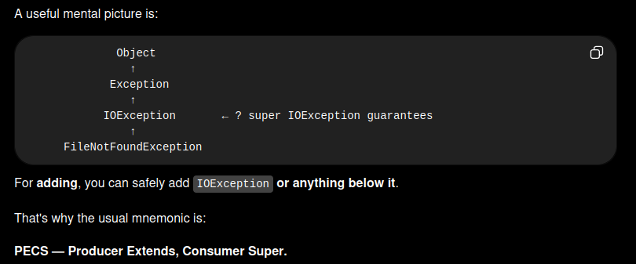

---


### Putting All Together

At this point we know everything that we need to know about generics. It is possible 
to put these concepts together to write some _really_ confusing code, which we could 
expect on the exam. This section is going to be difficult to read. It contains the 
hardest questions that we could probably be asked about generics, harder than the 
ones in the exam.

#### Combining Generic Declarations

First, we declare three classes that the example will use:
```
class A {}
class B extends A {}
class C extends B {}
```

Can we figure out why these do or don't compile? Also, what they do?
```
6: List<?> list1 = new ArrayList<A>();
7: List<? extends A> list2 = new ArrayList<A>();
8: List<? super A> list3 = new ArrayList<A>();
```

Line 6 creates an `ArrayList` that can hold instance of class `A`. It is stored in 
a variable with an unbounded wildcard. Any generic type can be referenced from an 
unbounded wildcard, making this okay.

Line 7 tries to create a list in a variable declaration with an upper-bounded wild-
card. This is okay. We can have `ArrayList<A>`, `ArrayList<B>`, or `ArrayList<C>` 
stored in that reference.

Line 8 is also okay. This time, we have a lower-bounded wildcard. The lowest type 
we can reference is `A`. Since that is what we have, it compiles.

Let's try another:
```
09: List<? extends B> list4 = new ArrayList<A>();       // does not compile
10: List<? super B> list5 = new ArrayList<A>();
11: List<?> list6 = new ArrayList<? extends A>();      // does not compile
```

Line 9 has an upper-bounded wildcard that allows `ArrayList<B>` or `ArrayList<C>` 
to be referenced. Since we have `ArrayList<A>` that is trying to be referenced, 
the code does not compile.

Line 10 has a lower-bounded wildcard, which allows a reference to `ArrayList<A>`, 
`ArrayList<B>`, or `ArrayList<Object>`.

Line 11 allows a reference to any generic type since it is an unbounded wildcard. 
The problem is that we need to know what that type will be when instantiating the 
`ArrayList`. It wouldn't be useful anyway, because wwe can't add any elements to 
that `ArrayList`.

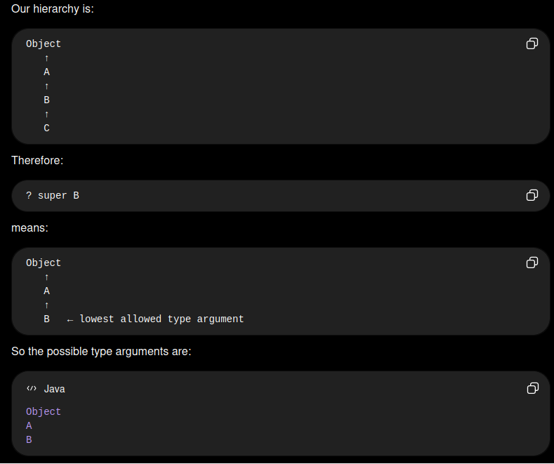


#### Passing Generic Arguments

Why the methods below don't compile or what the do? We will present the methods 
one at a time because the is more to think about.
```
<T> T first(List<? extends T> list) {
  return list.get(0);
}
```

The method `first()` is a perfectly normal use of generics. It uses a method-specific 
type parameter, `<T>`. It takes a parameter of `List<T>`, or some subclass of `T`, and 
it returns a single object ot that `T` type. For example, we can call it with a 
`List<String>` and have it return a `String`. Or we could call it with a `List<Number>` 
parameter and have it return a `Number`.

What is wrong with this one:
```
<T> <? extends T> second(List<? extends T> list) {     // does not compile
  return list.get(0)
}
```

The `second()` does not compile because the return type isn't actually a type. We 
are writing the method so, we know what type it is supposed to return. We don't get 
to specify this as wildcard.

Another:
```
<B extends A> B third(List<B> list) {
  return new B();     // does not compile
}
``` 

The `third()` method does not compile. `<B extends A>` says that we want to use `B` 
as a type parameter just for this method and that it needs to extend the `A` class. 
Coincidentally, `B` is also the name of a class. In fact isn't a coincidence, it's 
a tricky. Within the scope of the method, `B` can represent `A`, `B`, or `C`, 
because all extend the `A` class. Since `B` no longer refers to the `B` class in 
the method.

This on is straightforward:
```
void forth(List<? super B> list) { }
```

The `fourth()` method is a normal use of generics. We can pass the type `List<B>`, 
`List<A>` or `List<Object>`.

Finally, whis this example does not compile?
```
<X> void fifth(List<X super B> list) {     // does not compile
}
```

The last method, `fifth()`, does not compile because it tries to mix a method-specific 
type parameter with a wildcard. A wildcard must have a `?` in it.

[go to top](#chapter-9-collections-and-generics)


## Summary

The Java Collection Framework includes four main types of structures: list, sets, 
queues, and maps. The `Collection` interface is the parent interface os `List`, 
`Set`, and `Queue`. Additionally, `Deque` extends `Queue`. The `Map` interface 
does not extend `Collection`. We need to recognize the following:
* **List**: An ordered collection of elements that allows duplicate entries
    * **ArrayList**: standard resizable list
    * **LinkedList**: can easily add/remove from beginning or end
* **Set**: a collection of items without duplication
    * **HashSet**: uses hashCode() to find unordered elements
    * **TreeSet**: sorted collection. Does not allow null value
* **Queue/Deque**: an ordered collection of items, generally for processing
    * **ArrayDeque**: double-ended queue
    * **LinkedList**: double ended queue and list
* **Map**: maps unique keys to values (dictionary)
    * **HahsMap**: uses hashCode() to find the keys
    * **TreeMap**: sorted map. Does not allow null keys


The `Comparable` interface declares the `compareTo()` method. This method returns a 
_negative_ number if the object is smaller than its argument, _0_ if the two objects 
are equal, and a _positive_ number otherwise. The `compareTo()` method is declared 
on the object that is being compared, and it takes one parameter. The `Comparator` 
interface defines the `compare()` method. A _negative_ number is returned if the first 
argument is smaller, _zero_ if they are equal, and a _positive_ number otherwise. The 
`compare()` method can be declare in any code, and it takes two parameters. Often, a 
`Comparator` is implemented using a lambda.

Generics are type parameters for code. To create a class with a generic parameter, 
we add <T> after the class name. We can use any name we want fot the type parameter. 
Single uppercase letter are common choices. Generics allow us to specify wildcards. 
`<?>` is an unbounded wildcard that means any type. `<? extends Object>` is an upper 
bound that means any type that is Object or extends it. `<? extends MyInterface>` 
means any type that extends MyInterface. `<? super Number>` is a lower bound that 
means any typ that is Number or a superclass. A compiler error result from code that 
attempts to add an item in a list with an unbounded or upper-bounded wildcard.

[go to top](#chapter-9-collections-and-generics)
