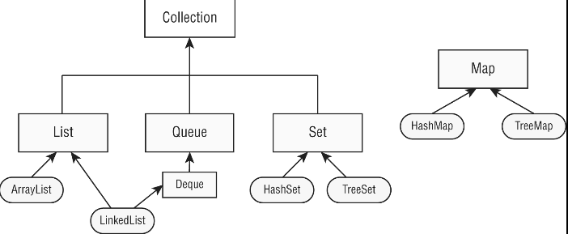
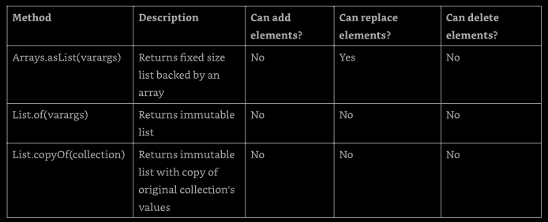
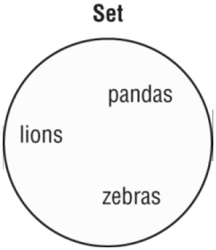
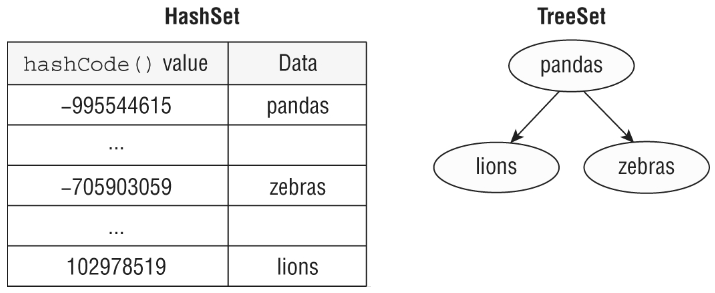

# Chapter 9: Collection and Generics

In this chapter, we will learn _Java Collections Framework_ classes and interfaces we 
need to know. The thread-safe collection types are discussed in Chapter 13, "Concurrency".
Lambdas, method reference and built-in functional interfaces are very used here, so, 
we need to know them very well and we cover them in Chapter 8.

We will discuss the details about Comparator and Comparable. Finally, we will cover 
how to create our own classes and methods that use generics so that the same class 
can be used with many types.


## Using Common Collection APIs

A _collection_ is a group of objects contained in a single object. The _Java Collections_ 
_Framework_ is a set of classes in `java.util` for storing collections. There are four 
main interfaces in the Java Collection Framework.
- `List`: is an ordered collection of elements that allows duplicate entries and 
    are accessed by an index.
- `Set`: is a collection of objects that does not allows duplicate entries.
- `Queue`: is a collection that orders its elements in a specific order for processing.
    A `Deque` is a subinterface of `Queue` that allows access at both ends.
- `Map`: is a collection that maps key to values, with not duplicate keys allowed. The
    elements in a map are key/value pairs, also known as **dictionary**.

The Collection interface, it subinterfaces, and some classes (rounded rect) that 
implement the interfaces (rectangles) are shown in the figure below: 

Note that `Map` doesn't implement `Collection` interface. It is considered part of 
Java Collection Framework even though it isn't technically a `Collection`. But _it_ 
_is a collection, since it contains a group of objects_. The reason they are treated 
differently is that they need different methods due to being key/value pairs.



### Using the Diamond Operator

When construction a Java Collection Framework, we need to specify the type that will 
go inside. We could write like this:
```
List<Integer> list = new ArrayList<Integer>();
```

And we might have generics that contain other generics, such this:
```
Map<Long, List<Integer>> mapOfLists = new HashMap<Long, List<Integer>>();
```

Thats a long and duplicated code. We could use the _diamond operator_ (<>) as shorthand 
notation that allows us to omit the generic type from the right side of a statement 
when the type can be inferred. So the two previous sentences can be write like this:
```
List<Integer> list = new ArrayList<>();

Map<Long, List<Integer>> mapOfLists = new HashMap<>();
```

To the compiler, both these declarations and the previous ones are equivalent, but 
the latter, beyond shorter, is easier to read.

The diamond operator cannot be used as tye type in a variable declaration. It can be 
used only on the right side of the assignment operation. This code does not compile:
```
List<> list = new ArrayList<Integer>();    // does not compile

class InvalidUse {
  void use(List<> data) {}    // does not compile
}
```

### Adding Data

The `add()` method inserts a new element int the `Collection` and returns whether it 
was successful. The method signature is this:
```
public boolean add(E element)
```

Here `E` represents the generic type that was used to create the collection. For some 
`Collection` types, `add()` always return `true`. For other types, there is logic as 
to whether the `add()` call was successful.
```
3: Collection<String> list = new ArrayList<>();
4: System.out.println(list.add("Sparrow"));    // true
5: System.out.println(list.add("Sparrow"));    // true
6:
7: Collection<String> set = new HashSet<>();
8: System.out.println(set.add("Sparrow"));    // true
9: System.out.println(set.add("Sparrow"));    // false
```

A `List` allows duplicates, making the return value `true` each time. A `Set` does not 
allow duplicates, so on line 9 Java returns `false` from the `add()` method call.

### Removing Data

The `remove()` method removes a single matching value in the `Collection` and returns 
whether it was successful. The method signature is as follows:
```
public boolean remove(Object object)
```

This time, the `boolean` return value tells us whether a match was removed. Examples:
```
3: Collection<String> birds = new ArrayList<>();
4: birds.add("hawk");     // [hawk]
5: birds.add("hawk");     // [hawk,hawk]
6: System.out.println(birds.remove("cardinal"));    // false
7: System.out.println(birds.remove("hawk"));     // true
8: System.out.println(birds);     // [hawk]
```

Line 6 tries to remove an element that is not in birds. It returns `false` because 
no such element is found. Line 7 tries to remove an element that is in birds, so 
it return `true`. Notice that it removes only one match.

### Counting Elements

The `isEmpty()` and `size()` methods look at how many elements are in the `Collection`. 
The method signatures are as follows:
```
public boolean isEmpty()

public int size()
```

The following shows how t use these methods:
```
Collection<String> birds = new ArrayList<>();
System.out.println(birds.isEmpty());    // true
System.out.println(birds.size());      0
birds.add("hawk");     // [hawk]
birds.add("hawk");     // [hawk,hawk]
System.out.println(birds.isEmpty());     // false
System.out.println(birds.size());     // 2
``` 

At the beginning, `birds` has a size of 0 and is empty. It has capacity that is greater 
than 0. After we add elements, the size becomes positive, and it is no longer empty.


### Clearing the Collection

the `clear()` method provides an easy way to discard all elements of the `Collection. 
The method signature is as follows:
```
public void clear()
```

The following shows how to use this method:
```
Collection<String> birds = new ArrayList<>();
birds.add("hawk");     // [hawk]
birds.add("hawk");     // [hawk,hawk]
System.out.println(birds.isEmpty());     // false
System.out.println(birds.size());      // 2
birds.clear();       // []
System.out.println(birds.isEmpty());    // true
System.out.println(birds.size());      // 0
```

After calling `clear()`, `birds` is back to being an empty `ArrayList` of size 0.


### Check Contents

The `contains()` method checks whether a certain value is in the `Collection`. The 
method signature is as follows:
```
public boolean contains(Object object)
```

The following shows how to use this method:
```
Collection<String> birds = new ArrayList<>();
birds.add("hawk");     // [hawk]
System.out.println(birds.contains("hawk"));    // true
System.out.println(birds.contains("robin"));    // false
```

The `contains()` method calls `equal()` on elements of the `ArrayList` to see whether 
there are any matches.


### Removing with Conditions

The `removeIf()` method removes all elements that match a condition. We can specify 
what should be deleted using a block of code or eve a method reference. The method 
signature is this:
```
public boolean removeIf(Predicate<? super E> filter)
```

The `? super` will be explain later in this chapter. It uses a `Predicate`, which 
takes one parameter and returns a `boolean`. Let's see am example:
```
4: Collection<String> list = new ArrayList<>();
5: list.add("Magician");
6: list.add("Assistant");
7: System.out.println(list);     // [Magician,Assistant]
8: list.removeIf(s -> s.startsWith("A"));
9: System.out.println(list);     // [Magician]
```

Line 8 shows how to remove all of the `String` values that begin with the letter A.
This allows us to make the Assistant disappear. Let's try an example with a method 
reference:
```
11: Collection<String> set = new HashSet<>();
12: set.add("Wand");
13: set.add("");
14: set.removeIf(String::isEmpty);    // s -> s.isEmpty()
15: System.out.println(set);     // [Wand]
```

On line 14, we remove any empty `String` objects from set. The comment on that line 
shows the lambda equivalent of the method reference. Line 15 shows that the `removeIf()` 
method successfully removed one element from list.


### Iterating

There's a `forEach()` method that we can call on a `Collection` instead of writing 
a loop. It uses a `Consumer` that takes a single parameter and doesn't return anything. 
The method signature is as follows:
```
public void forEach(Consumer<? super T> action)
```

Since cats like to explore, let's use them to show the usage:
```
Collection<String> cats = List.of("Annie", "Ripley");
cats.forEach(System.out::println);
cats.forEach(c -> System.out.println(c));
```

And now the cats have discovered how to print their names!


***Other Iteration Approaches***

There are other way to iterate through a `Collection`. For example, we already saw 
how to loop through a list using a enhanced for:
```
for (String element : collection)
  System.out.println(element);
```

And there is this older approach that may appear somewhere:
```
Iterator<String> iter = coll.iterator();
while (iter.hasNext()) {
  String string = iter.next();
  System.out.println(string);
}
```

The `hasNext()` method checks whether there is a next value. In other words, it tells 
us whether `next()` will execute without throwing an exception. The `next()` method 
actually moves the `Iterator` to the next element.


### Determining Equality

There is a custom implementation of `equals()`, so we can compare two Collections to 
compare the type and contents. The implementation will vary. For example, `ArrayList` 
**checks order**, while `HashSet` does not.
```
public boolean equals(Object object)
```

The following shows us an example:
```
23: var list1 = List.of(1, 2);
24: var list2 = List.of(2, 1);
25: var set1 = Set.of(1, 2);
26: var set2 = Set.of(2, 1);
27:
28: System.out.println(list1.equals(list2));     // false
29: System.out.println(set1.equals(set2));     // true
30: System.out.println(list1.equals(set1));      // false
```

Line 28 prints `false` because the elements are in a different order, and a `List` 
cares about order. By contrast, line 29 prints `true` because a `Set` is not sensitive 
to order. Finally, line 30 prints `false` because the types are different.


***Unboxing _nulls_***

Java protects us from many problems with Collections. However, it is still possible to 
write a `NullPointerException`:
```
3: var heights = new ArrayList<Integer>();
4: heights.add(null);
5: int h = heights.get(0);    // NullPointerException
```

On line 4, we add a `null` to the list. This is legal because a `null` reference can 
be assigned to any reference variable. On line 5, we try to _unbox_ that `null` to 
an `int` primitive. Java tries to get the `int` value of `null` and trows an exception.

[back to top](#using-common-collection-apis)


## Using the _List_ Interface

We use a list when we want an ordered collection that can contain duplicate entries. 
For example, a list of names may contain duplicates, since two persons can have the 
same name. Items can be retrieved and inserted at specific positions int the list 
based on an `int` index, much like an array. Unlike an array, though, many `List` 
implementations can change in size after they are declared.

While the classes implementing the `List` interface have many methods, we new to known 
only the most common ones. conveniently, these methods are the same for all of the 
implementations. The main thing all `List` implementation hav in common is that they 
are ordered and allow duplicates. Beyond that, the each offer different functionality.
We will look at the most used implementations in this chapter

**We have to be aware to which names are classes and which are interfaces, since known** 
**what is the best class or which is the best interface for a given task is a must.**


### Comparing List Implementations

An `ArrayList` is like a resizable array. When elements are added, the `ArrayList` 
automatically grows. When we aren't sure which collection to use, we have to choose 
an `ArrayList`.

Thee main benefit of an `ArrayList` is that we can _look up_  any element in constant 
time. Adding or removing an element is slower that accessing an element. This makes 
an `ArrayList` a good choice when we are reading more often than (or the same amount 
as) writing to the `ArrayList`.

A `LinkedList` is special because it implement both `List` and `Deque`.  It has all 
method of a list. It also has additional methods to facilitate adding or removing 
from the beginning and/or end of the list.

The main benefits of a `LinkedList` are that we can _access, add to, and remove from_ 
_the beginning and end of the list in constant time_. This makes a `LinkedList` a good 
choice when we need use a `Deque`. The figure 9.1 shows that a `LinkedList` implements 
both, the `List` and `Deque` interfaces.

**Figure 9.1**


### Creating a _List_  with a Factory Method

When we create a `List` of tye `ArrayList` or `LinkedList`, we known the type. There 
are a few special methods where we get a `List` but don't know the type. These methods 
lew us create a `List`, including data, in on line using a _factory method_. This is 
convenient, especially when testing. Some of these methods return an immutable object. 

**Table 9.1 - Factory methods to create list**



Let's take a look at an example of these three methods
```
16: String[] array = new String[]{"a", "b", "c"};
17: List<String> asList = Arrays.asList(array);    // [a, b, c]
18: List<String> of = List.of(array);    // [a, b, c]
19: List<String> copy = List.copyOf(asList);     //  [a, b, c]
20: 
21: array[0] = "z";
22: 
23: System.out.println(asList);     // [z, b, c]
24: System.out.println(of);     // [a, b, c]
25: System.out.println(copy);     // [a, b, c]
26: 
27: asList.set(0, "x");
28: System.out.println(Arrays.toString(array));    // [x, b, c]
29: 
30: copy.add("y");     // UnsupportedOperationException
```

Line 17 creates a `List` that is backed by an array. Line 21 changes the array, and 
line 23 reflects that change. Lines 27 and 28 show the other direction where changing 
the `List` updates the underlying array. Lines 18 and 19 create an immutable `List`. 
Line 30 shows it is immutable by throwing an exception when trying to add a value. 
All three list would throw an exception when adding or removing a value. The `of` 
and `copy` lists would also throw on on trying to update an element.


### Creating a _List_ with a Constructor

Most collections have two constructors that we need to know, the following code shows 
then for `LinkedList`:
```
var linked1 = new LinkedList<String>();
var linked2 = new LinkedList<String>(linked1);
```

The first says to create an empty `LinkedList` containing all the default. The second 
tells Java that we want to make a copy of another `LinkedList`. Since `linked1` is
empty in this example, nothing particularly interesting is happening.

`ArrayList` has an extra constructor we need to know, let's see all three:
```
var list1 = new ArrayList<String>();
var list2 = new ArrayList<String>(list1);
var list3 = new ArrayList<String>(10);
```

The first two are the common constructors we need to know for all collections. The 
final example says to create an `ArrayList` containing a specific number of slots, 
but again not to assign any. We can think of this as the size of the underlying array.

#### Using _var_ with _ArrayList_ 

Consider this code, which mixes `var` and _generics_:
```
var strings = new ArrayList<String>();
strings.add("a");
for (String s : strings){ // do something }
```

The type of `strings` is `ArrayList<String>`. This means we can add a `String` or 
loop through the `strings` object. What if we use the _diamond operator_ with `var`?
```
var list = new ArrayList<>();
```

The code compiles and the type of the `list` object is `ArrayList<Object>`. Since 
there isn't a type specified for the generic, Java has to assume the ultimate super-
class, `Object`. This is a bit silly and we don't have to write code like this, but 
this could appear in the exam, and now we know what expect.

What is happening here:
```
var list = new ArrayList<>();
list.add("a");
for (String s : list) { // do something }    // does not compile
```

Tye type of `list` is `ArrayList<Object>`. Since there isn't at type in the diamond 
operator, Java hast to assume the most generic option it can. Therefore, it picks 
`Object`, adding a `String` to the list is fine. We can add any subclass of `Object`. 
However, in the loop, we are forced to use the `Object` type rather than `String`.


### Working with _List_ Methods

The methods in the `List` interface are for working with indexes. In addition to the 
inherited `Collection` methods, the other methods signatures that we need to know are 
in the table 9.2.

**Table 9.2 - methods of _List_**
<pre>
<b>Method</b>                                <b>Description</b>

public boolean add(E element)        Adds elements to the end (available on all Collection API).

public void add(int index, E elem)   Adds element at index and moves the rest toward the end.

public E get(int index)              Return element at index.

public E remove(int index)           Removes element at index and moves the rest toward the front.

public default void                  Replaces each element in list with result of operator
  replaceAll(UnaryOperator<E> op)

public E set(int index, E e)         Replaces element at `index` and returns original. Throws 
                                       IndexOutOfBoundsException if index is invalid

public default void                  Sorts list. This will be cover later in a specific chapter
  sort(Comparator<? super E> c)      
</pre>

The following statements demonstrate most of these methods for working with a `List`:
```
 3: List<String> list = new ArrayList<>();
 4: list.add("SD");     // [SD]
 5: list.add(0, "NY");     // [NY,SD]
 6: list.set(1, "FL");     // [NY,FL]
 7: System.out.println(list.get(0));     // NY
 8: list.remove("NY");     // [FL]
 9: list.remove(0);     // []
10: list.set(0, "?");     // IndexOutOfBoundsException
```

On line 3, `list` starts out empty. Line 4 adds on element to the end of the list 
object. Line 5 add an element at index 0 that bumps the original index 0 to index 1. 
Notice how the `ArrayList` is now automatically one larger. Line 6 replaces the 
element at index 1 with a new value.
Line 7 user the `get()` method to print the element at a specific index. Line 8 
removes the element matching NY. Finally, line 9 removes the element at index 0, 
and list is empty again.
Line 10 throws an `IndexOutOfBoundsException` because there are no elements in the 
`List`. Since there are no elements to replace, even index 0 isn't allowed. If line 
10 were moved up between lines 4 and 5, the call would succeed.

The output would be the same if we tried theses examples with `LinkedList`, Although 
the code would be less efficient, it wouldn't be noticeable until we had a very large 
list.

The `replaceAll()` method uses a `UnaryOperator` that takes one parameter and returns 
a value of the same type:
```
var numbers = Arrays.asList(1, 2, 3);
numbers.replaceAll( x -> x*2);
System.out.println(numbers);     // [2, 4, 6]
```

This lambda doubles the value of each element in the list. The `replaceAll()` method 
call the lambda on each element of the list and replaces the value at that index.


#### Overloaded _remove()_ Methods

We've seen  two overloaded `remove()` methods. The one from `Collection` removes an 
object that matches the parameter. By contrast, the one from `List` removes an element 
at a specified index.

This gets tricky when we have an `Integer` type. What this code prints?
```
31: var list = new LinkedList<Integer>();
32: list.add(3);
33: list.add(2);
34: list.add(1);
15: list.remove(2);
36: list.remove(Integer.valueOf(2));
37: System.out.println(list);
```

The answer is 3, let's go se why. At the end of line 34, we have [3, 2, 1]. Line 35 
passes a primitive, which means we are requesting deletion of element at index 2. 
This leaves us with [3, 2]. Then, line 36 passes an `Integer` object, which means we 
are deleting the value 2. That brings us to [3].

Since calling `remove()` with an `int` uses the index, an index that doesn't exist will 
thrown an exception. For example, `list.remove(100)` throws an `IndexOutOfBoundsException`.


### Converting from _List_ to an _Array_

Since an array can be passed as a `vararg` (as shown on table 9.1), we also need to 
known how to do the reverse. Let's start with turning a `List` into an array.
```
13: List<String> list = new ArrayList<>();
14: list.add("hawk");
15: list.add("robin");
16: Object[] objectArray = list.toArray();
17: String[] stringArray = list.toArray(new String[0]);
18: list.clear();
19: System.out.println(objectArray.length);     // 2
20: System.out.println(stringArray.length);     // 2
```

Line 16 shows that a `List` knows how to convert itself to an array. The only problem 
is that it defaults to an array of class `Object`. This isn't usually what we want. 
Line 17 specifies the type of the array and does what we want. The advantage of 
specifying a size of 0 for the parameter, `new String[0]`, is that Java will create 
a new array of the proper size for the return value. I we like, we can suggest a larger 
array to be used instead. If the `List` fits in that array, it will be returned. 
Otherwise, a new array will be created.

We also have to notice that on line 18 we clear the original `List`. This does not 
affect either array. The array is a newly created object with no relationship to the 
origin `List`. It is simply a copy.


## Using the _Set_ Interface

We use a `Set` when we don't want to allow duplicate entries. For example, we might 
want to keep track of the unique animals that we want to see at the zoo. We aren't 
concerned with the orde in which we are see these animals, bute there ins't time to 
see them more than once. 

The main thing that all `Set` implementation hava in commom is that they do not allow 
duplicates. We will look at each implementation that we need to know to write code.

**Figure 9.3 - Set




### Comparing _Set_ Implementations

A `HashSet` stores its elements in a _hash table_, which means the keys are a hash 
and the values are an `Object`. This means that the `HashSet` uset the `hashCode()` 
method of the object ot retrive them more efficiently. A valid `hashCode()` doesn't 
mean every object will get a unique value, but the method is often written in a way 
that shash values are spread out over a large rangge to reduce collisions.

The main benefit it that addin element and checking whether an element is in the set 
both have constant time. The trade-off is that we lose the order in which we inserted 
the elements. Most of the time, we aren't concerned with this in a `Set` anyway, 
making the `HashSet` the most common set.

A `TreeSet` stores its elements in a sorted tree structure. The main benefit is that 
the set is always in sorted order. The thade-off is that adding and checking wheter 
an element exists takes longer that with a `HashSet`, especially as the tree grows 
larger.

**Figure 9.4 - an representation of the structure of the two types of set**




### Working with _Set_ Methods

Like a List, we can create an immutable Set in on line or make a copy of an existing 
one.
```
Set<Character> letters = Sef.of("z", "o", "o");
Set<Character> copy = Set.copyOf(letters);
```

These two are the only `Set` especific methods that we need to know. The other methods 
came from `Collection` and the sets behave like the other structures that implements 
this interface. Let's explore a bit more the differences between tye types of sets, 
stating with `HashSet`:
```
3: Set<Integer> set = new HashSet<>();
4: boolean b1 = set.add(66);    // true
5: boolean b2 = set.add(10);    // true
6: boolean b3 = set.add(66);    // false
7: boolean b4 = set.add(8);    // true
8: set.forEach(System.out::println);
```
This code prints three lines:
66
8
10

The `add()` method calls is straighforward. The return `true` unless the `Integer` 
already in the set. Line 6 returns `false`, because we already have 66 in the set, and 
a se must preserve uniqueness. Line 8 prints the elements of th set in an _arbitrary_ 
order. In this case, it happens not to be ssorted order or the order in which we added 
the elements.

The `equals()` method of the object is used to determine equality. The `hashCode()` 
method of the object is used to know in which bucket of a set to look in, so that Java 
doesn't have to look through the whole set to find out wheter an object is there. The 
best case is that hash codes are unique and Java has to call `equals()` on only one 
object. The worst case is that all implementations of `hashCode()` return the same 
value and Java has to call `equals()` on every element ot the set. 

Now let's look at the same example with `TreeSet`:
```
3: Set<Integer> set = new TreeSet<>();
4: boolean b1 = set.add(66);    // true
5: boolean b2 = set.add(10);    // true
6: boolean b3 = set.add(66);    // false
7: boolean b4 = set.add(8);    // true
8: set.forEach(System.out.println);
```

This time the code prints:
8
10
66

The elements are printed out in this natural sorted order. Numbers implement the 
`Comparable` interface, whish is used for sorting. Later in this chapter we'll see 
how to create our own `Comparable` objects.


## Using the _Queue_ and _Deque_ Interfaces


