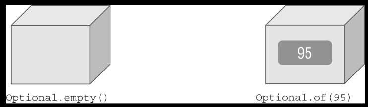
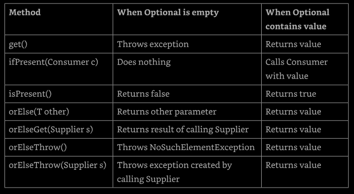
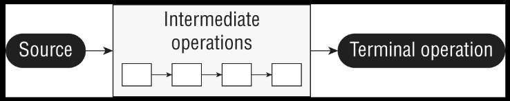
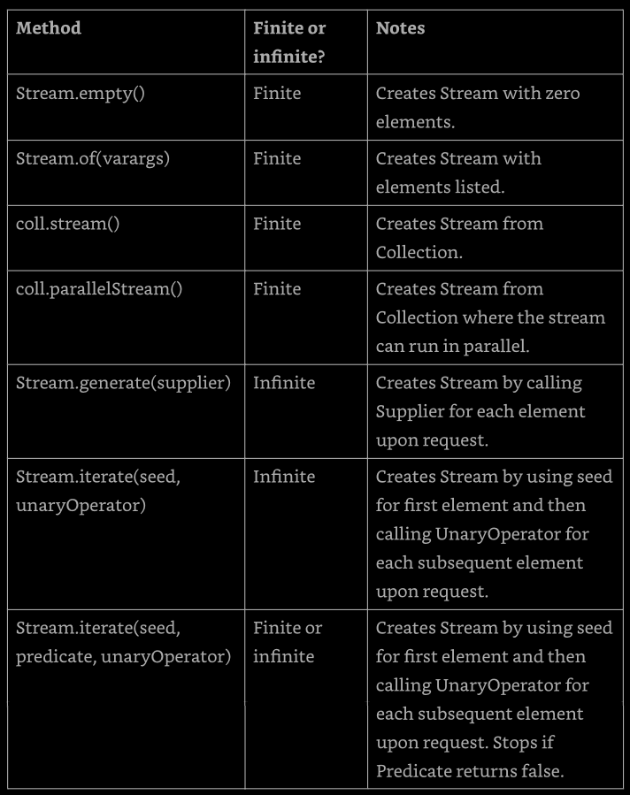
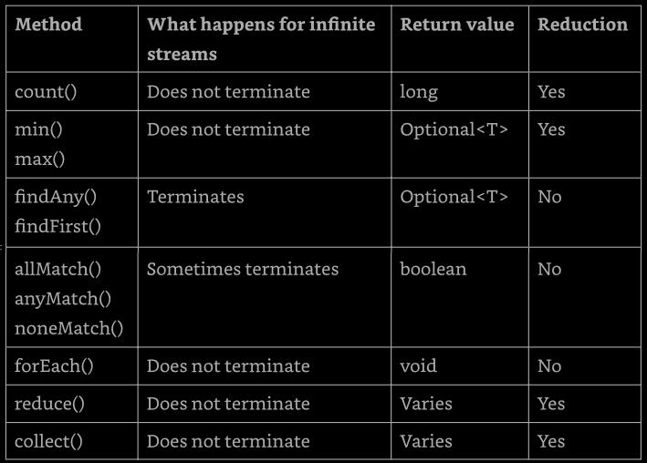

# Chapter 10 - Streams

This chapter add over Lambdas, Functional Interfaces, Collection, and Generics the 
concept of _functional programming_, focusing on the Streams API. Note that this is 
not a stream in the sense of input/output of the `java.io` package. This is another 
type of stream.

In this chapter the `Optional` interface is introduced. Then the concept of _stream_
_pipeline_ and how to tie all together. Functional programming tends to have a steep 
learning  curve but can be very exciting once we get the hang of it.


## Returning an _Optional_

Suppose that we are taking an introductory Java class and receive scores of 90 and 100 
on the first two exams. Now, we want the average. We could easily create a function that 
return the average of two number, but if we have only one, how to handle this? In this 
situation we could use the `Optional` type to return a value or do other thing when not 
all condition as met.

An `Optional` is created using a factory. We can either request an empty `Optional` or 
pass a value for the `Optional` to wrap. An `Optional` could be seen as a kind of a box 
that have something in it or might instead be empty.

**Figure 10.1 - Optional**




### Creating an _Optional_

Here's how to code our average method
```
10: public static Optional<Double> average(int... scores) {
11:   if (scores.length == 0) return Optional.empty();
12:   int sum = 0;
13:   for (int score : scores) sum += score;
14:   return Optional.of( (double) sum / scores.length );
15: }
```

Line 11 returns an empty `Optional` when we can't calculate an average. Lines 12 and 
13 add up the scores. There is a functional programming way to doing this math, and 
that will be get later in the chapter. In fact, the entire method could be written in 
one line, but that wouldn't shows us how `Optional` works. Line 14 creates an `Optional` 
to wrap the average.

Calling the method shows what is inside out two boxes:
```
System.out.println( average(90, 100) );     // Optional[95.0]
System.out.println( average() );            // Optional.empty
```

WE can see that on `Optional` contains a value and the other is empty. Normally, we 
want to check whether a value is there and/or get it out of the box. Here's on way:
```
Optional<Double> opt = average(90, 100);
if (opt.isPresent())
  System.out.println( opt.get() );     // 95.0
```

First we check wheter the `Optional` contains a value. Then we print it out. What if 
we didn't do the check, and the `Optional` was empty?
```
Optional<Double> opt = average();
System.out.println( opt.get() );     // NoSuchElementException
```

We'd get an exception since there is no value inside the `Optional`.
```
java.util.NoSuchElementException: No value present
```

When creating an `Optional`, it is common to want to use `empty()` when the value is 
`null`. We can do this with an if statement or ternary operator:
```
Optional o = (value == null) ? Optional.empty() : Optional.of(value);
```

If `value` is `null`, `o` is assigned to the empty `Optional`. Otherwise, we wrap the 
`value`. Since this is such a common pattern, Java provides a factory method to do the 
same thing:
```
Optional o = Optional.ofNullable(value);
```

This cover the static methods that we need to know about `Optional`. There area a few 
others that involve chaining, that will be cover later in this chapter. Next we will 
look to the instance methods

**Table 10.1 - Common Optional instance methods**



We already seen `get()` and `isPresent()`. The other methods allows us to write code 
that uses an `Optional` in one line without having to use the ternary operator. This 
makes the code easier to read. Instead of using an if statement, which we used when 
checking the average earlier, we can specify a `Consumer` to be run when there is a 
value inside the `Optional`. When there isn't, the method simply skips running the 
`Consumer`.
```
Optional<Double> opt = average(90, 100);
opt.ifPresent(System.out::println);     // 95
```

Using `ifPresent()` better express out intent. We want something done if a value is 
present. We cant think of it as an if statement with no else.


### Dealing with an Empty _Optional_

The remaining methods allows us to specify what to do if a value isn't present. There 
are a few choices. The first wo allows us to specify a return value either directly or 
using a `Supplier`.
```
30: Optional<Double> opt = average();
31: System.out.println( opt.orElse(Double.NaN) );
32: System.out.println( opt.ElseGet( () -> Math.random() ) );
```

This prints something like the following:
```
NaN
0.4977778435122
```

Line 31 shows that we can return a specify values or variable. In our case, we print 
"not a number" value. Line 32 shows using a `Supplier` to generate a value at runtime 
to return instead.

Alternatively, we can have the code throw an exception if the `Optional` is empty:
```
30: Optional<Double> opt = average();
31: System.out.println( opt.orElseThrow() );
```

This prints something like this:
```
Exception in thread "main" java.util.NoSuchElementException:
  No value present
  at java.base/java.util.Optional.orElseThrow(Optional.java:382)
```

Without specifying a `Supplier` for the exception, Java will throw a `NoSuchElementException`. 
Alternatively, we can have the code throw a custom exception if the `Optional`is empty. 
Remembering that the stack trace looks weird because the lambdas are generated rather than 
named classes.
```
30: Optional<Double> opt = average();
31: System.out.println( opt.orElseThrow( 
32:      () -> new IllegalStateException() ) );
```

This prints:
```
Exception in thread "main" java.lang.IllegalStateException
  at optionals.Methods.lambda$orElse$1(Methods.java:31)
  at java.base/java.util.Optional.orElseThrow(Optional.java:408)
```

Line 32 shows using a `Supplier` to create an exception that should be thrown. Notice 
that we do not write `throw new IllegalStateException()`. The `orElseThrow()` method 
takes care of actually throwing the exception when we run it.

The two methods that take a `Supplier` have different names. Why this code does not compile?
```
System.out.println(opt.orElseGet(
    () -> new IllegalStateException() ) );     // does not compile
```

The `opt` variable is an `Optional<Double>`. This means the `Supplier` must return a 
`Double`. Since this `Supplier` return an exception, tye type does not match.

The last example with `Optional` is easy. What this code does?
```
Optional<Double> opt = average(90, 100);
System.out.println( opt.orElse(Double.NaN) );
System.out.println( opt.orElseGet( () -> Math.random() ) );
System.out.println( opt.orElseThrow() );
```

It prints 95.0 three times. Since the value does exist, there is no nee to use the 
"or else" logic.

---
**Is _Optional_ the same as _null_?**

An alternative to `Optional`is to return `null`. There area a few shortcomings with 
this approach. One is that there isn't a clear way to express that `null` might be a 
special value. By contrast, returning an `Optional` is a clear statement in the API 
that there might not be a value.

Another advantage of `Optional` is that we can use a functional programming style 
with `ifPresent()` and the other methods rather than needing an if statement. We 
will see at the end of the chapter how to chain `Optional` calls.
---

## Using Streams

A _stream_ in Java is a sequence of data. A _stream pipeline_ consists of the operations 
that run on a stream to produce a result. First, we will look at the flow of pipelines 
conceptually, than we get into the code.

### Understanding the Pipeline Flow

Think of a stream pipeline as an assembly line in a factory. suppose that we are running 
an assembly line to make signs for the animal exhibits at the zoo. We have a number of 
jobs. It is one person's job to take the signs out of a box. It is a second person's job 
to paint the sign. Its is a third person's job to stencil the name ot the animal on the 
sign. It's the last person's job to put the completed sign in a box to be carried to the 
proper exhibit.

Notice that the second person can't do anything until one sign has been taken out of 
the box by the first person. Similarly, the third person can't do anything until one 
sign has been painted, and the last person cant'd do anything until it is stenciled.

The assembly line for making sign is finite. Once we process the contents of tout box of 
signs, we are finished. _ Finite_ streams have a limit. Other assembly lines essentially 
run forever, like one for food production. Of course, the do stop at some point when the 
factory closes down, but for an inordinately large period of time, they don't. 

Another important feature of an assembly line is that each person touches each element 
to do their operation, and then that piece of data is gone. It doesn't come back. The 
next person deals with it at that point. This is different tha the lists and queues, 
that we can access any element at any time. With streams, the data isn't generated up 
front, it is created when needed. This is an example of _lazy evaluation_, which delays 
execution until necessary.

Many things can happen in the assembly line stations along the way. In functional 
programming, these are called _stream operations_. Just like with the assembly line, 
operations occur in a pipeline. Someone has to start and end the work, and there can 
be any number of stations in between. After all, a job with one person isn't an 
assembly line!. There are three parts to a stream pipeline, as shown in Figure 10.2.
 - **Source**: where the stream comes from
 - **Intermediate operations**: transforms the stream into another one. There can be
    as few or as many intermediate operation as we would like. Since streams use lazy 
    evaluation, the intermediate operations do not run until the terminal operation runs.
 - **Terminal operation**: produces a result. Since streams can be used only once, the 
    stream is no longer valid after a terminal operation completes.

**Figure 10.2 - Stream pipeline**



Notice that the operations are unknown to us. When viewing the assembly line from the 
outside, we care only about what comes in and goes out. What happens in between is an 
implementation detail.


## Creating Stream Sources

In Java, the streams we have been talking about are represented by the `Stream<T>` 
interface, defined int the `java.util.stream` package.

### Creating Finite Streams

For simplicity, we start with finite streams. There are a few way to create them.
```
11: Stream<String> empty = Stream.empty();               // count = 0
12: Stream<Integer> singleElement = Stream.of(1);        // count = 1
13: Stream<Integer> fromArray = Stream.of(1, 2, 3);      // count = 3
```

Line 11 shows how to create an empty stream. Line 12 shows how to create a stream 
with a single element. Line 13 shows how to create a stream from a varargs. 

Java also provides a convenient way of converting a Collection to a stream.
```
14: var list = List.of("a", "b", "c", "d");
15: Stream<String> fromList = list.stream();
```

Line 15 shows that it is a simple method call to create a stream from a list. This is 
helpful since such conversions are common.


### Creating Infinite Streams

What we could do with list is good, but not impressive. We can't create an infinite 
list, though, which makes streams more powerful.
```
17: Stream<Double> randoms = Stream.generate(Math::random);
18: Stream<Integer> oddNumbers = Stream.iterate(1, n -> n + 2 );
```

Line 17 generates a stream of random numbers. How many random number? How many we need. 
It we call `randoms.forEach(System.out::println)`, the program will print random numbers 
until we kill it. Later in this chapter we will learn about operation like `limit()` to 
turn the infinite stream into a finite stream.

Line 18 gives us more control. The `iterate()` methods takes a seed o starting value as 
first parameter. This is the first element that will be part of the stream. The other 
parameter is a lambda expression that is passed the previous value and generate the next 
value. AS with the random number examples, it will keep on producing odd numbers as long 
as we need them.

What if we want just odd number less than 100? There's an overloaded version of 
`iterate()` that helps:
```
19: Stream<Integer> oddNumbersUnder100 = Stream.iterate(
20:   1,              // seed
21:   n -> n < 100,   // Predicate to specify when done
22:   n -> n + 2      // UnaryOperator to get next value  
23);
```
This method takes three parameters. Notice how they are separated by commas (,) just 
like in all other methods. When in a single line, don't confuse with a for loop and 
not use semicolons.


### Reviewing Stream Creation Methods

These are the way of creating a source for streams, give a `Collection` instance `coll`.

**Table 10.3 - Creating source**




## Using Common Terminal Operations

We can perform a terminal operation without any intermediate operations but no the 
other way around. This is wny we talk about terminal operations first. _Reductions_ 
area a special type of terminal operation where all of the contents ot the stream are 
combined into a single primitive or `Object`. For example, we might have an `int` or 
a `Collection`.

Table 10.4 summarizes this section, they will be explained from simplest to most complex.

**Table 10.4 - Terminal Stream Operations**




### Counting

The `count()` method determines the number of elements in a finite stream. For an 
infinite stream, it never terminates. The `count()` method is a reduction because 
it looks at each element in the stream and returns a single value. The method 
signature is as follows: 
```
public long count()
```

This example shows calling `count()` on a finite stream:
```
Stream<String> s = Stream.of("monkey", "gorilla", "bonobo");
System.out.println(s.count());     // 3
```

### Finding the Minimum and Maximum


