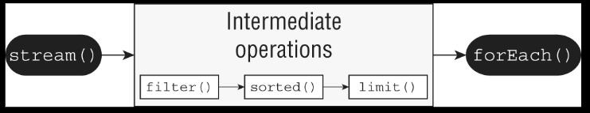
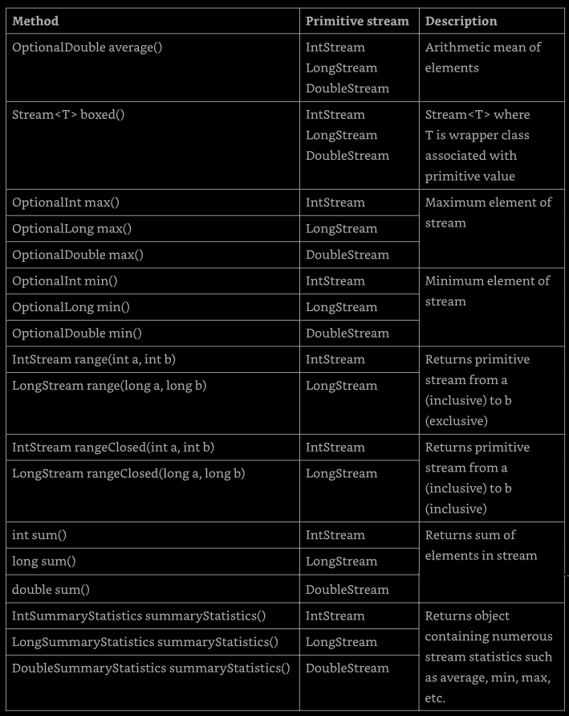
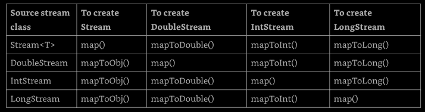
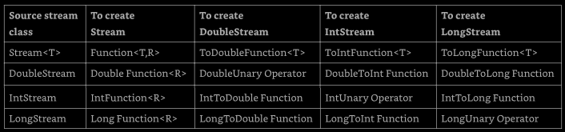
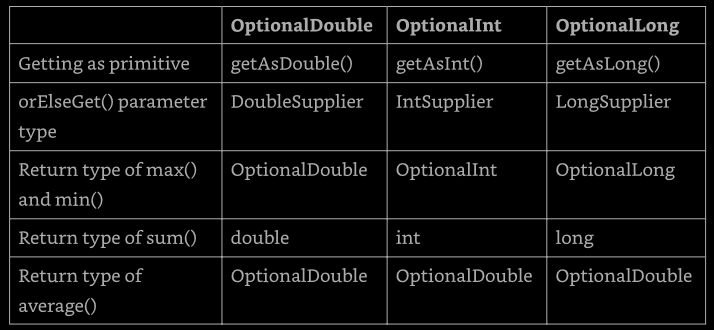
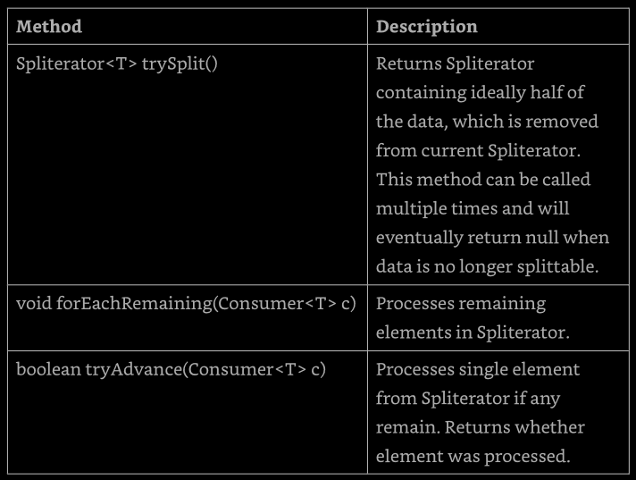
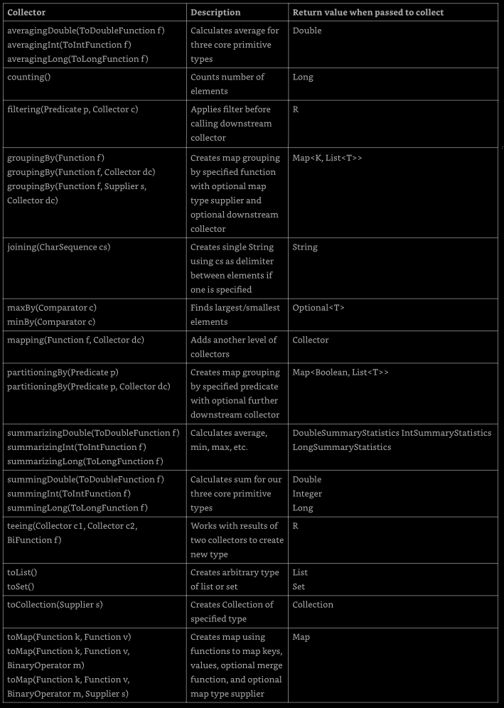

# Chapter 10 - Streams

This chapter add over Lambdas, Functional Interfaces, Collection, and Generics the 
concept of _functional programming_, focusing on the Streams API. Note that this is 
not a stream in the sense of input/output of the `java.io` package. This is another 
type of stream.

In this chapter the `Optional` interface is introduced. Then the concept of _stream_
_pipeline_ and how to tie all together. Functional programming tends to have a steep 
learning  curve but can be very exciting once we get the hang of it.

[Returning an Optional](#returning-an-optional)

[Using Streams](#using-streams)

[Working with Primitive Streams](#working-with-primitive-streams)

[Working with Advanced Stream Pipeline](#working-with-advanced-stream-pipelines-concepts)


## Returning an _Optional_

Suppose that we are taking an introductory Java class and receive scores of 90 and 100 
on the first two exams. Now, we want the average. We could easily create a function that 
return the average of two number, but if we have only one, how to handle this? In this 
situation we could use the `Optional` type to return a value or do other thing when not 
all condition as met.

An `Optional` is created using a factory. We can either request an empty `Optional` or 
pass a value for the `Optional` to wrap. An `Optional` could be seen as a kind of a box 
that have something in it or might instead be empty.

**Figure 10.1 - Optional**


### Creating an _Optional_

Here's how to code our average method
```
10: public static Optional<Double> average(int... scores) {
11:   if (scores.length == 0) return Optional.empty();
12:   int sum = 0;
13:   for (int score : scores) sum += score;
14:   return Optional.of( (double) sum / scores.length );
15: }
```

Line 11 returns an empty `Optional` when we can't calculate an average. Lines 12 and 
13 add up the scores. There is a functional programming way to doing this math, and 
that will be get later in the chapter. In fact, the entire method could be written in 
one line, but that wouldn't shows us how `Optional` works. Line 14 creates an `Optional` 
to wrap the average.

Calling the method shows what is inside out two boxes:
```
System.out.println( average(90, 100) );     // Optional[95.0]
System.out.println( average() );            // Optional.empty
```

WE can see that on `Optional` contains a value and the other is empty. Normally, we 
want to check whether a value is there and/or get it out of the box. Here's on way:
```
Optional<Double> opt = average(90, 100);
if (opt.isPresent())
  System.out.println( opt.get() );     // 95.0
```

First we check wheter the `Optional` contains a value. Then we print it out. What if 
we didn't do the check, and the `Optional` was empty?
```
Optional<Double> opt = average();
System.out.println( opt.get() );     // NoSuchElementException
```

We'd get an exception since there is no value inside the `Optional`.
```
java.util.NoSuchElementException: No value present
```

When creating an `Optional`, it is common to want to use `empty()` when the value is 
`null`. We can do this with an if statement or ternary operator:
```
Optional o = (value == null) ? Optional.empty() : Optional.of(value);
```

If `value` is `null`, `o` is assigned to the empty `Optional`. Otherwise, we wrap the 
`value`. Since this is such a common pattern, Java provides a factory method to do the 
same thing:
```
Optional o = Optional.ofNullable(value);
```

This cover the static methods that we need to know about `Optional`. There area a few 
others that involve chaining, that will be cover later in this chapter. Next we will 
look to the instance methods

**Table 10.1 - Common Optional instance methods**


We already seen `get()` and `isPresent()`. The other methods allows us to write code 
that uses an `Optional` in one line without having to use the ternary operator. This 
makes the code easier to read. Instead of using an if statement, which we used when 
checking the average earlier, we can specify a `Consumer` to be run when there is a 
value inside the `Optional`. When there isn't, the method simply skips running the 
`Consumer`.
```
Optional<Double> opt = average(90, 100);
opt.ifPresent(System.out::println);     // 95
```

Using `ifPresent()` better express out intent. We want something done if a value is 
present. We cant think of it as an if statement with no else.


### Dealing with an Empty _Optional_

The remaining methods allows us to specify what to do if a value isn't present. There 
are a few choices. The first wo allows us to specify a return value either directly or 
using a `Supplier`.
```
30: Optional<Double> opt = average();
31: System.out.println( opt.orElse(Double.NaN) );
32: System.out.println( opt.ElseGet( () -> Math.random() ) );
```

This prints something like the following:
```
NaN
0.4977778435122
```

Line 31 shows that we can return a specify values or variable. In our case, we print 
"not a number" value. Line 32 shows using a `Supplier` to generate a value at runtime 
to return instead.

Alternatively, we can have the code throw an exception if the `Optional` is empty:
```
30: Optional<Double> opt = average();
31: System.out.println( opt.orElseThrow() );
```

This prints something like this:
```
Exception in thread "main" java.util.NoSuchElementException:
  No value present
  at java.base/java.util.Optional.orElseThrow(Optional.java:382)
```

Without specifying a `Supplier` for the exception, Java will throw a `NoSuchElementException`. 
Alternatively, we can have the code throw a custom exception if the `Optional`is empty. 
Remembering that the stack trace looks weird because the lambdas are generated rather than 
named classes.
```
30: Optional<Double> opt = average();
31: System.out.println( opt.orElseThrow( 
32:      () -> new IllegalStateException() ) );
```

This prints:
```
Exception in thread "main" java.lang.IllegalStateException
  at optionals.Methods.lambda$orElse$1(Methods.java:31)
  at java.base/java.util.Optional.orElseThrow(Optional.java:408)
```

Line 32 shows using a `Supplier` to create an exception that should be thrown. Notice 
that we do not write `throw new IllegalStateException()`. The `orElseThrow()` method 
takes care of actually throwing the exception when we run it.

The two methods that take a `Supplier` have different names. Why this code does not compile?
```
System.out.println(opt.orElseGet(
    () -> new IllegalStateException() ) );     // does not compile
```

The `opt` variable is an `Optional<Double>`. This means the `Supplier` must return a 
`Double`. Since this `Supplier` return an exception, tye type does not match.

The last example with `Optional` is easy. What this code does?
```
Optional<Double> opt = average(90, 100);
System.out.println( opt.orElse(Double.NaN) );
System.out.println( opt.orElseGet( () -> Math.random() ) );
System.out.println( opt.orElseThrow() );
```

It prints 95.0 three times. Since the value does exist, there is no nee to use the 
"or else" logic.

---
**Is _Optional_ the same as _null_?**

An alternative to `Optional`is to return `null`. There area a few shortcomings with 
this approach. One is that there isn't a clear way to express that `null` might be a 
special value. By contrast, returning an `Optional` is a clear statement in the API 
that there might not be a value.

Another advantage of `Optional` is that we can use a functional programming style 
with `ifPresent()` and the other methods rather than needing an if statement. We 
will see at the end of the chapter how to chain `Optional` calls.
---

[back to to](#chapter-10---streams)


## Using Streams

A _stream_ in Java is a sequence of data. A _stream pipeline_ consists of the operations 
that run on a stream to produce a result. First, we will look at the flow of pipelines 
conceptually, than we get into the code.

### Understanding the Pipeline Flow

Think of a stream pipeline as an assembly line in a factory. suppose that we are running 
an assembly line to make signs for the animal exhibits at the zoo. We have a number of 
jobs. It is one person's job to take the signs out of a box. It is a second person's job 
to paint the sign. Its is a third person's job to stencil the name ot the animal on the 
sign. It's the last person's job to put the completed sign in a box to be carried to the 
proper exhibit.

Notice that the second person can't do anything until one sign has been taken out of 
the box by the first person. Similarly, the third person can't do anything until one 
sign has been painted, and the last person cant'd do anything until it is stenciled.

The assembly line for making sign is finite. Once we process the contents of tout box of 
signs, we are finished. _ Finite_ streams have a limit. Other assembly lines essentially 
run forever, like one for food production. Of course, the do stop at some point when the 
factory closes down, but for an inordinately large period of time, they don't. 

Another important feature of an assembly line is that each person touches each element 
to do their operation, and then that piece of data is gone. It doesn't come back. The 
next person deals with it at that point. This is different tha the lists and queues, 
that we can access any element at any time. With streams, the data isn't generated up 
front, it is created when needed. This is an example of _lazy evaluation_, which delays 
execution until necessary.

Many things can happen in the assembly line stations along the way. In functional 
programming, these are called _stream operations_. Just like with the assembly line, 
operations occur in a pipeline. Someone has to start and end the work, and there can 
be any number of stations in between. After all, a job with one person isn't an 
assembly line!. There are three parts to a stream pipeline, as shown in Figure 10.2.
 - **Source**: where the stream comes from
 - **Intermediate operations**: transforms the stream into another one. There can be
    as few or as many intermediate operation as we would like. Since streams use lazy 
    evaluation, the intermediate operations do not run until the terminal operation runs.
 - **Terminal operation**: produces a result. Since streams can be used only once, the 
    stream is no longer valid after a terminal operation completes.

**Figure 10.2 - Stream pipeline**


Notice that the operations are unknown to us. When viewing the assembly line from the 
outside, we care only about what comes in and goes out. What happens in between is an 
implementation detail.


### Creating Stream Sources

In Java, the streams we have been talking about are represented by the `Stream<T>` 
interface, defined int the `java.util.stream` package.

#### Creating Finite Streams

For simplicity, we start with finite streams. There are a few way to create them.
```
11: Stream<String> empty = Stream.empty();               // count = 0
12: Stream<Integer> singleElement = Stream.of(1);        // count = 1
13: Stream<Integer> fromArray = Stream.of(1, 2, 3);      // count = 3
```

Line 11 shows how to create an empty stream. Line 12 shows how to create a stream 
with a single element. Line 13 shows how to create a stream from a varargs. 

Java also provides a convenient way of converting a Collection to a stream.
```
14: var list = List.of("a", "b", "c", "d");
15: Stream<String> fromList = list.stream();
```

Line 15 shows that it is a simple method call to create a stream from a list. This is 
helpful since such conversions are common.


#### Creating Infinite Streams

What we could do with list is good, but not impressive. We can't create an infinite 
list, though, which makes streams more powerful.
```
17: Stream<Double> randoms = Stream.generate(Math::random);
18: Stream<Integer> oddNumbers = Stream.iterate(1, n -> n + 2 );
```

Line 17 generates a stream of random numbers. How many random number? How many we need. 
It we call `randoms.forEach(System.out::println)`, the program will print random numbers 
until we kill it. Later in this chapter we will learn about operation like `limit()` to 
turn the infinite stream into a finite stream.

Line 18 gives us more control. The `iterate()` methods takes a seed o starting value as 
first parameter. This is the first element that will be part of the stream. The other 
parameter is a lambda expression that is passed the previous value and generate the next 
value. AS with the random number examples, it will keep on producing odd numbers as long 
as we need them.

What if we want just odd number less than 100? There's an overloaded version of 
`iterate()` that helps:
```
19: Stream<Integer> oddNumbersUnder100 = Stream.iterate(
20:   1,              // seed
21:   n -> n < 100,   // Predicate to specify when done
22:   n -> n + 2      // UnaryOperator to get next value  
23);
```
This method takes three parameters. Notice how they are separated by commas (,) just 
like in all other methods. When in a single line, don't confuse with a for loop and 
not use semicolons.


#### Reviewing Stream Creation Methods

These are the way of creating a source for streams, give a `Collection` instance `coll`.

**Table 10.3 - Creating source**


### Using Common Terminal Operations

We can perform a terminal operation without any intermediate operations but no the 
other way around. This is wny we talk about terminal operations first. _Reductions_ 
area a special type of terminal operation where all of the contents ot the stream are 
combined into a single primitive or `Object`. For example, we might have an `int` or 
a `Collection`.

Table 10.4 summarizes this section, they will be explained from simplest to most complex.

**Table 10.4 - Terminal Stream Operations**


#### Counting

The `count()` method determines the number of elements in a finite stream. For an 
infinite stream, it never terminates. The `count()` method is a reduction because 
it looks at each element in the stream and returns a single value. The method 
signature is as follows: 
```
public long count()
```

This example shows calling `count()` on a finite stream:
```
Stream<String> s = Stream.of("monkey", "gorilla", "bonobo");
System.out.println(s.count());     // 3
```

#### Finding the Minimum and Maximum

The `min()` and `max()` methods allow us to pass a custom comparator and find the 
smallest or largest value in a finite stream according to that sort order. Like the 
`count()` method, `min()` and `max()` hang on an infinite stream because the cannot 
be sure that a smaller or larger value isn't coming later in the stream. Both methods 
are reductions because the return a single value after looking at the entire stream. 
The method signatures re as follows:
```
public Optional<T> min(Comparator<? super T> comparator)
public Optional<T> max(Comparator<? super T> comparator)
```

This example finds the animal with the fewest letters in its name:
```
Stream<String> s = Stream.of("monkey", "ape", "bonobo");
Optional<String> min = s.min( (s1, s2) -> s1.length() - s2.length() );
min.ifPresent(System.out::println);     // ape
```

Notice that the code returns an `Optional` rater than the value. This allows the method 
to specify that no minimum or maximum was found. We use the `Optional` method `ifPresent()` 
and a method reference to print out the minimum only if on is found. As an example of 
where there isn't a minimum, let's look at an empty stream:
```
Optional<?> minEmpty = Stream.empty().min( (s1, s2) -> 0 );
System.out.println(minEmpty.isPresent());     // false
```

Since the stream is empty, the comparator is never called, and no value is present 
in the `Optional`.

#### Finding a Value

The `findAny()` and `findFirst()` methods return an element of the stream unless the 
stream is empty. If the stream is empty, they return an empty `Optional`. This is the 
first method we've seen that can terminate with an infinite stream. Since Java generates 
only the amount of stream we need, the infinite stream need to generate only one element.

As its name implies, the `findAny()` method can return any element of the stream. When 
called on the streams we've seen up until now, it commonly returns the first element, 
although this  behavior is not guaranteed.

These methods are terminal operation but no reductions. The reason is that they sometimes 
return without processing all of the elements. This means that they return a value based 
on the stream but do not reduce the entire stream in one value.

These is the method signatures:
```
public Optional<T> findAny()
public Optional<T> findFirst()
```

This examples find an animal:
```
Stream<String> s = Stream.of("monkey", "gorilla", "bonobo");
Stream<String> infinite = Stream.generate( () -> "chimp" );


s.findAny().ifPresent(System.out::println);           // monkey (usually)
infinite.findAny().ifPresent(System.out::println);    // chimp 
```

Finding any one match is more useful that it sounds. Sometime we just want to sample 
the results and get a representative element, but we don't need to waste the processing 
generating then all.


#### Matching

The `allMatch()`, `anyMatch()`, and `noneMatch()` methods search a stream and return 
information about how the stream pertains to the predicate. These may or may not 
terminate for infinite streams. It depends on the data. Like the find methods, they 
are not reductions because they do not necessarily look at all of the elements.

The methods signatures are as follows:
```
public boolean anyMatch(Predicate<? super T> predicate)
public boolean allMatch(Predicate<? super T> predicate)
public boolean noneMatch(Predicate<? super T> predicate)
```

This examples checks whether animal names begin with letters
```
var list = List.of("monkey", "2", "chimp");
Stream<String> infinite = Stream.generate( () -> "chimp" );
Predicate<String> pred = x -> Character.isLetter( x.charAt(0) );

System.out.println( list.stream().anyMatch(pred) );     // true
System.out.println( list.stream().allMatch(pred) );     // false
System.out.println( list.stream().noneMatch(pred) );    // false
System.out.println( infinite.anyMatch(pred) );          // true
```

This shows that we can reuse the same predicate, but we need a different stream each 
time. The `anyMatch()` method returns `true` because two of the three elements match. 
The `allMatch()` method returns `false` because on doesn't match. The `noneMatch()` 
method also returns `false` because at least one matches. On the infinite stream, one 
match is found, so the call terminates. If `allMatch()` was called, it would run until 
we killed the program.


#### Iterating

As in the Java Collections Framework, it is common to iterate over the elements of 
a stream. As expected, calling `forEach()` on an infinite stream does not terminate. 
Since there is no return value, it is not a reduction. Before use it, we have to 
consider if another approach would be better.

The method signature is as follows:
```
public void forEach(Consumer<? super T> action)
```

Notice that this is the only terminal operation with a return type of void. If we 
want something to happen, we have to make it happen in the `Consumer`. Here's one 
way to print the elements in the stream (other will be shown):
```
Stream<String> s = Stream.of("Monkey", "Gorilla", "Bonobo");
s.forEach(System.out::println);     // MonkeyGorillaBonobo
```

We cant use a traditional for on a stream:
```
Stream<Integer> s = Stream.of(1);
for (Integer i : s) { }     // does not compile
```

So, while in a `Collection` wen can call `for` or `forEach()`, in a `Stream` just 
`forEach()`, be aware.

While `forEach()` sounds like a loop, it is really a terminal operator for streams. 
Streams cannot be used as the source in a for-each loop because the don't implement 
the `Iterable` interface.


#### Reducing

The `reduce()` method combines a stream into a single object. It is a reduction, which 
means it processes all elements. The three method signatures are these:
```
public T reduce(T identity, BinaryOperator<T> accumulator)

public Optional<T> reduce(BinaryOperator<T> accumulator)

public <U> U reduce(
  U identity,
  BiFunction<U,? super T,U> accumulator,
  BinaryOperator<U> combiner
)
```

Whe will taken then one at a time. The most common way of doing a reduction is to start 
with an initial value and keep merging it with the next value. Thing about how we would 
concatenate an array of `String` object into a single `String` without functional 
programming. It might look something like this:
```
var array = new String[] { "w", "o", "l", "f"};
var result = "";
for (var s : array) { result = result + s; }
System.out.println(result);                            // wolf
```

The _identity_ is the initial value of the reduction, in this case an empty `String`. 
The _accumulator_ combines the current result with the current value in the stream. 
With lambdas, we can do the same thing with a stream and reduction:
```
Stream<String> stream = Stream.of("w", "o", "l", "f");
String word = stream.reduce("", (s, c) -> s + c );
System.out.println(word);                              // wolf
```

Notice how we still have the empty `String` as the identity. We also still concatenate 
the `String` object to get the next value. We can even rewrite this with a method 
reference:
```
Stream<String> stream = Stream.of("w", "o", "l", "f");
String word = stream.reduce("", String::concat);
System.out.println(word);                              // wolf
```

Lest's try another one. How we can write a reduction to multiply all of the `Integer` 
object in a stream? One solution:
```
Stream<Integer> stream = Stream.of(3, 5, 6);
System.out.println(stream.reduce(1, (a, b) -> a*b) );   // 90
```

We set the identity to 1 and the accumulator to multiplication. In many cases, the 
identity isn't really necessary, so Java lets us omit it. When we don't specify an 
identity, an `Optional` is returned because there might not be any data. There are 
three choices for what is in the `Optional`:
- If the stream is empty, an empty `Optional` is returned
- if the stream has one element, it is returned
- if the stream has multiple elements, the accumulator is applied to combine them

The following illustrates each of these scenarios:
```
BinaryOperator<Integer> op = (a, b) -> a * b;
Stream<Integer> empty = Stream.empty();
Stream<Integer> oneElement = Stream.of(3);
Stream<Integer> threeElements = Stream.of(3, 5, 6);

empty.reduce(op).ifPresent(System.out::println);          // no output
oneElement.reduce(op).ifPresent(System.out.println);      // 3
threeElements.reduce(op).ifPresent(System.out::println);  // 90
```

Why are there two similar methods? Why not just always require the identity? Java 
could have done that. However, sometimes it is nice to differentiate the case where 
the stream is empty rather than the case where there is a value that happens to match 
the identity being returned from the calculation. The signature returning an `Optional` 
lets us differentiate these cases. For example, we might return `Optional.empty()` 
when the stream is empty and `Optional.of(3)` when there is a value.

The third method signature is used when we are dealing with different types. It allows 
Java to create intermediate reductions and then combine them at the end. Let's take 
a look an an example that counts the number of characters in each `String`.
```
Stream<String> stream = Stream.of("w", "o", "l", "f!");
int length = stream.reduce(0, (i, s) -> i + s.length(), (a, b) -> a + b );
System.out.println(length);        // 5
```

The first parameter, `0`, is the value for the _initializer_. If we had an empty 
stream, this would be the answer. The second parameter is the _accumulator_. Unlike 
the accumulators we previously saw, this one handles mixed data types. In this example, 
the first argument, `i`, is an `Integer`, while the second argument, `s`, is a `String`. 
It adds the length of the current `String`to our running total. The third parameter is 
called the _combiner_, which combines any intermediate totals. In this case, `a` and 
`b` are both `Integer` values. 

The three-argument `reduce()` operation is useful when working with parallel streams 
because it allows the stream to be decomposed and reassembled by separate threads. 
For example, if we needed to count the length of four 100-character strings, the first 
two values and the last two values could b computed independently. The intermediate 
result, 200 + 200, would then be combined into the final value.


#### Collecting

The `collect()` is a special type of reduction called a _mutable reduction_. It is 
more efficient than a regular reduction because we use the same mutable object while 
accumulating. Common mutable object include `StringBuilder` and `ArrayList`. This is 
a really useful method, because it lets us get data out of streams and into another 
form. The method signatures are as follows:
```
public <T> R collect(
  Supplier<T> supplier, 
  BiConsumer<T, ? super T> accumulator,
  BiConsumer<R, R> combiner
)

public <R, A> R collect(Collector<? super T, A, R> collector)
```

Let's start with the first signature, which is used when we want to code specifically how 
collection should work. Our wold example from reduce can be converted to use `collect()`:
```
Stream<String> stream = Stream.of("w", "o", "l", "f");

StringBuilder word = stream.collect(
  StringBuilder::new,
  StringBuilder::append,
  StringBuilder::append
)

System.out.println(word);     // wolf
```

The first parameter is the _supplier_, which creates the object that will store the 
results as we collect. Remembering that a `Supplier` doesn't take any parameters and 
return a value. In this case, it constructs a new `StringBuilder`.

The second parameter is the _accumulator_, which is a `BiConsumer` that takes two 
parameters and doesn't return anything. It is responsible for adding one more element to 
the data collection. In this example, it appends the next `String` to the `StringBuilder`.

The final parameter is the _combiner_, which is another `BiConsumer`. It is responsible 
for taking two data collections and merging them. This is useful when we are processing 
in parallel. Two smaller collections are formed and then merged into one. This would 
work with `StringBuilder` only if we didn't care about the order of the letters. In this 
case, the accumulator and combiner have similar logic.

Now let's look at an example where the logic is different in the accumulator and combiner: 
```
Stream<String> = Stream.of("w", "o", "l", "f");

TreeSet<String> set = stream.collect(
  TreeSet::new,
  TreeSet::add,
  TreeSet::addAll
)
```

The collector has three parts as before. The _supplier_ creates an empty `TreeSet`. The 
_accumulator_ adds a single `String` from the `STream` to the `TreeSet`. The _combiner_ 
adds all of the elements of one `TreeSet` to another in case the operation were done in 
parallel and need to be merged.

We started with the long signature because that's how we implement our own collector. 
It is important to know how to do this to understand how collectors work. In practice, 
many common collectors como up over and over so, Java, rather than making developer 
keep reimplementing the same ones, provides a class with common collectors, named 
`Collectors`, of course. This approach also makes the code easier to read because it 
is more expressive. For example, we could rewrite the previous example as follows:
```
Stream<String> stream = Stream.of("w", "o", "l", "f");
TreeSet<String> set =
  stream.collect(Collectors.toCollect(TreeSet::new));
System.out.println(set);     // [f, l, o, w]
```

if we didn't nee the set to be sorted, we could make the code even shorter:
```
Stream<String> stream = Stream.of("w", "o", "l", "f");
Set<String> set = stream.collect(Collectors.toSet());
System.out.println(set);     // [f, w, l, o]
```

We might get a different output for this last one since `toSet()` makes no guarantees 
as to which implementation of `Set` we'll get. It is likely to be a `HashSet`, but 
we shouldn't expect or rely on that.


### Using Common Intermediate Operations

Unlike a terminal operation, an intermediate operation produces a stream as its result. 
An intermediate operation can also deal with an infinite stream simply by returning 
another infinite stream. Since elements are produced only as needed, this works fine. 
The assembly line worker doesn't need to worry about how many more elements are coming 
through and instead can focus only on the current element.

#### Filtering

The `filter()` method returns a `Stream` with elements that match a given expression. 
Here is the method signature:
```
public Stream<T> filter<Predicate<? super T> predicate
```

This operation is easy to remember and powerful because we can pass any `Predicate` to 
it. For example, this retains all elements that begin with the letter "m":
```
Stream<String> s = Stream.of("monkey", "gorilla", "bonobo");
s.filter( x -> x.startsWith("m") )
  .forEach(System.out::print);      // monkey
```

#### Removing Duplicates

The `distinct()` method returns a stream with duplicate values removed. The duplicates 
do not nee to be adjacent to be removed. Java call `equals()` to determine whether the 
objects are equivalent. The method signature is as follows:
```
public Stream<T> distinct()
```

Here an example:
```
Stream<String> s = Stream.of("duck", "duck", "duck", "goose");
s.distinct()
  .forEach(System.out::print);     // duckgoose
```

#### Restricting by Position

The `limit()` and `skip()` methods can make a `Stream` smaller, or `limit()` could 
make a finite stream out of an infinite stream. The methods signatures are these:
```
public Stream<T> limit(long maxSize)
public Stream<T> skip(long n)
```

The following code create an infinite stream of number counting from 1. The `skip()` 
operation return an infinite stream starting with the numbers counting from 6, since 
it skips the first five elements. The `limit()` call takes the first two of those. Now 
we have a finite stream with two elements, which we can then print with the `forEach()` 
method:
```
Stream<Integer> s = Stream.iterate(1, n -> n + 1);
s.skip(5)
  .limit(2)
  .forEach(System.out::print);    // 6 7
```

#### Mapping

The `map()` method creates a one-to-one mapping from the elements in the stream to 
the elements of the next step in the stream. The method signature is as follows:
```
public <R> Stream<R> map(Function<? super T, ? extends R> mapper)
```

This one looks more complicated than the others. It uses the lambda expression to 
figure out the type passed to that function and the on returned. The return type is 
the stream that is returned.

---
The `map()` method on streams is for transforming data. Don't confuse it with the 
`Map` interface, which maps keys to values.
---

As an example, this code converts a list of `String` objects to a list of `Integer` 
objects representing their lengths:
```
Stream<String> s = Stream.of("monkey", "gorilla", "bonobo");
s.map(String::length)
  .forEach(System.out::print);     // 6 7 6
```

Remembering that `String::length` is shorthand for the lambda `x -> x.length()`, which 
clearly shows it is a function that turns a `String` into an `Integer`.


#### Using _flatMap_

The `flatMap()` method takes each element in the stream and makes any elements it 
contains top-level elements in a single stream. This is helpful when we want to 
remove empty elements from a stream or combine a stream os lists. The method signature 
will be shown here only for consistency with other methods, but we don't need to read 
this nor will be asked to explain it:
```
public <R> Stream<R> flatMap(
  Function<? super T, ? extends Stream<? extends R>> mapper)
```

This gibberish basically says that it returns a `Stream` of the type that fhe function 
contains at a lower level.

What we should understand is the example. this gets all of the animals int the same 
level and removes the empty list.
```
List<String> zero = List.of();
var one = List.of("Bonobo");
var two = List.of("Mama Gorilla", "Baby Gorilla");
Stream<List<String>> animals = Stream.of(zero, one, two);

animals.flatMap( m -> m.stream())
  .forEach(System.out::println);
```
The output:
```
Bonobo
Mamma Gorilla
Baby Gorilla
```

As we can see, it removed the empty list completely and changed all elements of each 
list to be at the top level of the stream.

---
**Concatenating Streams

While `flatMap()` is good for the general case, there is a more convenient way to 
concatenate two streams:
```
var one = Stream.of("Bonobo");
var two = Stream.of("Mamma Gorilla", "Baby Gorilla");

Stream.concat(one, two)
  .forEach(System.out::println);
```

This produces the same three lines as the previous example. The two streams are 
concatenated, and the terminal operation, `forEach()`, is called.
---

#### Sorting

The `sorted()` method returns a stream with the elements sorted. Just like sorting 
arrays, Java uses natural ordering unless we specify a comparator. The method signatures 
are these:
```
public Stream<T> sorted()
public Stream<T> sorted(Comparator<? super T> comparator)
```

Calling the first signature uses the default sort order.
```
Stream<String> s = Stream.of("brown-", "bear-");
s.sorted()
  .forEach(System.out::print);    // bear-brown
```

We can optionally use a `Comparator` implementation via a method or a lambda. In this 
example, we are using a method:
```
Stream<String> s = Stream.of("brown bear", "grizzly-");
s.sorted(Comparator.reverseOrder())
  .forEach(System.out::print);     // grizzly-brown bear-
```

Here we pass a `Comparator` to specify that we want to sort in the reverse of natural 
sort order. Now a tricky one. Why this doesn't compile?
```
Stream<String> = s Stream.of("brown bear-", "grizzly-");
s.sorted(Comparator::reverseOrder);     // does not compile
```

Let's take a look at the second `sorted()` method signature again. It takes a `Comparator`, 
which is a functional interface that takes two parameter and returns an `int`. However, 
`Comparator::reverseOder` doesn't do that. Because `reverseOrder()` takes no arguments and 
returns a value, the method reference is equivalent to `() -> Comparator.reverseOrder()`, 
which is really a `Supplier<Comparator>`. This is not compatible with `sorted()`. This 
shows us that is really important to know method reference well.


#### Taking a Peek

The `peek()` method is our final intermediate operation. It is useful for debugging 
because it allows us to perform a stream operation without changing the stream. The 
method signature is as follows:
```
public Stream<T> peek(Consumer<? super T> action)
```

The most common use for `peek()` is to output the contents of the stream as it goes 
by. Suppose that we made a type and counted bears beginning with the letter "g" instead 
of "b". We are puzzled why the count is 1 instead of 2. We can add a `peek()` method 
to find out why.
```
var stream = Stream.of("black bear", "brown bear", "grizzly");
long count = stream.filter( s -> startsWith("g"))
  .peek(System.out::println).count();     // grizzly
System.out.println(count);                // 1
```

In a stream, `peek()` looks at each element that goes through that part of the stream 
pipeline. It's like a worker take notes on how a particular step of the process is doing. 
This is different from `peek()` in a `Queue` where it looks only at the first element of 
the queue.

---
**Danger: Changing State with _peak()_**

Remembering that `peak()` is intended to perform an operation without changing the 
result. Here's a straightforward stream pipeline that doesn't use `peek()`.
```
var numbers = new ArrayList<>();
var letters = new ArrayList<>();
numbers.add(1);
letters.add('a');

Stream<List<?>> stream = Stream.of(numbers, letters);
stream.map(List::size).forEach(System.out::print);     // 11
```

Now we add a `peek()` cal and note that Java doesn't prevent us from writing bad 
peek code:
```
Stream<List<?>> bad = Stream.of(numbers, letters);
bad.peek(x -> x.remove(0))
  .map(List::size)
  .forEach(System.out::print);     // 00
```

This example is bad because `peek()` is modifying the data structure that is used in 
the stream, which causes the result of the stream pipeline to be different that if 
the peek wasn't present.

---


### Putting Together the Pipeline

Streams allows us to use chaining and express what we want to accomplish rather 
than how to do so. Let's say that we wanted to get the first two names of out friends 
alphabetically that are four characters long. Without streams, we'd have to write 
something like the following:
```
var list = List.of("Toby", "Anna", "Leroy", "Alex");
List<String> filtered = new ArrayList<>();
for (String name : list)
  if (name.length() == 4) filtered.add(name);

Collections.sort(filtered);
var iter = filtered.iterator();
if (iter.hasNext()) System.out.println(iter.next());
if (iter.hasNext()) System.out.println(iter.next());
```

This works. It takes some reading and thinking to figure out what is going on. The 
problem we are trying to solve gets lost in the implementation. It is also very focused 
on the how rather than on the what. With streams, the equivalent code is as follows:
```
var list = list.of("Toby", "Anna", "Leroy", "Alex");
list.stream()
  .filter(n -> n.length() == 4)
  .sorted()
  .limit(2)
  .forEach(System.out::println)
```

The difference is that we express what is going on. We care about String objects of 
length 4. Then we want them sorted. Then we want the first two. Then we want to print 
them out. It maps better to the problem that we are trying to solve, and it is simpler.

In this example we see all three parts of the pipeline. Figure 10.5 show how each 
intermediate operation in the pipeline feeds into the next.

**Figure 10.5 - Stream pipeline with multiple operations**




Remembering that the assembly line foreperson is figuring out hwo to best implement 
the stream pipeline. They set up all of the tables with instructions to wait before 
starting. They tell the `limit()` worker to inform them when two elements go by. They 
tell the `sorted()` worker that they should just collect all of the elements as they 
come in and sort them all at once. After sorting, they should start passing them to 
the `limit()` worker one at a time. 


Another example. What this code does?
```
Stream.generate( () -> "Elsa" )
  .filter( n -> n.length() == 4 )
  .sorted()
  .limit(2)
  .forEach(System.out::println);
```

It hangs until we kill the program, or it throws an exception after running out of 
memory. The foreperson has instructed `sorted()` to wait for everything to then sort. 
That never happens because there is a infinite stream.


What about this?
```
Stream.generate( () -> "Elsa" )
  .filter( n -> n.length() == 4 )
  .limit(2)
  .sorted()
  .forEach(System.out::println);
```

This one prints "Elsa" twice. The `filter()` lets elements through, and `limit()` stops 
the earlier operations after two elements. Now `sorted()` can sort because we have a 
finite list.

What this code does?
```
Stream.generate( () -> "Olaf Lazisson" )
  .filter( n -> n.length() == 4 )
  .limit(2)
  .sorted()
  .forEach(System.out::println);
```

This one hangs as well until we kill the program. The `filter()` doesn't allow anything 
through, so `limit()` never sees two elements. This means we have to keep waiting and 
hope that they show up.


We can even chain two pipelines together. Let's try identify the two sources and 
the two terminal operations in this code.
```
30: long count = Stream.of("goldfish", "finch")
31:   .filter( s -> s.length() )
32:   .collect( Collectors.toList() )
33:   .stream()
34:   .count();
35: System.out.println(count);     // 1
```

Lines 30 to 32 are one pipeline, and lines 33 and 34 are another. For the first 
pipeline, line 30 is the source, and line 32 is the terminal operation. For the 
second pipeline, line 33 is the source, and line 34 is the terminal operation. A 
complicated way of outputting 1!

When we see chained pipelines, we need to note where the source and terminal 
operations are. This will help us to keep track of what is going on. We can even 
rewrite the code to have a variable in between, so it isn't as long and complicated.
```
List<String> helper = Stream.of("goldfish", "finch")
  .filter( s -> s.length() > 5 )
  .collect( Collectors.toList() );
long count = helper.stream()
  .count();
System.out.println(count);
```

The style we use is up to us. However, we nee to be able to read both styles.

[back to top](#chapter-10---streams)


## Working with Primitive Streams

Up until now, all fot the streams we've created used the `Stream` interface with 
a generic type, like `Stream<String>`, `Stream<Integer>`, and so on. For numeric 
values, we have been using wrapper classes. We did this with the `Collections` 
API in Chapter 9, so it should feel natural.

Java actually includes other stream classes besides Stream that we can use  to work 
with select primitives: int, double, and long. Let's take a look at wy this is needed. 
Suppose that we want to calculate the sum of number in a finite stream:
```
Stream<Integer> stream = Stream.of(1, 2, 3);
System.out.println(stream.reduce( 0, (s, n) -> s + n) );    // 6
```

It wasn't hard to write a reduction. We start the accumulator with zero. We then 
added each number to that running total as it came up in the stream. There is another 
way of doing that:
```
Stream<Integer> stream = Stream.of(1, 2, 3);
System.out.println( stream.mapToInt( x -> x).sum() );    // 6
```

This time, we converted our `Stream<Integer>` to an `IntStream` with `mapToInt()`, 
and asked te `IntStream` to calculate the sum for us. An `IntStream` has many of 
the same intermediate and terminal methods as a `Stream` but includes specialized 
methods for working with numeric data. The primitive streams know how to perform 
certain common operations automatically.

This seems like a nice convenience, but when we think about how to compute an 
average, this gets very important. We need to divide by the number of the elements. 
The problem is that streams allow only one pass. Java recognizes that calculating 
an average is a common thing to do, and it provides a method to calculate the 
average on the stream classes for primitives.
```
IntStream intStream = IntStream.of(1, 2, 3);
OptionalDouble avg = intStream.average();
System.out.println(avg.getAsDouble());     // 2.0
```

Not only is it possible to calculate the average, but it is also easy to do so. 
Clearly, primitive streams are important. We will look at creating and using 
such streams, including optionals and functional interfaces.


### Creating Primitive Streams

These are the three types of primitive streams:
 - **IntStream**: used for the primitive types `int`, `short`, `byte`, and `char`
 - **LongStream**: used fot the primitive type `long`
 - **DoubleStream**: used for the primitive types `double` and `float`

These three are the most common, so Java designers went with just them.

The table below shows some of the methods that are unique to primitive streams. Note 
that common methods like `empty()` are not include, but the exists in this streams.

**Table 10.5 - Common primitive stream methods**



Some methods for creating a primitive stream are equivalent to how we created the 
source for a regular `Stream`. We can create an empty stream with this:
```
DoubleStream empty = DoubleStream.empty();
```

Another way is to use the `of()` factory method from a single value or by using 
varargs overloaded:
```
DoubleStream oneValue = DoubleStream.of(3.14);
oneValue.forEach(System.out::println);

DoubleStream varargs = DoubleStream.of(1.0, 1.1, 1.2);
varargs.forEach(System.out::println);
```

This code outputs:
```
3.14
1.0
1.1
1.2
```

We can also use the two methods for creating infinite streams, just like we did 
with `Stream`.
```
var random = DoubleStream.generate(Math::random);
var fractions = DoubleStream.iterate(.5, d -> d / 2 );
random.limit(3).forEach(System.out::println);
fractions.limit(3).forEach(System.out::println);
```

Since the streams are infinite, a limit intermediate operation was added so that the 
output doesn't  print values forever. The first stream calls a static method on `Math` 
to get a random double. The second stream keeps creating smaller numbers, dividing the 
previous value by two each time. The output is something like this:
```
0.7890654...
0.2856334...
0.6311403...
0.5
0.25
0.125
```

The `Random` class provides a method to get primitives streams of random numbers 
directly. For example, `ints()` generates an infinite `IntStream` of primitives. 
It works the same way for each type of primitive stream.

When dealing with `int` or `long` primitives, it is common to count. Suppose that 
we wanted a stream with the numbers from 1 through 5. We could write this using what 
we've seen so far:
```
IntStream count = IntStream.iterate(1, n -> n + 1).limit(5);
count.forEach(System.out::print);     // 12345
```

This code does print out the number 1 - 5. However, it is a lot of code to do 
something so simple. Java provides a method that can generate a range of numbers:
```
IntStream range = IntStream.range(1, 6);
range.forEach(System.out::print);     // 12345
```

The first parameter to the `range()` method is _inclusive_, meaning it includes the 
number. The second parameter is _exclusive_, which means it stops right before that 
number. There is another method, `rangeClosed()`, which is inclusive on both params:
```
IntStream rangeClosed = IntStream.rangeClosed(1, 5);
rangeClosed.forEach(System.out::println);     // 12345
```

This time we expressed that we want a closed range or an inclusive range. This method 
better matches how we express a range of number in plain english.


### Mapping Streams

Another way to create a primitive stream is by mapping from another stream type. 
Table 10.6 shows that there is a method for mapping between any stream types.

**TAble 10.6: Mapping methods between types of streams**




Of course, they have to be compatible types for this to work. Java requires a 
mapping function to be provided as a parameter, for example:
```
Stream<String> objStream = Stream.of("penguin", "fish");
IntStream intStream = objStream.mapToInt( s -> s.length() );
```

This function takes an Object, which is a `String` in this case. The function 
returns an `int`. The function mappings are intuitive here. Tye take the source 
type and return the target type. In this example, the actual function type is 
`ToIntFunction`. Table 10.7 show the mapping function names. As we can see, 
they do what we expect.

**Table 10.7: Function parameter when mapping between types of stream**




We nee to memorize this two tables, it's not as hard as i might seen. There are 
pattern in the names if we remember a few rules. For Table 10.6, mapping to the 
same type we started with is just called `map()`. When return an object stream, 
the method is `mapToObj()`. Beyond that, it's the name of the primitive type in 
the map method name.

---
**Using _flatMap()_**

We can use this approach on primitive streams as well. It works the same way as 
on a regular Stream, except the method name is different. Here's an example:
```
var integerList = new ArrayList<Integer>();

IntStream ints = integerList.stream()
  .flatMapToInt( x -> IntStream.of(x) );

DoubleStream doubles = integerList.stream()
  .flatMapToDouble( x -> DoubleStream.of(x) );

LongStream longs = integerList.stream()
  .flatMapToLong( x -> LongStream.of(x) );
```

---

Additionally, we can create a `Stream` from a primitive stream. These methods show 
two ways of accomplishing this:
```
private static Stream<Integer> mapping(IntStream stream) {
  return stream.mapToObj(x -> x);
}

private static Stream<Integer> boxing(IntStream stream) {
  return stream.boxed();
}
```

The first one uses the `mapToObj()` method we saw earlier. The second one is more 
succinct. It does not require a mapping function because all it does is autobox 
each primitive to the corresponding wrapper object. The `boxed()` method exists 
on all three types of primitive streams.


### Using _Optional_ with Primitive Streams

Earlier in the chapter we saw a method to calculate the average of an `int[]`, now 
is time to see a better way. Now that we know about primitive streams, we can calculate 
the average in one line.
```
var stream = IntStream.rangeClosed(1, 10);
OptionalDouble optional = stream.average();
```

The return type is not the `Optional` that we ha've been seen until now. Its is a 
new type called `OptionalDouble`. Why a separate type? Why not just `Optional<Double>`? 
The difference is that `OptionalDouble` is for a _primitive_ and `Optional<Double>` is 
for a `Double` wrapper class. Working with the _primitive optional_ class looks similar 
to working with the `Optional` class itself.
```
optional.ifPresent(System.out::println);                      // 5.5
System.out.println(optional.getAsDouble());                   // 5.5
System.out.println(optional.orElseGet( () -> Double.NaN );    // 5.5
```

The only noticeable difference is that we called `getAsDouble()` rather than `get()`. 
This make it clear that we are working with a primitive. Also, `orElseGet()` takes a 
`DoubleSupplier` instead of a `Supplier`.

AS with the primitive streams, there are three types-specific classes for primitives. 
Table 10.8 shows the minor difference among the three.

**Table 10.8: Optional types for primitive**



A number of stream methods return an optional such as `min()` or `findAny()`. These 
each return the corresponding optional type. The primitive stream implementations also 
add two new methods that is good to know. The `sum()` method does not return an optional. 
If we try to add uyp an empty stream, we will get zero. The `average()` method always 
returns an `OptionalDouble` since an average can potentially have fractional data for 
any type.

Let's try an example for a better understanding:
```
5: LongStream longs = LongStream.of(5, 10);
6: long sum = longs.sum();
7: System.out.println(sum);                                        // 15
8: DoubleStream doubles = DoubleStream.generate( () -> Math.PI );
9: OptionalDouble min = doubles.min();                             // runs infinitely
```

Line 5 creates a stream of long primitives with two elements. Line 6 shows that we don't 
use an optional to calculate a sum. Line 8 create an infinite stream of double primitives. 
Line 9 is there to remind us that a question about code tha runs infinitely can appear 
with primitive streams as well.


### Summarizing Statistics

We've learned enough to be able to get the maximum value from a stream of `int` primitives. 
If the stream is empty, we want to throw an exception.
```
private static int max(IntStream ints) {
  OptionalInt optional = ints.max();
  return optional.orElseThrow(RuntimeException::new);
}
```

This should be old by now. We got an `OptionalInt` because we have an `IntStream`. If 
the optional contains a value, we return it. Otherwise, we throw an new `RuntimeException`.

Now we want to change the method to take an `IntStream` and return a range. The range is 
the minimum value subtracted from the maximum value. Both `min()` and `max()` are terminal 
operations, which means that the use up the stream when they are run. We can't run two 
terminal operations against the same stream. Since this is a common problem, the primitive 
stream solve it for us with summary statistics. _Statistic_ is just a big word for a 
number that was calculated from data.
```
private static int range(IntStream ints) { 
  IntSummaryStatistics stats = ints.summaryStatistics();
  if (stats.getCount() == 0) throw new RuntimeException();
  return stats.getMax() - stats.getMin();
}
```

Here we asked java to perform many calculations about the stream. Summary statistics 
include the following:
- **getCount()**: returns a long representing the number of values
- **getAverage()**: returns a double representing the average. If the stream is empty, return 0
- **getSum()**: returns the sum as a double for `DoubleSummaryStream` and long for 
      `IntSummaryStream` and `LongSummaryStream`.
- **getMin()**: returns the smaller number (minimum) as a double, int or long, depending 
      on tye type of the stream. If the stream is empty, returns the largest numeric value 
      based on tye type.
- **getMax()**: returns the largest number (maximum) as a double, int, or long depending 
      on the type of the stream. If the stream is empty, returns the smallest numeric value 
      base on the type.

[back to top](#chapter-10---streams)


## Working with Advanced Stream Pipelines Concepts

In this last stream section we will learn about the relationship between streams and 
the underlying data, chaining Optional, grouping, and teeing collectors.

### Linking Streams to Underlying Data

What this outputs?
```
25: var cats = new ArrayList<String>();
26: cats.add("Annie");
27: cats.add("Ripley");
28: var stream = cats.stream();
29: cats.add("KC");
30: System.out.println(stream.count());
```

The correct answer is 3. Lines 25 - 27 create a `List` with two elements. Line 28 
requests that a stream be created from that `List`. Since streams area lazily evaluated, 
this implies that the stream isn't created on line 28. An object of type `Stream` is 
created and this object knows where to look for the data when it is needed. On line 29, 
the `List`, `cats`, gets a new element. On line 30, the stream pipeline runs. First, it 
looks at the source and seeing three elements, returns the value.

### Chaining _Optionals_

By now we are familiar with the benefits of chaining operations in a stream pipeline. A 
few of the intermediate operations for streams are available for `Optional`.

Suppose we are given an `Optional<Integer>` and asked to print the value, but only if 
it is a three-digit number. Without functional programming, we could write the following:
```
private static void threeDigit(Optional<Integer> optional) {
  if(optional.isPresent()) {     // outer if
    var num = optional.get();
    var string = "" + num;
    if (string.length() == 3 )     // inner if
      System.out.println(string)
  }
}
```

It works, but it contains nested if statements. That's extra complexity. Let's try this 
again with functional programming:
```
private static void threeDigit(Optional<Integer> optional) {
  optional.map( n -> "" + n)           // part 1
    .filter( s -> s.length() == 3)     // part 2
    .ifPresent(System.out::println);   // part 3
}
```

This is much shorter and more expressive. With lambdas, is common to write all the three 
parts in a a single line. Here, they are one by line to show what happens with both the 
functional programming and non-functional programming approaches.

Suppose that we are given an empty Optional. This first approach returns false for the 
outer if statement. The second approach sees an empty Optional and has both `map()` and 
`filter()` pass it through. Then `ifPresent()` sees an empty Optional and doesn't call 
the Consumer parameter.

The next case is where we are given an Optional.of(4). The first approach return false 
for the inner if statement. The second approach maps the number 4 to "4". The `filter()` 
then returns an empty Optional since the filter doesn't match, and `ifPresent()` doesn't 
cal the Consumer parameter.

The final case is where we are given an Optional.of(123). The first approach return true 
for both if statements. The second approach maps the number 123 to "123". The `filter()` 
the returns the same Optional, and `ifPresent()` now does call the Consumer parameter.

Now suppose that we wanted to get an `Optional<Integer>` representing the length of the 
`String` contained in another `Optional`. Simple as this:
```
Optional<Integer> result = optional.map(String::length);
```

What if we had a helper method that did the logic of calculating something for us that 
returns `Optional<Integer>`? Using map doesn't work:
```
Optional<Integer> result = optional
    .map(ChainingOptional::calculator);     // does not compile
```

The problem is that `calculator()` return `Optional<Integer>`. The `map()` method adds 
another `Optional`, giving us `Optional<Optional<Integer>>`. No problem. The solution 
is to call `flatMap()`, instead.
```
Optional<Integer> result = optional
    .flatMap(ChainingOptionals::calculator);
```

This one works because `flatMap()` removes the unnecessary layer. In other words, if 
flattens the result. Chaining calls to `flatMap()` is useful when we want to transform 
on `Optional` type to another.

---
**Checked Exceptions and Functional Interfaces**

One thing to note is that most functional interfaces do not declare checked exceptions. 
This is normally okay. However, it is a problem when working with methods that declare 
checked exceptions. Suppose that we have a class with a method that throws a checked 
exception:
```
import java.io.*;
import java.util.*;

public class ExceptionCaseStudy {
  private static List<String> create() throws IOException {
    throw new IOException();
  }
} 
```

Now we use it in a stream:
```
public void good() throws IOException {
  ExceptionCaseStudy.create().stream().count();
}
```

Nothing new here. The `create()` method throws a checked exception. The calling method 
handles or declares it. Now, what about this one?
```
public void bad() throws IOException {
  Supplier<List<String>> s = ExceptionCaseStudy::create;     // does not compile
}
```

The actual compiler error is as follows:
```
unhandled exception type IOException
```

The problem here is that the lambda to which this method reference expands does not 
declare an exception. The `Supplier` interface does now allow check exceptions. There 
are two approaches to get around this problem. On is to catch the exception and turn 
it into an unchecked exception.
```
public void ugly() {
  Supplier<List<String>> s = () -> {
    try {
      return ExceptionCaseStudy.create();
    } catch (IOException e) {
      throw new RuntimeException(e);
    }
  };
}
```

This works. But the code is ugly. On of the benefits of functional programming is that 
the code is supposed to be easy to read and concise. Another alternative is to create 
a wrapper method with try/catch.
```
private static List<String> createSafe() {
  try {
    return ExceptionCaseStudy.create();
  } catch (IOException e) {
    throw new RuntimeException(e);
  }
}
```

Now we can use the safe wrapper in out `Supplier` without issue.
```
public void wrapped() {
  Supplier<List<String>> s2 = ExceptionCaseStudy::createSafe;
}
```

---

### Using a _Spliterator_

Suppose you buy a bag of food so two children can feed the animals at the petting 
zoo. To avoid arguments, you have come prepared with an extra empty bag. You take 
roughly half the food out of the main bag and put it into the bag you brought from 
home. The original bag still exists with the other half of the food. 

A `Spliterator` provides this level of control over processing. It starts with a 
`Collection` or a stream -- that is your bag of food. You call `trySplit()` to take 
some food out of the bag. The rest of the food stays in the original `Spliterator` 
object.

The characteristics of a `Spliterator` depend on the underlying data source. A 
Collection data source is a basic Spliterator. By contrast, when using a Stream 
data source, the Spliterator can be parallel or even infinite. The Stream itself 
is executed lazily rather than when the Spliterator is created.

Implementing our own Spliterator can ge complicated and luckily we don't have to 
to frequently. We need to know how to work with some of the common methods declared 
on this. The simplified methods we need to know are in table 10.9.

**Table 10.9: Spliterator methods**




Let's look at an example where we divide the bag int three:
```
12: var stream = List.of(
13:   "bird-", "bunny-", "cat-", "dog-", "fish-", "lamb-", "mouse-");
14: Spliterator<String> = originalBagOfFood = stream.spliterator();
15: Spliterator<String> emmasBag = originalBagOfFood.trySplit();
16: emmasBag.forEachRemaining(System.out.print);                      // bird-bunny-cat-
17:
18: Spliterator<String> jillsBag = originalBagOfFood.trySplit();
19: jillsBag.tryAdvance(System.out::print);                           // dog-
20: jillsBag.forEachRemaining(System.out::print);                     // fish-
21: 
22: originalBagOfFood.forEachRemaining(System.out::print);            // lamb-mouse
```

On lines 12 and 13, we define a `List`. Lines 14 and 15 create two `Spliterator` 
references. The first is the original bag, which contains all seven elements. The 
second is out split of the origin bag, putting roughly half of the elements at the 
front into Emma's bag. We then print the three contents of Emma's bag on line 16.

Ou original bag of food now contains four elements. We create a new `Spliterator` on 
line 18 and put the first two elements into Jill's bag. We use `tryAdvance()` on line 
19 to output a single element, and the line 20 prints all remaining elements (one left).

We start with seven elements, removed three, and then removed two more. This leaves us 
with two elements in the original bag created on line 14. These two items are output on 
line 22.

Now let's try an example with a `Stream`. This is a complicated way to print out 123.
```
var originalBag = Stream.iterate( 1, n -> ++n )
    .spliterator();

Spliterator<Integer> newBag = originalBal.trySplit();

newBag.tryAdvance(System.out::print);     // 1
newBag.tryAdvance(System.out::print);     // 2
newBag.tryAdvance(System.out::print);     // 3
```

Notice that this is an infinite stream. No problem. The `Spliterator` recognizes that 
the stream is infinite and doesn't attempt to give us half. Instead, `newBag` contains 
a large number of elements. We get the first three since we call `tryAdvance()` three 
times. It would be a bad idea call `forEachRemaining()` on a infinite stream!

A `Spliterator` can have a number of characteristics such as CONCURRENT, ORDERED, SIZED, 
and SORTED. Normally we will see only a straightforward `Spliterator`. For example, our 
infinite stream was not SIZED.


### Collecting Results

Early in the chapter we saw the `collect()` terminal operation. There are many predefined 
collectors, including the shown in Table 10.10. These collectors are available via static 
methods on the `Collectors` class. We look at the different types of collectors int the 
following section. We left out the generic type for simplicity.

**Table 10.10: Collectors methods**




There is one more collector called `reducing()`.  Its is a general reduction in case 
all of the previous collectors don't meet our needs.


#### Using Basic collectors

Luckily, many of these collectors work the same way. Let's try at an example:
```
var ohMy = Stream.of("lions", "tigers", "bears");
String result = obMy.collect(Collectors.joining(", "));
System.out.println(result);     // lions, tiger, bears
```

Notice how the predefined collectors are in the `Collectors` class rather than the 
`Collector` interface. This is a common theme, which we saw with `Collection` versus 
`Collections`.

We pass the predefined `joining()` collector to the `collect()` method. All elements 
of the stream are then merged into a `String` with the specified delimiter between 
each element. It is important to pass the `Collector` the collect method. It exists 
to help collect elements. A `Collector` doesn't do anything on it own.

Another. What is the average length of the three animal names?
```
var ohMy = Stream.of("lions", "tigers", "bears");
Double result = ohMy.collect(Collectors.averagingInt(String::length));
System.out.println(result);     // 5.33333333333
```

The pattern is the same. We pass a collector to `collect()`, and it performs the 
average for us. This time, we needed to pass a function to tell the collector what 
to average. We used a method reference, which returns an `int` upon execution. With 
primitive streams, the result of an average was always a double, regardless of what 
type is being averaged. For collectors, its is a `Double` since those need an Object.

Often, we'll find ourself interacting with code that was written without streams. This 
means that it will expect a `Collection` type rather than a `Stream` type. No problem. 
We can still express ourself using a `Stream` and then convert to a `Collection` at 
the end. For example:
```
var ohMy = Stream.of("lions", "tigers", "bears");
TreeSet<String> result = ohMy
    .filters(s -> s.startsWith("t"))
    .collect(Collectors.toCollection(TreeSet::new));
System.out.println(result);     /// [tigers]
```

This time we have all three parts of the stream pipeline. `Stream.of()` is the source 
for the stream. The intermediate operation is `filter()`. Finally, the terminal operation 
is `collect()`, which creates a `TreeSet`. If we didn't cre which implementation of `Set` 
we got, we could have written `Collectors.toSet()`, instead.

At this point we are able to use all of the `Collectors` in Table 10.10, excepting these: 
`groupingBy()`, `mapping()`, `partitioningBy()`, `toMap()`, and `teeing()`.


#### Collecting into Maps

Code using `Collectors` involving maps can get quite long. We will build it up slowly 
in order to make sure we understand each example before going on tho the next one. Let's 
start with a straightforward example to create a map from a stream:
```
var ohMy = Stream.of("lions", "tigers", "bears");
Map<String, Integer> map = ohMy.collect(
  Collectors.toMap( s -> s, String::length)
);
System.out.println(map);     // {lions=5, bears=5, tigers=6}
```

When creating a `map`, we need to specify two functions. The first function tells the 
collector how to create the `key`. In our example, we use the provided `String` as the 
key. The second function tells the collector how to create the `value`. In our example, 
whe use the length of the String as the value.

---
**Note:**
Returning the same value passed int a lambda is a common operation, so Java provides 
a method for it. We can rewrite `s -> s` as `Function.identity()`. It is not shorter 
and may o may no be clearer, we use your own judgment about to use it.

---


Now we want to do the reverse and map the length of the animal name to the name itself. 
Our first incorrect attempt is shown here:
```
var ohMy = Stream.of("lions", "tigers", "bears");
Map<Integer, String> map = ohMy.collect(Collectors.toMap(
  String::length,
  k -> k
));    // bad
```

Returning this gives an exception similar ot the following:
```
Exception in thread "main"
  java.lang.IllegalStateException: Duplicate key 5
```

What's wrong? Two of the animal names are the same length. We didn't tell Java what to 
do. Should the collector choose the first one in encounters? The last one it encounters? 
Concatenate the two? Since the collector has no idea what to do, it "solves" the problem 
by throwing an exception and making it our problem. Let's suppose that our requirement 
is to create a comma-separated `String` with the animal names. We could write this:
```
var ohMy = Stream.of("lions", "tigers", "bears");
Map<Integer, String> map = ohMy.collect(Collectors.toMap(
  String::length,
  s -> s,
  (s1, s2) -> s1 + ", " + s2
))
System.out.println(map);              // {5=lions, bears, 6=tigers}
System.out.println(map.getClass());   // class java.util.HashMap
```
The first parameter passed to `toMap()` capture the length of each string and than 
uses it as `key`. The second parameter simply uses the string `s` as the value to the 
key. Finally, the third parameter tells to the collect how to do when the `key` already 
exists. In this case it concatenates the exiting string, `s1` with the other`s2`.

It so happens that the `Map` returned is a `HashMap`. This behavior is not guaranteed. 
Suppose that we want to mandate that the code return a `TreeMap` instead. We would just 
add a constructor reference as a parameter:
```
var ohMy = Stream.of("lions", "tigers", "bears");
TreeMap<Integer, String> map = ohMy.collect(Collector.toMap(
  String::length,
  k -> k,
  (s1, s2) -> s1 + ", " + s2,
  TreeMap::new
));
System.out.println(map);              // {5=lions, bears, 6=tigers}
System.out.println(map.getClass());   // class java.util.TreeMap
```

This time we get the type we specified.This code is long but not too complicated.


#### Grouping, Partitioning, and Mapping

**Grouping**

Now suppose that we want to get groups of names by their length. We can do that by 
saying that we want to group by length.
```
var ohMy = Stream.of("lions", "tiger", "bears");
Map<Integer, List<String>> map = ohMy.collect(
  Collectors.groupingBy(String::length)
);
System.out.println(map);     // {5=[lions,bears], 6=[tigers]}
```

The `groupingBy()` collector tells `collect()` that it should group all of the 
elements of the stream into a `Map`. The function determines the keys in the `Map`. 
Each value in the `Map` is a `List` of all entries that match that key. Note that 
the function we call in `groupingBy()` cannot return `null`, since it's a key! 

If we prefer a `Set` as the value in the map, there is another method signature that 
lets us pass a _downstream collector_. This is a second collector that does something 
special with the values.
```
var ohMy = Stream.of("lions", "tigers", "bears");
Map<Integer, Set<String>> map = ohMy.collect(
  Collectors.groupingBy(
    String::length,
    Collectors.toSet()
  )
);
System.out.println(map);     // {5=[lions,bears], 6[tigers]}
```

We can even change the type of `Map` returned through yet another parameter:
```
var ohMy = Stream.of("lions", "tigers", "bears")
TreeMap<Integer, Set<String>> map = ohMy.collect(
  Collectors.groupingBy(
    String::length,
    TreeMap::new,
    Collectors.toSet()
  )
);
System.out.println(map);     // {5=[lions,bears], 6=[tigers]}
```

What if we want to change the type of `Map`returned by leave the type of values alone 
as a `List`?. The isn't a method for this specifically because it is easy enough to write 
with the existing ones.
```
var ohMy = Stream.of("lions", "tigers", "bears");
TreeMap<Integer, List<String>> map = ohMy.collect(
  Collectors.groupingBy(
    String::length,
    TreeMap::new,
    Collectors.toList()
  )
);
System.out.println(map);
```

---

**Partitioning**

Partitioning is a special case of grouping. With partitioning, there are only two 
possible groups: true and false. _Partitioning_ is like splitting a list into two parts.

Suppose that we are making a sign to put outside each animal's exhibit. We have two sizes 
of signs. On can accommodate names with five or fewer characters. The other is needed for 
longer names. We can partition the list according to which sign we need.
```
var ohMy = Stream.of("lions", "tigers", "bears");
Map<Boolean, List<String>> map = ohMy.collect(
  Collectors.partitioningBy( s -> s.length() <= 5 )
);
System.out.println(map);     // {false=[tigers], true=[lions,bears]}
```

Here we pass a `Predicate` with the logic for which group each animal name belongs in. 
Now, suppose that we've figured out hwo to use a different font, and seven characters 
can now fit on the smaller sign. We just change the `Predicate`.
```
var ohMy = Stream.of("lions", "tigers", "bears");
Map<Boolean, List<String>> map = ohMy.collect(
  Collectors.partitioningBy( s -> s.length() <= 7 )
);
System.out.println(map);     // {false=[], true=[lions, tigers, bears]}
```
Notice that there are still two keys in the map--one for each boolean value. It 
so happens that one of the values is an empty list, but is is still there. As with 
`groupingBy()`, we can change the type of `List` to something else.
```
var ohMy = Stream.of("lions", "tigers", "bears");
Map<Boolean, Set<String>> map = ohMy.collect(
  Collectors.partitioningBy(
    s -> s.length() <= 7,
    Collectors.toSet()
  )
);
System.out.println(map);     // {false=[], true=[lions, tigers, bears]}
```

Unlike `groupingBy()`, we cannot change the type of `Map` that is returned. However, 
there area only two keys in the map, so does it really matter which `Map` type we use?

Instead of using the downstream collector to specify the type, we can use any of the 
collectors that we've already saw. For example, we can group by the length of the animal 
name to see how many of each length we have.
```
var ohMy = Stream.of("lions", "tigers", "bears");
Map<Integer, Long> map = obMy.collect(
  Collects.groupingBy(
    String::length,
    Collectors.counting()
  )
);
System.out.println(map);     // {5=2, 6=1}
```

---
**Debugging Complicated Generics**

When working with `collect()`, there are often many levels of generics, making compiler 
error unreadable. Here are three useful techniques for dealing with this situation:
- Start over with a simple statement, and keep adding to it. By making one thing at a 
    time, we will know which code introduced the error.
- Extract parts of the statement into separate statements. For example, try write 
    `Collectors.groupingBy(String::length, Collectors.counting());`. It it compiles, 
    we know that the problem lies elsewhere. If it doesn't compile, we have a much 
    shorter statement to troubleshoot.
- Use generic wildcard for the return type of the final statement: for example,
    `Map<?, ?>`. If that change alone allows the code to compile, we'll know that the 
    problems lies with the return type not being what we expect.

---

**Mapping**

The `mapping()` collector lets us go down a level and add another collector. Suppose 
that we wanted to get the first letter of the first animal alphabetically of each length. 
Why? Perhaps for a random sampling. Yes, this part is not intuitive.
```
var ohMy = Stream.of("lions", "tigers", "bears");
Map<Integer, Optional<Character>> map = ohMy.collect(
  Collectors.groupingBy(
    String::length,
    Collector.mapping(
      s -> s.charAt(0),
      Collectors.minBy( (a, b) -> a - b)
    )
  )
);
System.out.println(map);     // {5=Optional[b], 6=Optional[t]}
```
This code is not easy to read and, generally, is the most complicated thing that we 
need to understand. Comparing it to the previous example, we can see that we replaced 
`counting()` with `mapping()`. It so happens that `mapping()` takes two parameters: 
the function for the value and hwo to group it further.

We might see collectors used with a static import to make the code shorter. Sometimes 
even `var` is used for the return value and less indentation is used. This means that 
we might see something like this:
```
var ohMy = Stream.of("lions", "tigers", "bears");
var map = ohMy.collect(groupingBy(String::length,
  mapping(s -> s.charAt(0), myBy((a,b) -> a - b))));
System.out.println(map);     // {5=Optional[b], 6=Optional[t]}
```

The code does the same thing as in the previous example. This means that is import to 
recognize the collector names becaus we might not have the `Collectors` class name to 
call our attention to it.


### Teeing Collectors

Suppose we want to return two things. As we've learned, this is problematic with 
streams because we only get one pass. The summary statistics are good when we want 
those operations. Luckily, we can use `teeing()` to return multiple values of our 
own.

First, we define a return type. We'll use a `record` here:
```
record Separations(String spaceSeparated, String commaSeparated) {}
```

Now we write the stream, with special attention to the number oc `Collectors`.
```
var list = List.of("x", "y", "z");
Separations result = list.stream()
    .collect(Collectors.teeing(
        Collectors.joining(" "),
        Collectors.joining(","),
        (s, c) -> new Separations(s, c)
    )
);
System.out.println(result);
```

When executed the code prints the following:
```
Separations[spaceSeparated=x y z, commaSeparated=x,y,z]
```

There area three `Collectors` in this code. Two of them are for `joining()` and 
produce the values we want to return. The third is `teeing()`, which combines the 
results into the single object we want to return. This way, Java is happy because 
only one objects is returned, ans we are happy because we don't have to go through 
the stream twice. 

[back to top](#chapter-10---streams)


## Summary

An `Optional<T>` can be empty or store a value. We can check whether it contains 
a value with `isPresent()` and `get()` the value inside. We can return a different 
value with `orElse(T t)` or throw an exception with `orElseThrow()`. There are even 
three methods that take functional interfaces as parameters: `ifPresent(Consumer c)`, 
`orElseGet(Supplier s)`, and `orElseThrow(Supplier s)`. There are three optional types 
for primitives: `OptionalDouble`, `OptionalInt`, and `OptionalLong`. These have the 
methods `getAsDouble()`, `getAsInt()`, and `getAsLong()`, respectively.

A stream pipeline has three parts. The source is required, and it creates the data in 
the stream. There can be zero or more intermediate operations, which aren't executed 
until the terminal operation runs. The first stream class we covered was `Stream<T>`, 
which takes a generic argument T. The `Stream<T>` class includes many useful intermediate 
operations including `filter()`, `map()`, `flatMap()`, and `sorted()`. Examples of 
terminal operation include `allMatch()`, `count()`, and `forEach()`.

Besides the `Stream<T>` class, there are three primitive stream: 
`DoubleStream`, `IntStream`, and `LongStream`. In addition to the usual `Stream<T>` 
methods, `IntStream` and `LongStream` have `range()` and `rangeClosed()`. The call 
`range(1, 10)` on `IntStream` and `LongStream` creates a stream of the primitives from 
1 to 9. By contrast, `rangeClosed(1, 10)` creates a stream of the primitives from 1 to 
10. The primitives streams have math operation including ` average()`, `max()`, and 
`sum()`. The also have `summaryStatistics()` to get man y statistics in one call.

We can use a `Collector` to transform a stream into a traditional collection. We can 
even group fields to create a complex map in one line. Partitioning works the same way 
as grouping, except that the keys are always true and false. A partitioned map always has 
two keys, even if the value is empty for the key. A teeing collector allows us to combine 
the result ot two other collectors.

We nee to memorize the tables 10.6 and 10.7, or at least be able to spot the 
incompatibilities, such as type differences. Finally, we have to remember that 
streams are lazily evaluated. They take lambdas or method references as 
parameters, which execute later when the method is run.

[back to to](#chapter-10---streams)
