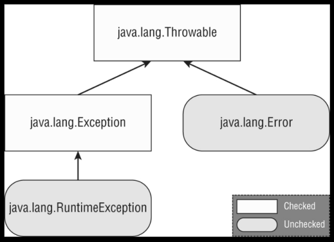
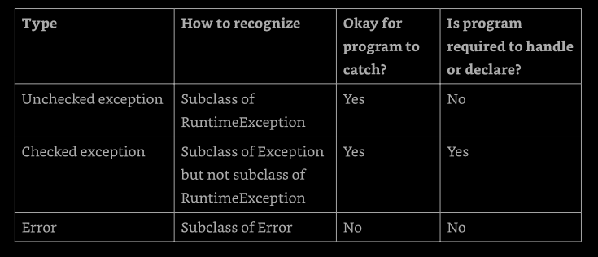
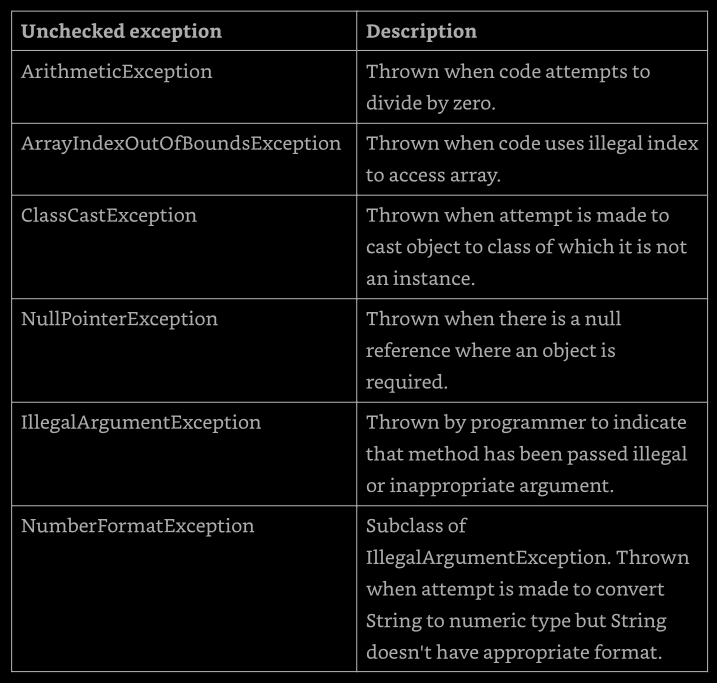
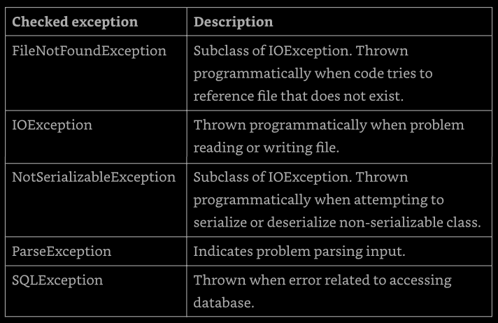

# Chapter 11: Exceptions and Localization

**Handling Exceptions**: Handle exception using try/cath/finally, 
try-with-resources, and multi-catch blocks, including exceptions

**Implementing Localization**: implement localization 
using locales, resource bundles, parse and format messages, dates, times, and numbers 
including currency and percentage values.


This chapter is about creating applications to adapt to change. What happens if a user 
enter invalid data on a web page? What if out connection to a database goes down in the 
middle of a sale? Finally, how do we build applications that can support multiple 
language or geographic regions?


In this chapter, we discuss these problems and solutions to them using exceptions, 
formatting, and localization. One way to make sure our applications respond to change 
is to build in support early on. For example, supporting localization doesn't mean we 
actually need to support specific languages right away. It just means our application 
can be more easily adapted in the future. This chapter provides structure for designing 
application that better adapt to change.

[Understanding Exceptions](#understanding-exceptions)

[Recognizing Exception Classe](#recognizing-exception-classes)

[Handling Exceptions](#handling-exceptions)

[Automating Resource Management](#automating-resource-management)

[Formatting Values](#formatting-values)

[Supporting Internalization and Localization](#support-internalization-localization)

[Loading Properties with Resource Bundles](#loading-properties-resource-bundles)

[Summary](#summary)


## Understanding Exceptions

A program can fail for just about any reason. Here are just a few possibilities:
- The code tries tro connect to a website, but the internet connection is down.
- We made a coding mistake and tried to access an invalid index in an array
- One method calls another with a value that the method doesn't support. 

As we can see, some of these are coding mistakes. Other are completely beyond our 
control. Our program cant't help it if the internet connection goes down. What it 
_can_ do is deal with the situation.


### The Role of Exceptions

An _exception_ is a Java way of saying: "I give up. I don't know what to do right now. 
You deal with it.". When we write a method, we can either deal with the exception or 
make it the calling code's problem.

These are the two approaches Java uses when dealing with exceptions. A method can 
handle the exception case itself or make it the caller's responsibility.

---

**Return Codes vs. Exceptions**

Exceptions are used when "something goes wrong". However, the word _wrong_ is subjective. 
The following code returns -1 instead of throwing an exception if no match is found.
```
public int indexOf(String[] names, String name) {
  for (int i = 0; i < names.length; i++) {
    if (names[i].equals(name)) { return i; }
  }
  return -1;
}
```

While common for certain tasks like searching, return codes should generally be avoided. 
After all, Java provided an exception framework just for these cases.

---

### Understanding Exception Types

An exception is an event that alters the program flow. Java has a `Throwable` class 
for all objects that represent these events. Not all of them have the word _exception_ 
in their class name, which can be confusing. Figure 11.1 shows the key subclasses of 
`Throwable`.



**Figure 11.1: Throwable subclasses

#### Checked Exceptions

A _checked exception_ is an exception that must be declared or handled by the 
application code where it is thrown. In Java, checked exceptions all inherit `Exception` 
but not `RuntimeException`. Checked exceptions tend to be more anticipated, for example, 
trying to read a file that doesn't exist.

Checked exceptions also include any class that inherits `Throwable` but not `Error` or 
`RuntimeException`, such as a class that direct extends `Throwable`. We just need to 
know about checked exceptions that extend `Exception`.

What we check with checked exceptions? Java has a rule called _the handle or declare_ 
_rule_. This rule means that all checked exceptions that could be thrown within a method 
are either wrapped in a compatible try and catch blocks or declared in the method signature.

Because checked exceptions tend to be anticipated, Java enforces the rule that the 
programmer must do something to show that the exception was thought about. Maybe it was 
handled in the method. Or maybe the method declares that it can't handle the exception 
and someone else should.

Let's take an example. The following `fall()` method declares that it might throw an 
`IOException`, which is a checked exception.
```
void fall(int distance) throws IOException {
  if (distance > 10) {
    thrown new IOException();
  }
}
```

There are two keywords to express the situation. The `throw` keyword tells Java 
that we want to throw an `Exception`, while the `throws` keyword simply declares that  
the method might thrown an `Exception`. It also might not.

The following alternate version of the `fall()` method handles the exception:
```
void fall(int distance) {
  try {
    if (distance > 10) {
      throw new IOException();
    }
  } catch (Exception e) {
    e.printStackTrace();
  }
}
```

Notice that the catch statement uses `Exception` not `IOException`. Since `IOException` 
is a subclass of `Exception`, the catch block is allowed to catch it. The try and catch 
block will be cover in more detail later in this chapter.

#### Unchecked Exceptions

An _unchecked exception_ is any exception that does not need to be declared or handled 
by the application code where it is thrown. Unchecked exceptions are often referred to 
as _runtime exceptions_, although in Java, unchecked exceptions include any class that 
inherits `RuntimeException` or `Error`.

---

It is permissible to handle or declare an unchecked exception. That said, it is 
better to document the unchecked exceptions callers should know about in a Javadoc 
comment rather that declaring an unchecked exception

---

A _runtime exception_ is defined as the `RuntimeException` class and its subclasses. 
Runtime exception tend to be unexpected but not necessarily fatal. For example, accessing 
an invalid array index is unexpected. Even though they do inherit the `Exception` class, 
they are not checked exceptions.

an unchecked exception can occur on nearly any line of code, so it is not required 
to be handled or declared. For example, a `NullPointerException` can be thrown in the 
body of the following method if the input reference is null:
```
void fall(String input) {
  System.out.println(input.toLowerCase());
}
```

We work with object in Java so frequently that a `NullPointerException` can happen 
almost anywhere. If we had to declare unchecked exceptions everywhere, every single 
method would have that clutter. The code will compile if we declare an unchecked 
exception. However, it is redundant.


#### Error and Throwable

Error means something went so horrible that our program should not attempt to recover 
from it. For example, the disk drive "disappeared" or the program ran out of memory. 
These are abnormal conditions that we aren't likely to encounter an cannot recover from.

Commonly, the only thing we need to know about `Throwable` is that it is the parent 
class of all exceptions, including the `Error` class. While we _can_ handle `Throwable` 
and `Error` exceptions, it is not recommended to us do so in our applications.


#### Reviewing Exception Types

We need to know very closely the exceptions on Table 11.1, never forgetting that 
`Throwable` is either an `Exception` or an `Error`.

**Table 11.1: Types of exceptions and errors**




### Throwing an Exception

Any Java code can throw an exception; this includes code wrote by our own. Some 
exceptions are provided with Java. We might encounter an exception that was made up 
just for one situation. This is legal. For example, this is a valid exception name: 
`MyMadeUpException` is clearly an exception. The Java conventions demand that all 
exceptions classes have the word "Exception" in their names.

There are two types of code that can thrown exceptions. First are code that are wrong:
```
String[] animals = new String[0];
System.out.println(animals[0]);      // ArrayIndexOutOfBoundsException
```

This code throws an `ArrayIndexOutOfBoundsException` since the array has no elements. 
That means that questions about exceptions can be hidden in questions that appear to 
be about something else.

---

Some questions have a choice about not compiling and about throwing an exception. 
Special attention is required on code that call a method on a null reference or that 
references an invalid array or List index. If we spot this, now we know that the 
correct answer is that the code throws an exception at runtime

---

The second way for code to result in an exception is to explicitly request java to 
throw one. Java lets us to write statements like these:
```
throw new Exception();
throw new Exception("Ow! I fell.");
throw new RuntimeException();
throw new RuntimeException("Ow! I fell.");
```

The `throw` keyword tells java that we want some other part ot the code to deal 
with the exception. When creating an exception, we can usually pass a `String` 
parameter with a message, or we can pass no parameters and use the defaults. We 
say _usually_ because this is a convention. Someone has declared a constructor 
that takes a `String`. Someone could also create an exception class that does 
not have a constructor that takes a message.

Additionally, we should known that an `Exception` is an `Object`. This means we 
can store it in an object reference, so this is legal:
```
var e = new RuntimeException();
throw e;
```

The code instantiates an exception on one line and then throws on the next. The 
exception can come from anywhere, even passed into a method. As long as it is a 
valid exception, it can be thrown.

Why this code does not compile?
```
3: try {
4:   throw new RuntimeException();
5:   throw ne ArrayIndexOutOfBoundsException();     // does not compile
6: } catch (Exception e) { }
```

Since line 4 throws an exception, line 5 can never be reached during runtime. The 
compiles recognizes this and reports an unreachable code error.


### Calling Methods that Throw Exceptions

When we are calling a method that throws an exception, the rules are the sames as 
within a method. Why the following code doesn't compile?
```
class NoMoreCarrotsException extends Exception {}

---
public class Bunny {
  public static void main(String[] args) {
    eatCarrot();    // does not compile
  }

  private static void eatCarrot() throws NoMoreCarrotsException {}
}
```

The problem is that `NoMoreCarrotException` is a checked exception. Checked exceptions 
must be handled or declared. The code would compile if we changed the `main()` method 
to either of these:
```
public static void main(String[] args) throws NoMoreCarrotException {
  eatCarrot()
}

---

public static void main(String[] args) {
  try {
    eatCarrot();
  } catch (NoMoreCarrotException e) { 
    System.out.println("sad rabbit");
  }
}
```

We have to notice that `eatCarrot()` didn't throw an exception; it just declared 
that it could. This is enough for the compiler to require the caller to handle or 
declare the exception.

The compiler is still on the lookout for unreachable code. Declaring an unused 
exception isn't considered unreachable code. It gives the method the option to 
change the implementation to throw that that exception in the future.

What is the problem here?
```
public void bad() {
  try {
    eatCarrot();
  } catch (NoMoreCarrotException e) {     // does not compile
    System.out.println();
  }
}

private void eatCarrot() {}
```

Java knows that `eatCarrot()` can't throw a checked exception, which means there 
is no way for the catch block in `bad()` to be reachable.

When wee see a checked exception declared inside a catch block, we need to make 
sure that the code in the associated try block is capable of throwing the exception 
or a subclass of the exception. If not, the code is unreachable and does not compile. 
This rule does not extend to unchecked exceptions or exceptions declared in a 
method signature.

### Overriding Methods with Exceptions

In chapter 6 we saw a rule that says: an overridden method may not declare any 
new or broader checked exceptions than the method it inherits. For example, this 
code is not allowed:
```
class CanNotHopException extends Exception {}
---

class Hopper {
  public void hop() {}
}
---

class Bunny extends Hopper {
  public void hop() throws CanNotHopException {}     // does not compile
}
```

Java knows `hop()` isn't allowed to thrown any checked exceptions because the 
`hop()` method in the superclass `Hopper` doesn't declare any. If this was allowed, 
we could write code that calls Hopper's `hop()` version of the method and not handle 
any exceptions. Then, if `Bunny` were used in its place, the code wouldn't know 
to handle or declare `CanNotHopException`.

An overridden method in a subclass is allowed to declare fewer exceptions than the 
superclass or interface. This is legal because callers are already handling them.
```
class Hopper {
  public void hop() throws CanNotHopException {}
}
---

class Bunny extends Hopper {
  public void hop() {}    // this is fine
}
```

An overridden method not declaring on of the exceptions thrown by the parent 
method is similar to the method declaring that it throws an exception it never 
actually throws. This is perfectly legal. Similarly, a class is allowed to declare 
a subclass of an exception type. The idea is the same. The superclass or interface 
has already taken care of a broader type.


### Printing an Exception

There are three ways to print an exception. We can let Java print it out, print 
just the message, or print where the stack trace comes from. This example shows 
all three approaches.
```
05: public static void main(String[] args) {
06:   try {
07:     hop();
08:   } catch (Exception e) {
09:     System.out.println(e + "\n");
10:     System.out.println(e.getMessage() + "\n");
11:     e.printStackTrace();
12:   }
13: }
14: private static void hop() {
15:   throw new RuntimeException("cannot hop");
16: }
```

This code prints the following:
```
java.lang.RuntimeException: cannot hop

cannot hop

java.lang.RuntimeException: cannot hop
  at Handling.hop(Handling.java:15)
  at Handling.main(Handling.java:7)
```

The first line shows what Java prints out by default: the exception type and message. 
The second line shows just the message. The rest shows a stack trace. The stack trace 
is usually the most helpful because it shows the hierarchy of method calls were made 
to reach the line that threw the exception.

[back to top](#chapter-11-exceptions-and-localization)


## Recognizing Exception Classes

We need to recognize three groups of exceptions: RuntimeException, checked exceptions, 
and Error. We will look at common examples of each type. We need to recognize which which 
type of an exception it is and whether it's thrown by the JVM or by a programmer. For 
some exceptions, we also need to know which are inherited from one another.

### _RuntimeException_ classes

RuntimeException and its subclasses are unchecked exceptions that don't have to be 
handled or declared. They can be thrown by the programmer o the JVM. Common unchecked 
exceptions class are listed in Table 11.2.

**Table 11.2: Unchecked exceptions**




**ArithmeticException**

Trying to divide an `int` by zero gives an undefined result. When this occurs, 
the JVM will throw an `ArithmeticException`:
```
int answer = 11 / 0;
```

Running this code results in the following output:
```
Exception in thread "main" java.lang.ArithmeticException: / by zero
```

Java doesn't spell out the word _divide__. That's okay, though, because we know that 
/ is the division operator and that Java is trying to tell us division by zero occurred.

The thread "main" is telling us the code was called directly or indirectly from a program 
with a `main` method. On the exam, this is all the output we will see. Next comes the name 
of the exception, followed by extra information (if any) that goes with the exception.


**ArrayIndexOutOfBoundsException**

We know by now that array indexes start with 0 and go up to 1 less than the length 
of the array, which means this code will throw an `ArrayIndexOutOfBoundsException`:
```
int[] countsOfMoose = new int[3];
System.out.println(countsOfMoose[-1]);
```

This is a problem because there's no such thing as a negative array index. Running 
this code yields the following output:
```
Exception in thread "main" java.lang.ArrayIndexOutOfBoundsException: Index - 1 out 
of bounds for length 3
```


**ClassCastException**

Java tries to protect us from impossible casts. This code doesn't compile because 
`Integer`is not a subclass of `String`:
```
String type = "moose";
Integer number = (Integer) type;     // does not compile
```

More complicated code thwarts Java's attempts to protects us. When the cast fails 
at runtime, Java will throws a `ClassCastException`:
```
String type = "moose";
Object obj = type;
Integer number = (Integer) obj;      // ClassCastException
```

The compiler sees a cast from `Object` to `Integer`. This could by okay. The 
compiler doesn't realize there's a `String` in that `Object`. When the code runs, 
it yields the following output:
```
Exception in thread "main" java.lang.ClassCastException: java.base/java.lang.String 
cannot be cast to java.lang.base/java.lang.Integer
```

Java tells us both types that were involved in the problem, making it apparent 
what's wrong.


**NullPointerException**

Instance variables and methods must be called on a non-null reference. If the 
reference is null, the JVM will throw a `NullPointerException`.
```
1: public class Frog {
2:   public void hop(String name, Integer jump) {
3:     System.out.println(name.toLowerCase() + " " + jump.intValue());
4:   }
5: 
6:   public static void main(String[] args) {
7:     new Frog().hop(null, 1);
8:   }
9: }
```

Running this code results in the following output:
```
Exception in thread "main" java.lang.NullPointerException: Cannot invoke 
  "String.toLowerCase()" because "<parameter1>" is null
```

The JVM tells us _the object reference_ that triggered the `NullPointerException`.
I we change the line 7 to:
```
7:     new Frog().hop("Kermit", null);
```

Then the output ant runtime changes as follows:
```
Exception in thread "main" java.lang.NullPointerException: Cannot invoke 
  "java.lang.Integer.intValue()" because "<parameter2>" is null
```


**IllegalArgumentException**

`IllegalARgumentException` is a way for our programs to protect itself. We want 
to tell the caller that something is wrong, preferably in an obvious way that the 
caller can't ignore so the programmer will fix the problem. Seeing the code end with 
an exception is a great reminder that something is wrong. Consider this example 
when called as `setNumberEggs(-2)`:
```
public void setNumberEggs(int numberEggs) {
  if (numberEggs < 0)
    throw new IllegalArgumentException("# eggs must no be negative");
  this.numberEggs = numberEggs;
}
```

The program throws an exception when it's not happy with the parameter values 
the output looks like this:
```
Exception in thread "main" 
  java.lang.IllegalArgumentException: # eggs must no be negative
```

Clearly, this is a problem that must be fixed if the programmer wants the program 
to do anything useful.


**NumberFormatException**

Java provides methods to convert strings to numbers. When these are passed an 
invalid value, they throw a `NumberFormatException`. The idea is similar to 
`IllegalArgumentException`. Since this is a common problem, Java gives it a separate 
class. In fact, `NumberFormatException`is a subclass of `IllegalArgumentException`. 
Here's an example of trying to convert something non-numeric into an `int`.
```
Integer.parseInt("abc");
```

The output looks like this:
```
Exception in thread "main"
  java.lang.NumberFormatException: For input string: "abc"
```

We need to know that `NumberFormatException` is a subclass of `IllegalArgumentException`. 
Later in this chapter we'll see why that is important.


### Checked _Exception_ Classes

Checked exceptions have `Exception` in their hierarchy but not `RuntimeException`. 
They mus be handled or declared. Common checked exception are listed in Table 11.3.

**Table 11.3: Checked exceptions**




We need to know that these are all checked exceptions that must be handled or declared. 
We also need to known that `FileNoFoundException` and `NotSerializableException` are 
subclasses of `IOException`. 


### _Error_ Classes

Errors are unchecked exceptions that extend the `Error` class. They are thrown by 
the JVM and should no be handled or declared. Errors are rare, but we might see the 
ones listed in Table 11.4.

**Table 11.4: Error**


We just need to know that these errors are unchecked and the code if often unable 
to recover from them.

[back to top](#chapter-11-exceptions-and-localization)


## Handling Exceptions