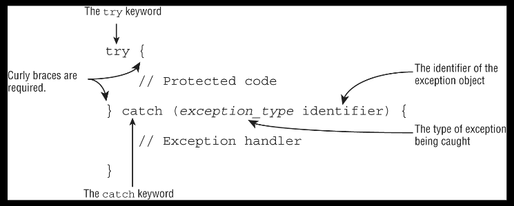
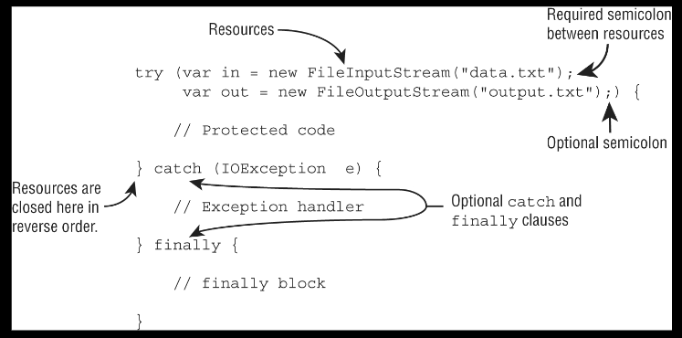
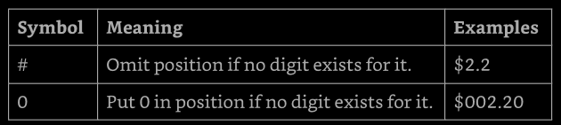
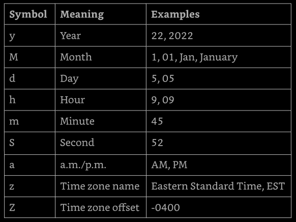
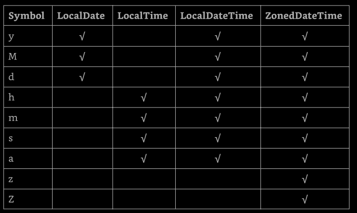

# Chapter 11: Exceptions and Localization

**Handling Exceptions**: Handle exception using try/cath/finally, 
try-with-resources, and multi-catch blocks, including exceptions

**Implementing Localization**: implement localization 
using locales, resource bundles, parse and format messages, dates, times, and numbers 
including currency and percentage values.


This chapter is about creating applications to adapt to change. What happens if a user 
enter invalid data on a web page? What if out connection to a database goes down in the 
middle of a sale? Finally, how do we build applications that can support multiple 
language or geographic regions?


In this chapter, we discuss these problems and solutions to them using exceptions, 
formatting, and localization. One way to make sure our applications respond to change 
is to build in support early on. For example, supporting localization doesn't mean we 
actually need to support specific languages right away. It just means our application 
can be more easily adapted in the future. This chapter provides structure for designing 
application that better adapt to change.

[Understanding Exceptions](#understanding-exceptions)

[Recognizing Exception Classe](#recognizing-exception-classes)

[Handling Exceptions](#handling-exceptions)

[Automating Resource Management](#automating-resource-management)

[Formatting Values](#formatting-values)

[Supporting Internalization and Localization](#support-internalization-localization)

[Loading Properties with Resource Bundles](#loading-properties-resource-bundles)

[Summary](#summary)


## Understanding Exceptions

A program can fail for just about any reason. Here are just a few possibilities:
- The code tries tro connect to a website, but the internet connection is down.
- We made a coding mistake and tried to access an invalid index in an array
- One method calls another with a value that the method doesn't support. 

As we can see, some of these are coding mistakes. Other are completely beyond our 
control. Our program cant't help it if the internet connection goes down. What it 
_can_ do is deal with the situation.


### The Role of Exceptions

An _exception_ is a Java way of saying: "I give up. I don't know what to do right now. 
You deal with it.". When we write a method, we can either deal with the exception or 
make it the calling code's problem.

These are the two approaches Java uses when dealing with exceptions. A method can 
handle the exception case itself or make it the caller's responsibility.

---

**Return Codes vs. Exceptions**

Exceptions are used when "something goes wrong". However, the word _wrong_ is subjective. 
The following code returns -1 instead of throwing an exception if no match is found.
```
public int indexOf(String[] names, String name) {
  for (int i = 0; i < names.length; i++) {
    if (names[i].equals(name)) { return i; }
  }
  return -1;
}
```

While common for certain tasks like searching, return codes should generally be avoided. 
After all, Java provided an exception framework just for these cases.

---

### Understanding Exception Types

An exception is an event that alters the program flow. Java has a `Throwable` class 
for all objects that represent these events. Not all of them have the word _exception_ 
in their class name, which can be confusing. Figure 11.1 shows the key subclasses of 
`Throwable`.


**Figure 11.1: Throwable subclasses

#### Checked Exceptions

A _checked exception_ is an exception that must be declared or handled by the 
application code where it is thrown. In Java, checked exceptions all inherit `Exception` 
but not `RuntimeException`. Checked exceptions tend to be more anticipated, for example, 
trying to read a file that doesn't exist.

Checked exceptions also include any class that inherits `Throwable` but not `Error` or 
`RuntimeException`, such as a class that direct extends `Throwable`. We just need to 
know about checked exceptions that extend `Exception`.

What we check with checked exceptions? Java has a rule called _the handle or declare_ 
_rule_. This rule means that all checked exceptions that could be thrown within a method 
are either wrapped in a compatible try and catch blocks or declared in the method signature.

Because checked exceptions tend to be anticipated, Java enforces the rule that the 
programmer must do something to show that the exception was thought about. Maybe it was 
handled in the method. Or maybe the method declares that it can't handle the exception 
and someone else should.

Let's take an example. The following `fall()` method declares that it might throw an 
`IOException`, which is a checked exception.
```
void fall(int distance) throws IOException {
  if (distance > 10) {
    thrown new IOException();
  }
}
```

There are two keywords to express the situation. The `throw` keyword tells Java 
that we want to throw an `Exception`, while the `throws` keyword simply declares that  
the method might thrown an `Exception`. It also might not.

The following alternate version of the `fall()` method handles the exception:
```
void fall(int distance) {
  try {
    if (distance > 10) {
      throw new IOException();
    }
  } catch (Exception e) {
    e.printStackTrace();
  }
}
```

Notice that the catch statement uses `Exception` not `IOException`. Since `IOException` 
is a subclass of `Exception`, the catch block is allowed to catch it. The try and catch 
block will be cover in more detail later in this chapter.

#### Unchecked Exceptions

An _unchecked exception_ is any exception that does not need to be declared or handled 
by the application code where it is thrown. Unchecked exceptions are often referred to 
as _runtime exceptions_, although in Java, unchecked exceptions include any class that 
inherits `RuntimeException` or `Error`.

---

It is permissible to handle or declare an unchecked exception. That said, it is 
better to document the unchecked exceptions callers should know about in a Javadoc 
comment rather that declaring an unchecked exception

---

A _runtime exception_ is defined as the `RuntimeException` class and its subclasses. 
Runtime exception tend to be unexpected but not necessarily fatal. For example, accessing 
an invalid array index is unexpected. Even though they do inherit the `Exception` class, 
they are not checked exceptions.

an unchecked exception can occur on nearly any line of code, so it is not required 
to be handled or declared. For example, a `NullPointerException` can be thrown in the 
body of the following method if the input reference is null:
```
void fall(String input) {
  System.out.println(input.toLowerCase());
}
```

We work with object in Java so frequently that a `NullPointerException` can happen 
almost anywhere. If we had to declare unchecked exceptions everywhere, every single 
method would have that clutter. The code will compile if we declare an unchecked 
exception. However, it is redundant.


#### Error and Throwable

Error means something went so horrible that our program should not attempt to recover 
from it. For example, the disk drive "disappeared" or the program ran out of memory. 
These are abnormal conditions that we aren't likely to encounter an cannot recover from.

Commonly, the only thing we need to know about `Throwable` is that it is the parent 
class of all exceptions, including the `Error` class. While we _can_ handle `Throwable` 
and `Error` exceptions, it is not recommended to us do so in our applications.


#### Reviewing Exception Types

We need to know very closely the exceptions on Table 11.1, never forgetting that 
`Throwable` is either an `Exception` or an `Error`.

**Table 11.1: Types of exceptions and errors**


### Throwing an Exception

Any Java code can throw an exception; this includes code wrote by our own. Some 
exceptions are provided with Java. We might encounter an exception that was made up 
just for one situation. This is legal. For example, this is a valid exception name: 
`MyMadeUpException` is clearly an exception. The Java conventions demand that all 
exceptions classes have the word "Exception" in their names.

There are two types of code that can thrown exceptions. First are code that are wrong:
```
String[] animals = new String[0];
System.out.println(animals[0]);      // ArrayIndexOutOfBoundsException
```

This code throws an `ArrayIndexOutOfBoundsException` since the array has no elements. 
That means that questions about exceptions can be hidden in questions that appear to 
be about something else.

---

Some questions have a choice about not compiling and about throwing an exception. 
Special attention is required on code that call a method on a null reference or that 
references an invalid array or List index. If we spot this, now we know that the 
correct answer is that the code throws an exception at runtime

---

The second way for code to result in an exception is to explicitly request java to 
throw one. Java lets us to write statements like these:
```
throw new Exception();
throw new Exception("Ow! I fell.");
throw new RuntimeException();
throw new RuntimeException("Ow! I fell.");
```

The `throw` keyword tells java that we want some other part ot the code to deal 
with the exception. When creating an exception, we can usually pass a `String` 
parameter with a message, or we can pass no parameters and use the defaults. We 
say _usually_ because this is a convention. Someone has declared a constructor 
that takes a `String`. Someone could also create an exception class that does 
not have a constructor that takes a message.

Additionally, we should known that an `Exception` is an `Object`. This means we 
can store it in an object reference, so this is legal:
```
var e = new RuntimeException();
throw e;
```

The code instantiates an exception on one line and then throws on the next. The 
exception can come from anywhere, even passed into a method. As long as it is a 
valid exception, it can be thrown.

Why this code does not compile?
```
3: try {
4:   throw new RuntimeException();
5:   throw ne ArrayIndexOutOfBoundsException();     // does not compile
6: } catch (Exception e) { }
```

Since line 4 throws an exception, line 5 can never be reached during runtime. The 
compiles recognizes this and reports an unreachable code error.


### Calling Methods that Throw Exceptions

When we are calling a method that throws an exception, the rules are the sames as 
within a method. Why the following code doesn't compile?
```
class NoMoreCarrotsException extends Exception {}

---
public class Bunny {
  public static void main(String[] args) {
    eatCarrot();    // does not compile
  }

  private static void eatCarrot() throws NoMoreCarrotsException {}
}
```

The problem is that `NoMoreCarrotException` is a checked exception. Checked exceptions 
must be handled or declared. The code would compile if we changed the `main()` method 
to either of these:
```
public static void main(String[] args) throws NoMoreCarrotException {
  eatCarrot()
}

---

public static void main(String[] args) {
  try {
    eatCarrot();
  } catch (NoMoreCarrotException e) { 
    System.out.println("sad rabbit");
  }
}
```

We have to notice that `eatCarrot()` didn't throw an exception; it just declared 
that it could. This is enough for the compiler to require the caller to handle or 
declare the exception.

The compiler is still on the lookout for unreachable code. Declaring an unused 
exception isn't considered unreachable code. It gives the method the option to 
change the implementation to throw that that exception in the future.

What is the problem here?
```
public void bad() {
  try {
    eatCarrot();
  } catch (NoMoreCarrotException e) {     // does not compile
    System.out.println();
  }
}

private void eatCarrot() {}
```

Java knows that `eatCarrot()` can't throw a checked exception, which means there 
is no way for the catch block in `bad()` to be reachable.

When wee see a checked exception declared inside a catch block, we need to make 
sure that the code in the associated try block is capable of throwing the exception 
or a subclass of the exception. If not, the code is unreachable and does not compile. 
This rule does not extend to unchecked exceptions or exceptions declared in a 
method signature.

### Overriding Methods with Exceptions

In chapter 6 we saw a rule that says: an overridden method may not declare any 
new or broader checked exceptions than the method it inherits. For example, this 
code is not allowed:
```
class CanNotHopException extends Exception {}
---

class Hopper {
  public void hop() {}
}
---

class Bunny extends Hopper {
  public void hop() throws CanNotHopException {}     // does not compile
}
```

Java knows `hop()` isn't allowed to thrown any checked exceptions because the 
`hop()` method in the superclass `Hopper` doesn't declare any. If this was allowed, 
we could write code that calls Hopper's `hop()` version of the method and not handle 
any exceptions. Then, if `Bunny` were used in its place, the code wouldn't know 
to handle or declare `CanNotHopException`.

An overridden method in a subclass is allowed to declare fewer exceptions than the 
superclass or interface. This is legal because callers are already handling them.
```
class Hopper {
  public void hop() throws CanNotHopException {}
}
---

class Bunny extends Hopper {
  public void hop() {}    // this is fine
}
```

An overridden method not declaring on of the exceptions thrown by the parent 
method is similar to the method declaring that it throws an exception it never 
actually throws. This is perfectly legal. Similarly, a class is allowed to declare 
a subclass of an exception type. The idea is the same. The superclass or interface 
has already taken care of a broader type.


### Printing an Exception

There are three ways to print an exception. We can let Java print it out, print 
just the message, or print where the stack trace comes from. This example shows 
all three approaches.
```
05: public static void main(String[] args) {
06:   try {
07:     hop();
08:   } catch (Exception e) {
09:     System.out.println(e + "\n");
10:     System.out.println(e.getMessage() + "\n");
11:     e.printStackTrace();
12:   }
13: }
14: private static void hop() {
15:   throw new RuntimeException("cannot hop");
16: }
```

This code prints the following:
```
java.lang.RuntimeException: cannot hop

cannot hop

java.lang.RuntimeException: cannot hop
  at Handling.hop(Handling.java:15)
  at Handling.main(Handling.java:7)
```

The first line shows what Java prints out by default: the exception type and message. 
The second line shows just the message. The rest shows a stack trace. The stack trace 
is usually the most helpful because it shows the hierarchy of method calls were made 
to reach the line that threw the exception.

[back to top](#chapter-11-exceptions-and-localization)


## Recognizing Exception Classes

We need to recognize three groups of exceptions: RuntimeException, checked exceptions, 
and Error. We will look at common examples of each type. We need to recognize which which 
type of an exception it is and whether it's thrown by the JVM or by a programmer. For 
some exceptions, we also need to know which are inherited from one another.

### _RuntimeException_ classes

RuntimeException and its subclasses are unchecked exceptions that don't have to be 
handled or declared. They can be thrown by the programmer o the JVM. Common unchecked 
exceptions class are listed in Table 11.2.

**Table 11.2: Unchecked exceptions**


**ArithmeticException**

Trying to divide an `int` by zero gives an undefined result. When this occurs, 
the JVM will throw an `ArithmeticException`:
```
int answer = 11 / 0;
```

Running this code results in the following output:
```
Exception in thread "main" java.lang.ArithmeticException: / by zero
```

Java doesn't spell out the word _divide__. That's okay, though, because we know that 
/ is the division operator and that Java is trying to tell us division by zero occurred.

The thread "main" is telling us the code was called directly or indirectly from a program 
with a `main` method. On the exam, this is all the output we will see. Next comes the name 
of the exception, followed by extra information (if any) that goes with the exception.


**ArrayIndexOutOfBoundsException**

We know by now that array indexes start with 0 and go up to 1 less than the length 
of the array, which means this code will throw an `ArrayIndexOutOfBoundsException`:
```
int[] countsOfMoose = new int[3];
System.out.println(countsOfMoose[-1]);
```

This is a problem because there's no such thing as a negative array index. Running 
this code yields the following output:
```
Exception in thread "main" java.lang.ArrayIndexOutOfBoundsException: Index - 1 out 
of bounds for length 3
```


**ClassCastException**

Java tries to protect us from impossible casts. This code doesn't compile because 
`Integer`is not a subclass of `String`:
```
String type = "moose";
Integer number = (Integer) type;     // does not compile
```

More complicated code thwarts Java's attempts to protects us. When the cast fails 
at runtime, Java will throws a `ClassCastException`:
```
String type = "moose";
Object obj = type;
Integer number = (Integer) obj;      // ClassCastException
```

The compiler sees a cast from `Object` to `Integer`. This could by okay. The 
compiler doesn't realize there's a `String` in that `Object`. When the code runs, 
it yields the following output:
```
Exception in thread "main" java.lang.ClassCastException: java.base/java.lang.String 
cannot be cast to java.lang.base/java.lang.Integer
```

Java tells us both types that were involved in the problem, making it apparent 
what's wrong.


**NullPointerException**

Instance variables and methods must be called on a non-null reference. If the 
reference is null, the JVM will throw a `NullPointerException`.
```
1: public class Frog {
2:   public void hop(String name, Integer jump) {
3:     System.out.println(name.toLowerCase() + " " + jump.intValue());
4:   }
5: 
6:   public static void main(String[] args) {
7:     new Frog().hop(null, 1);
8:   }
9: }
```

Running this code results in the following output:
```
Exception in thread "main" java.lang.NullPointerException: Cannot invoke 
  "String.toLowerCase()" because "<parameter1>" is null
```

The JVM tells us _the object reference_ that triggered the `NullPointerException`.
I we change the line 7 to:
```
7:     new Frog().hop("Kermit", null);
```

Then the output ant runtime changes as follows:
```
Exception in thread "main" java.lang.NullPointerException: Cannot invoke 
  "java.lang.Integer.intValue()" because "<parameter2>" is null
```


**IllegalArgumentException**

`IllegalARgumentException` is a way for our programs to protect itself. We want 
to tell the caller that something is wrong, preferably in an obvious way that the 
caller can't ignore so the programmer will fix the problem. Seeing the code end with 
an exception is a great reminder that something is wrong. Consider this example 
when called as `setNumberEggs(-2)`:
```
public void setNumberEggs(int numberEggs) {
  if (numberEggs < 0)
    throw new IllegalArgumentException("# eggs must no be negative");
  this.numberEggs = numberEggs;
}
```

The program throws an exception when it's not happy with the parameter values 
the output looks like this:
```
Exception in thread "main" 
  java.lang.IllegalArgumentException: # eggs must no be negative
```

Clearly, this is a problem that must be fixed if the programmer wants the program 
to do anything useful.


**NumberFormatException**

Java provides methods to convert strings to numbers. When these are passed an 
invalid value, they throw a `NumberFormatException`. The idea is similar to 
`IllegalArgumentException`. Since this is a common problem, Java gives it a separate 
class. In fact, `NumberFormatException`is a subclass of `IllegalArgumentException`. 
Here's an example of trying to convert something non-numeric into an `int`.
```
Integer.parseInt("abc");
```

The output looks like this:
```
Exception in thread "main"
  java.lang.NumberFormatException: For input string: "abc"
```

We need to know that `NumberFormatException` is a subclass of `IllegalArgumentException`. 
Later in this chapter we'll see why that is important.


### Checked _Exception_ Classes

Checked exceptions have `Exception` in their hierarchy but not `RuntimeException`. 
They mus be handled or declared. Common checked exception are listed in Table 11.3.

**Table 11.3: Checked exceptions**


We need to know that these are all checked exceptions that must be handled or declared. 
We also need to known that `FileNoFoundException` and `NotSerializableException` are 
subclasses of `IOException`. 


### _Error_ Classes

Errors are unchecked exceptions that extend the `Error` class. They are thrown by 
the JVM and should no be handled or declared. Errors are rare, but we might see the 
ones listed in Table 11.4.

**Table 11.4: Error**


We just need to know that these errors are unchecked and the code if often unable 
to recover from them.

[back to top](#chapter-11-exceptions-and-localization)


## Handling Exceptions

What do we do when us encounter a exception? How do we handle or recover from the 
exception?. I this section, we will see the various statements in Java that support 
handling exceptions

### Using _try_ and _catch_ Statements

Java uses a try statement to separate the logic that might throw an exception from 
the logic to handle the exception. Figure 11.2 shows the syntax of a _try statement_.


**Figure 11.2: try statement syntax**

The code in the _try block_  in run normally. If any of the statements throws an 
exception that can be caught by the exception type listed in the _catch block_, the 
try block stops running, and execution goes to the catch statement. If none of the 
statements in the try block throws an exception that cab be caught, the _catch clause_ 
will not run. Catch block or catch clause are used interchangeable in Java.

The curly braces are required for tye and catch blocks. 
```
03: void explore() {
04:   try {
05:     fall();
06:     System.out.println("never get here. unreachable.");
07:   } catch (RuntimeException e) {
08:     getUp()
09:   }
10:   seeAnimals();
11: }
12: void fall() { throw new RuntimeException(); }
```

At line 5, `fall()` method was called. Line 12 throws an exception. This means 
Java jumps straight to the catch block, skipping line 6. On line 8, `getUp()` is 
called. Now the try statement is over, and execution proceeds normally with line 10.

Now let's see some invalid try statements.
```
try                       // does not compile
  fall();
catch (Exception e)
  System.out.println("get up");
```

The problem is that the braces `{}` are missing. Tye try statements are like methods 
in that the curly braces are required even if there is only one statement inside the 
code blocks, while if statements and loops are special and allow us to omit the 
curly braces.

What the problem here?
```
try {        // does not compile
  fall();
}
```

This code doesn't compile because the try block doesn't have anything after it. Since 
the try statement is for something to happen if an exception occurs, the catch statement 
is mandatory.


### Chaining _catch_ Blocks

We need to understand how  exceptions works when placed together. First we need 
to recognize if the exception is a checked exception or an unchecked exception. 
Second, we need to determine whether any of the exceptions are subclasses of the others.
```
class AnimalIsOutForAWalk extends RuntimeException {}

class ExhibitClose extends RuntimeException {}

class ExhibitClosedForLunch extends ExhibitClosed {}
```

In this example, there are three custom exceptions. All are unchecked exceptions 
because the directly or indirectly extend `RuntimeException`. Now we chain both types 
of exceptions with two catch blocks and handle them by printing out an appropriate 
message:
```
public void visitPorcupine() {
  try {
    seeAnimal();
  } catch (AnimalIsOutForAWalk e) {                  // first catch block
    System.out.println("try back later in the day")
  } catch (ExhibitClosed e) {                        // second catch block
    System.out.println("not today")
  }
}
```

There are three possibilities when this code is run. If `seeAnimal()` doesn't throw 
an exception, nothing is printed out. If the animal is out for a walk, only the first 
catch block runs. If the exhibit is closed, only the second catch block runs. It is 
not possible for both catch blocks to be executed when chained together like this.

A rule exists for the order of the catch blocks. Java looks at them in the order 
they appear. If it is impossible for one of the catch blocks to be executed, a compiler 
error about unreachable code occurs. For example, this happens when a superclass catch 
block appears before a subclass catch block. We alway have to pay attention to any 
subclass exceptions.
```
public void visitMonkeys() {
  try {
    seeAnimal();
  } catch (ExhibitClosed e) {
    System.out.println("not today")
  } catch (ExhibitClosedForLunch e) {      // does not compile
    System.out.println("try back later")
  }
}
```

If the more specific `ExhibitClosedForLunch` exception is thrown, the catch block 
for `ExhibitClosed` runs, which means there is no way for the second catch block to 
ever run. Java correctly tells us there is an unreachable catch block.


### Applying a Multi-catch Block

often, we want the result of an exception that is thrown to be the same, regardless 
of which particular exception is thrown. A multi-catch block allows multiple exception 
type to be caught by the same catch block:
```
public stat void main(String[] args) {
  try { 
    System.out.println(Integer.parseInt(args[1]));
  } catch (ArrayIndexOutOfBoundsException | NumberFormatException e) {
    System.out.println("Missing or invalid input");
  } catch (Exception e) {
    System.out.println("Handling other exceptions not caught on first catch");
  }
}
```

There's no duplicate code, the common logic is all in one place, and the logic is 
exactly where we would expect to find it. If we wanted, we could still have a second 
catch block for `Exception` in case we want to handle other types of exceptions 
differently.

The intends of multi-catch exceptions is to be used for exceptions that aren't related, 
and it prevents us from specifying redundant types in a multi-catch. What's wrong here?
```
try {
  throw new IOException();
} catch (FileNotFoundException | IOException e) { 
  System.out.println("does not compile")
}
```

Specifying related exceptions in the multi-catch is redundant, and the compiler 
gives a message like this:
```
The exception FileNotFoundException is already caught by the alternative IOException
```

Since the `FileNotFoundException` is a subclass of `IOException`, this code will 
not compile. A multi-catch block follows rules similar to chaining catch blocks 
together, which we saw in previous section. The on difference between multi-catch 
blocks and chaining catch blocks is that the order does not matter for a 
multi-catch block within a single catch expression.


### Adding a _finally_ Block

The try statement also lets us run code at the end with a _finally clause_, 
regardless of whether an exception is thrown. There are two paths through code with 
both a `catch` and a `finally`. If an exception is thrown, the finally block is run 
after the catch block. If no exception is thrown, the finally block is run after 
the try block completes.

Let's go to an example:
```
void explore() {
  try {
    fall();
  } catch (Exception e) {
    getHugFromDaddy();
  } finally {
    seeMoreAnimal();
  }
  goHome();
}
```

...

There is on additional rule we should know for finally blocks. If a try statement 
with a finally block is entered, then the finally block will always be executed, 
regardless of whether the code completes successfully. Take a loo fa the following 
`goHome()` method. Assuming an exception may or may not be thrown on line 14, what 
are the possible values that this method could print? Also, what would the return 
value be in each case?
```
12: int goHome() {
13:   try {
14:     //
15:     System.out.print(1);
16:     return -1;
17:   } catch (Exception e) {
18:     System.out.print("2");
19:     return -2;
20:   } finally {
21:     System.out.print("3");
22:     return -3;
23:   } 
24: }
```

If an exception is not thrown on line 14, then line 15 will be executed, printing 1. 
Before the method returns, though, the finally block is executed, printing 3. If an 
exception is thrown, then lines 15 and 16 will be skipped and lines 17 to 19 will be 
executed, printing 2, followed by 3 from the finally block. While the first value 
printed may differ, the method always print 3 last since it's in the finally block.

What is the return value of the `goHome()` method? In this case, it's always -3. 
Because the finally block is executed shortly before the method completes, it 
interrupts the return statement from inside both the try and cat blocks.

---

**_System.exit()_**

There is one exception to "the finally block will always be executed" rule: Java 
defines a method that we call as `System.exit()`. It takes an integer parameter 
that represents the status code that is returned.
```
try {
  System.exit(0);
} finally {
  System.out.println("Never going to get here");    // not printed
}
```

`System.exit()` tells Java: "Stop. End the program right now.". When `System.exit()` 
is called in the try or catch block, the finally block does not run.

---

[back to to](#chapter-11-exceptions-and-localization)


## Automating Resource Management

Often our application works with files, databases, and various connection objects. 
Commonly, these external data sources are referred to as _resources_. In many cases, 
we _open_ a connection to the resource, whether it's over the network or within a 
file system. We then _read/write_ the data we want. Finally, we _close_ the resource 
to indicate that we are done with it.

What happens if we don't close a resource when we are done with it? In a short, a lot 
of bad things could happen. If we are connecting to a database, we could use up all 
available connections, meaning no one can talk to the database until our application 
release the connections. Although we commonly hear about memory leaks causing programs 
to tail, a _resource leak_ is just as bad and occurs when a program fails to release 
its connection to a resource, resulting in the resource becoming inaccessible. This 
could mean our program can no longer talk to the database or, even worse, all programs 
are unable to reach the database!


### Introducing Try-with-Resources

Let's take a look at an method that opens a file, reads the data, and closes it:
```
04: public void readFile(String file) {
05:   FileInputStream is = null;
06:   try {
07:     is = new FileInputStream("myfile.txt");
08:     // read file data
09:   } catch (IOException e) {
10:     e.printStackTrance();
11:   } finally {
12:     if (is != null) {
13:       try {
14:         is.close();
15:       } catch (IOException e2) {
16:         e2.printStackTrace();
17:       }
18:     }
19:   }
20: }
```

That's a long method. Why do we have two try and catch  blocks? Because lines 7 
and 14 both include checked `IOException` calls, and those need to be caught in 
the method or rethrown by the method. Half the lines of code in this method are 
just closing a resource. And the more resource we have, the longer code like this 
becomes. For example, we may have multiple resource that need to be closed in a 
particular order. We also don't want an exception caused ny closing one resource 
to prevent the closing of another resource.

To solve this, Java include the _try-with-resource_ statement to automatically 
close all resources in a try clause. This feature is also known as _automatically_ 
_resource management_, because Java automatically takes care of the closing.

Let's take a look at our same example using a try-with-resource statement:
```
04: public void readFile(String file) {
05:   try (FileInputStream is = new FileInputStream("myfile.txt")) {
06:     // read file data
07:   } catch (IOException e) {
08:     e.printStackTrace();
09:   }
10: }
```

Functionally, they are similar, but our new version has half as many lines. More 
importantly, though, by using a try-with-resources statement, we guarantee that as 
soon as a connection passes out of scope, Java will attempt to close it within the 
same method.

Behind the scenes, the compiler replaces a try-with-resources block with a try 
and finally block. We refer to this "hidden" finally block as an _implicit_ finally 
block since it is created an used ny the compiler automatically. We can still create 
a programmer-defined finally block when using a try-with-resources statement; we 
have just be aware that the implicit on will be called first.


### Basics of Try-with-Resources

Figure 11.5 shows what a try-with-resources statements looks like. Note that on or 
more resources can be opened in the try clause. When multiple resources are opened, 
they are closed in the _reverse_ of the order in which they were created. Also, we 
have to note that parentheses are used to list those resources, and semicolons are 
used to separate the declarations. This works just like declaring a multiple 
indexes in a for loop.



**Figure 11.5: The syntax of a basic try-with-resources statement**

What happened to the catch block in Figure 11.5? It turns out a catch block is 
options with a try-with-resources statement. For example, we can rewrite the previous 
`readFile()` example so that the method declares the exception to make it even shorter.
```
04: public void readFile(String file) throws IOException {
05:   try (FileInputStream is = new FileInputStream("myfile.txt")) {
06:     // read file data
07:   }
08: }
```

Earlier in this chapter we learned that a try statement must have one or more catch 
blocks or a finally block. A try-with-resources statement differs from a try statement 
in that neither of these is required, although a developer may add both. However, we 
need to know that the implicit finally block runs _before_ any programer-coded ones.


### Constructing Try-with-Resources Statements

ONly class that implement the `AutoClosable` interface can be used in a 
try-with-resources statement. For example, the following does not compile as `String` 
does not implement the `AutoCloseable` interface.
```
try (String reptile = "lizard") { }
```

Inheriting `AutoCloseable` requires implementing a compatible `close()` method.
```
interface AutoClosable {
  public void close() throws Exception;
}
```

This means that the implemented version of `close()` can choose to throw 
`Exception` or a subclass or not throw any exceptions at all. Throughout the rest 
of this section, we use the following custom resource class that simply prints a 
message when the `close()` method is called:
```
public class MyFileClass implements AutoCloseable {
  private final int num;
  public MyFileClass(int num) { 
    this.num = num; 
  }
  @Override 
  public void close() {
    System.out.println("Closing: " + num);
  }
}
```

#### Declaring Resources

While try-with-resources does support declaring multiple variables, each variable 
must be declared in a separate statement. For example, the following do not compile:
```
try (MyFileClass is = new MyFileClass(1),     // does not compile
      os = new FmyFileClass(2)) {
}

try (MyFileClass ab = new MyFileClass(1),     // does not compile
      MyFileClass os = New MyFileClass(2)) {
}
```

The first example does not compile because it is missing the data type, and it 
uses a comma (,) instead of a semicolon (;). The second example does not compile 
because it also uses a comma (,) instead of a semicolon (;). Each resource must 
include the data type and be separated by a semicolon (;).

We can declare a resource using `var` as the data type in a try-with-resources 
statement, since resources are local variables.
```
try (var f = new BufferedInputStream(new FileInputStream("it.txt"))) {
  // process the file
}
```

Declaring resources is a common situation where using var is quite helpful, as 
it shortens the long line of code.


#### Scope of Try-with-statement

The resources created in the try clause are in scope only within the try block. 
This is another way to remember that the implicit finally runs before any catch/finally 
bloc that we code ourself. The implicit close has run already, and the resource is no 
longer available.
```
3: try (Scanner sc = new Scanner(System.in)) {
4:   sc.nextLine();
5: } catch (Exception e) {
6:   sc.nextInt();              // does not compile
7: } finally {
8:   sc.next();                 // does not compile
9: }
```

The problem is that `Scanner` has gone out of scope at the end ot the `try` 
clause. Lines 6 and 8 do not have access to `sc` variable. We can't accidentally 
use an object that has been closed. In a traditional `try` statement, the variable 
has to be declared before the try statement so that both the `try` and `finally` 
blocks can access it, which hast the unpleasant side effect of making the variable 
in scope for the rest of the method.


#### Following Order of Operations

When working with try-with-resources statements, it is important to know that 
resources are closed in the reverse of the order in which they are created. Using 
our custom `MyClassFile`, whit this method prints?
```
public static void main(String... xyz) {
  try (MyFileClass bookReader = new MyClassFile(1);
      MyFileClass movieReader = new MyClassFile(2)) {
    System.out.print("Try block");
    throw new RuntimeException();
  } catch(Exception e) {
    System.out.println("Catch Block");
  } finally {
    System.out.println("Finally Block");
  }
}
```

The output is as follows:
```
Try Block
Closing: 2
Closing: 1
Catch Block
Finally Block
```

We have to remember that resources are closed in the reverse of the order in 
which they are declared, and the implicit finally is executed before the programer-
defined finally.


#### Applying Effectively Final

While resources are often created in the try-with-resources statement, it is 
possible to declare them ahead of time, provided tye are marked `final` or effectively 
final. The syntax uses the resource name in place of the resource declaration, separated 
by a semicolon (;). Let's try another example:
```
11: public static void main(String... args) {
12:   final var bookReader = new MyClassFile(4);
13:   MyFileClass movieReader = new MyFileClass(5);
14:   try (bookReader;
15:         var tvReader = new MyClassFile(6);
16:         movieReader) {
17:     System.out.println("Try Block")
18:   } finally {
19:     System.out.println("Finally Block");
20:   }
21: }
```

Line 12 declares a final variable `bookReader`, while line 13 declares an effectively 
final variable `movieReader`. Both of these resources can be used in a try-with-resources 
statement. We know `movieReader` is effectively final because it is a local variable that 
is assigned a value only once. The test for effectively final is that if we insert the 
`final` keyword when the variable is declared, the code still compiles.

Lines 14 and 16 use the new syntax to declare resources in a try-with-resources 
statement, using just the variable name and separating the resources with a semicolon (;). 
Line 15 uses the normal syntax for declaring a new resource within try try clause.

On execution, the code prints the following:
```
Try Block
Closing: 5
Closing: 6
Closing: 4
Finally Block
```

When we see a question with a try-with-resources statement with a variable not 
declared inside the try clause, we have to make sure that it is effectively final.
```
31: var writer = Files.newBufferedWriter(path);
31: try (writer) {                                  // does not compile
33:   writer.append("Welcome to the zoo!");
34: }
35: writer = null
```

The `writer` variable is reassigned on line 35, result in the compiler not considering 
it effectively final. Since it is not an effectively final variable, it cannot be used 
in a try-with-resource statement on line 32.

We also have to pay attention is on attempt to try accessing a resource after it has 
been closed:
```
41: var writer = Files.newBufferedWriter(path);
42: writer.append("This write is permitted but a really bad idea!");
43: try (writer) {
44:   writer.append("Welcome to the zoo");
45: }
46: writer.append("This write will fail!");         // IOException
```

This code compiles but throws an exception on line 46 with the message `Stream` 
closed. While it is possible to write to the resource before the try-with-resource 
statement, it is not afterward.


#### Understanding Suppressed Exceptions

This is probably one of the most confusing topic about exceptions. What happens 
if the `close()` method throws an exception? Lest try an example:
```
public class TurkeyCage implements AutoCloseable {
  public void close() {
    System.out.println("Close gate");
  }
  public static void main(String[] args) {
    try (var t = new TurkeyCage()) {
      System.out.println("Put turkeys in");
    }
  }
}
```

If the `TurkeyCage` doesn't close, the turkeys could all escape. Clearly, we need 
to handle such condition. We already known that the resources are closed before any 
programmer-coded catch blocks are run. This means we can catch the exception thrown 
by `close()` if we want. Alternatively, we can allow the caller to deal with it.

Let's expand our example with a new class `JammedTurkeyCage`:
```
01: public class JammedTurkeyCage implements AutoCloseable {
02:   public void close() throws IllegalStateException {
03:     throw new IllegalStateException("Cage door does not close");
04:   }
05:   public static void main(String[] args) {
06:     try (JammedTurkeyCage t = new JammedTurkeyCage()) {
07:       System.out.println("Put turkeys in");
08:     } catch (IllegalStateException e) {
09:       System.out.println("Caught: " + e.getMessage());
10:     }
11:   }
12: }
```

The `close()` method is automatically called by try-with-resources. It throws 
an exception, which is caught by out catch block and prints the following:
```
Caught: Cage door does not close
```

This seem reasonable enough. What happens if the try block also throws an exception? 
When multiple exceptions are thrown, all bu the first are called _suppressed exceptions_.
the idea is that Java treats the first exception as the primary one and tacks on any that 
come up while automatically closing.

What the following implementation of out `main()`  method outputs?
```
05: public static void main(String[] args) {
06:   try (JammedTurkeyCage t = new JammedTurkeyCage()) {
07:     throw new IllegalStateException("Turkeys ran off");
08:   } catch (IllegalStateException e) {
09:     System.out.println("Caught: " + e.getMessage());
10:     for (Throwable t : e.getSuppressed())
11:       System.out.println("Suppressed: " + t.getMessage());
12:   }
13: }
```

Line 7 throws the primary exception. At this point, the try clause ends, and 
Java automatically call the `close()` method. Line 3 of `JammedTurkeyCage` throws 
an `IllegalStateException`, which is added as a suppressed exception. Then line 8 
catches the primary exception. Line 9 prints the message for the primary exception. 
Lines 10 and 11 iterate through any suppressed exceptions and print them. The 
program prints the following:
```
Caught: Turkeys ran off
Suppressed: Cage door does not close
```

We've to keep in mind that the catch block looks for matches on the primary exception. 
What this code prints?
```
05: public static void main(String[] args) {
06:   try (JammedTurkeyCage t = new JammedTurkeyCage()) {
07:     throw new RuntimeException("Turkeys ran off");
08:   } catch (IllegalStateException e) {
09:     System.out.println("caught: " + e.getMessage());
10:   }
11: }
```

Line 7 again throws the primary exception. Java call the `close()` method and adds 
a suppressed exception. Line 8 would catch the `IllegalStateException`. However, we 
don't have one of those. The primary exception is a `RuntimeException`. Since this 
code does not match the catch clause, the exception is thrown to the caller. 
Eventually, the `main()` method would output something like the following:
```
Exception in thread "main" java.lang.RuntimeException: Turkeys ran off
  at JammedTurkeyCage.main(JammedTurkeyCage.java:7)
  Suppressed: java.lang.IllegalStateException:
    Cage door does not close
  at JammedTurkeyCage.close(JammedTurkeyCage.java:3)
  at jammedTurkeyCage.main(JammedTurkeyCage.java:8)
```

Java remembers the suppressed exceptions that go with a primary exception even if 
we don't handle them in the code.

---

If more than two resources thrown an exception, the first one to be thrown becomes 
the primary exception, and the rest are grouped as suppressed exceptions. And since 
resources are closed in the reverse of the order in which they are declared, the 
primary exception wi.l be on the last declared resource that throws an exception.

---

We also have to keep in mind that suppressed exceptions apply on to exceptions thrown 
in the try clause. The following example does not throw a suppressed exception:
```
05: public static void main(String[] args) {
06:   try (JammedTurkeyCage t = new JammedTurkeyCage()) {
07:     throw new IllegalStateException("Turkey ran off");
08:   } finally {
09:     thrown new RuntimeException(" and we couldn't find them");
10:   }
11: }
```

Line 7 throws an exception. Then Java tries to close the resource and adds a 
suppressed exception to it. Now we have a problem. The finally block runs after all 
this. Since line 9 also throws an exception, the previous exception from line 7 is 
lost, with the code printing the following:
```
Exception in thread "main" java.lang.RuntimeException:
   and we couldn't find them
  at JammedTurkeyCage.main(JammedTurkeyCage.java:9)
```

This has always been and continues to be bad programming practice. We don't want 
to lose exceptions. The reason for this hat to do with backward compatibility. This 
behavior existed before automatic resource management was added.

[back to to](#chapter-11-exceptions-and-localization)


## Formatting Values

In this section we are going to be working with numbers, dates and times. This 
is especially important in the next section when we expand customization to different 
languages and locales. Maybe now is a good point to review Chapter 4, Core API's, to 
refresh our memory on creating various date/time objects.

### Formatting Numbers

In Chapter 4 we saw how to control the output of a number using the `String.format()` 
method. That's useful for simple stuff, but sometimes we need finer-grained control. 
With that, we introduce the `NumberFormat` interface, which hat two commonly used 
methods:
```
public final String format(double number)
public final String format(long number)
```

Since `NumberFormat` is an interface, we need the concrete `DecimalFormat` class to 
use it. It includes a constructor that takes a pattern `String`:
```
public DecimalFormat(String pattern)
```

The patterns can get quite complex. But commonly we use only two of the formatting 
characters, shown in Table 11.5

**Table 11.5: DecimalFormat symbols**



These examples should help illuminate how these symbols work:
```
12: double d = 1234.567;
13: NumberFormat f1 = new DecimalFormat("###,###,###.0");
14: System.out.println(f1.format(d));                          // 1,234.6
15:
16: NumberFormat f2 = new DecimalFormat("000,000,000.00000");
17: System.out.println(f2.format(d));                         // 000,001,234.56700
18:
19: NumberFormat f3 = new DecimalFormat("Your balance $#,###,###.##");
20: System.out.println(f3.format(d));                         // Your balance $1,234.57
```

Line 14 displays the digits in the number, rounding to the nearest 10th after the 
decimal. The extra positions to the left are omitted because we used #. Line 17 adds 
leading and trailing zeros to make the output the desired length. Line 20 shows prefixing 
a non-formatting character along with rounding because fewer digits are printed than 
available. We have to note that commas are automatically removed if the are used 
between # symbols.

### Formatting Dates and Times

The date and time classes support many methods to get data out of them.
```
LocalDate date = LocalDate.of(2026, Month.SEPTEMBER, 20);
System.out.println(date.getDayOfWeek());           // SUNDAY
System.out.println(date.getMonth());               // SEPTEMBER
System.out.println(date.getYear(0));               // 2026
System.out.println(date.getDayOfYear());           // 263
```

Java provides a class called `DateTimeFormatter` to display standard formats.
```
import java.time.format.DateTimeFormatter;

LocalDate date = LocalDate.of(2026, Month.SEPTEMBER, 20);
LocalTime time = LocalTime.of(11, 12, 34);
LocalDateTime dt = LocalDateTime.of(date, time);

System.out.println(date.format(DateTimeFormatter.ISO_LOCAL_DATE));
System.out.println(time.format(DateTImeFormatter.ISO_LOCAL_TIME));
System.out.println(dt.format(DateTimeFormatter.ISO_LOCAL_DATE_TIME));
```

The code snipped prints the following:
```
2026-09-20
11:12:34
2026-09-20T11:12:34
```

The `DateTimeFormatter` will thrown an exception if it encounters an incompatible 
type. For example, each of the following will produce an exception at runtime since 
it attempts to format a date with a time value, and vice versa:
```
date.format(DateTimeFormatter.ISO_LOCAL_TIME);    // RuntimeException
time.format(DateTimeFormatter.ISO_LOCAL_DATE);    // RuntimeException
```

### Customizing the Date/Time Format

If we don't want to use on of the predefined formats, `DateTimeFormatter` supports 
a custom format using a _date format string_.
```
var f = DateTimeFormatter.ofPattern("MMMM dd, yyyy 'at' hh:mm");
System.out.println(dt.format(f));       // September, 20, 2026 at 11:12
```

Let's break this down a bit. Java assigns each letter or symbol a specific date/time 
part. For example, `M` is used for month, while `y` is used for year. And case matters! 
Using `m` instead of `M` means it will return the minute of the hour, not the month of 
the year.

What about the number of symbols? The number often dictates the format of the date/time 
part. Using `M` by itself outputs the minimum number of characters for a month, such as 
1 for January, while using `MM` always outputs two digits, such as 01. Furthermore, using 
`MMM` prints the three-latter abbreviation, such as 'Jul' for July, while `MMMM` prints 
the full month name.

#### Standard Date/Time Symbols

As a programmer, we should be familiar enough with the various symbols that we can 
use at a date/time string and have a good ide of what the output will be. Table 11.6 
includes the symbols that we should be familiar with for out daily life.

**Table 11.6: Common date/time symbols**




Let's try some examples:
```
import java.time.format.DateTimeFormatter;

var dt = LocalDateTime.of(2026, Month.SEPTEMBER, 20, 13, 15, 30);

var formatter1 = DateTimeFormatter.ofPattern("MM/dd/yyyy hh:mm:ss");
System.out.println(dt.format(formatter2));     // 09/10/2026 13:15:30

var formatter2 = DateTimeFormatter.ofPattern("MM_yyyy_-_dd");
System.out.println(dt.format(formatter2));     // 09_2026_-_20

var formatter3 = DateTimeFormatter.ofPattern("h:mm z");
System.out.println(dt.format(formatter3));     // DateTimeException
```

The first example prints the date, with the month before the day, followed by the time. 
The second example prints the date in a weird format with an extra  character that are 
just displayed as part of the output.

The third example throws an exception at runtime because the underlying `LocalDateTime` 
does not have a time zone specified. If `ZonedDateTime` were used instead, the code would 
complete successfully and print something like 13:15 BRT, depending on the time zone.

As we can see, we need to **make sure the format string is compatible with the underlying**
**date/time** type. Table 11.7 shows which symbols we can use with each of the date/time 
objects.

**Table 11.7: Supported date/time symbols**




### Selecting a _format()_ Method

The date/time classes contain a `format()` method that will take a formatter, while 
the formatter classes contain a `format()` method that will take a date/time object. 
The result is that either of the following is acceptable:
```
var dateTime = LocalDateTime.of(2026, Month.SEPTEMBER, 20, 13, 15, 30);
var formatter = DateTimeFormatter.ofPattern("MM/dd/yyyy hh:mm:ss");

System.out.println(dateTime.format(formatter));     // 09/20/2026 13:15:30
System.out.println(formatter.format(dateTime));     // 09/20/2026 13:15:30
```

These statements print the same value at runtime. Which syntax to use is up to us.


### Adding Custom Text Values


