# Chapter 12: Modules

**Objectives:**
- Packaging and deploying Java code and use the Java Platform Module System
- Define modules and their dependencies, exposes module content including for 
    reflection. Define services, producers, and consumers
- Compile Java code, produce modular and non-modular jars, runtime images, and 
    implement migration using unnamed and automatic modules

Packages can be grouped int modules. In this chapter, the purpose of modules and 
how to build our own are explained. We also will see how to run them and how to 
discover existing modules. Next, we will cover strategies for migrating an application 
to use modules, running a partially modularized application, and dealing with 
dependencies. Whe then move on to discuss services and services locators. Finally, 
we show how to create a runtime image.

[Introducing Modules](#introducing-modules)

[Creating Modular Program](#creating-and-running-a-modular-program)

[Multiples Modules](#multiples-modules)

[Diving into the Module Declaration](#diving-into-the-module-declaration)


---


## Introducing Modules

When writing code in real life, programs tends to become bigger. A real project 
will consist of hundreds or thousands of classes grouped int packages. These packages 
are grouped into Java archive (JAR) files. A JAR is a ZIP file with some extra 
information, and the extension is .jar.

The Java Platform Module System includes the following:
- a format for module JAR files
- Partitioning of the JDK into modules
- Additional command-line options for Java tools


### Exploring a Module

In Chapter 1 we had a small Zoo application. It had only on class and just printed 
out on thing. Now imagine that we had a whole staff of programmers and were automating 
the operation of the zoo. Many things need to be coded, including the interaction with 
the animals, visitors, the public website, and outreach.

A _module_ is a group of on or more packages plus a special file called `module-info.java`. 
The contents of this file are the _module declaration_. Figure 12.1 list just a few of the 
modules a zoo might need. We decided to focus on the animal interactions in our example. 
The full zoo could easily have a dozen modules.

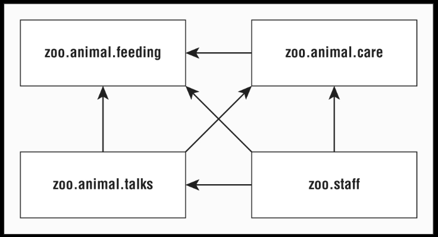

**Figure 12.1: Design of a modular system**

Now let's drill down into on of these modules. Figure 12.2 shows wht is inside the 
zoo.animal.talks module. There are three packages with two classes each. (It's a small 
zoo). There is also a strange file called module-info.java. This file is required to 
be inside all modules. More detail will be explained later in this chapter.

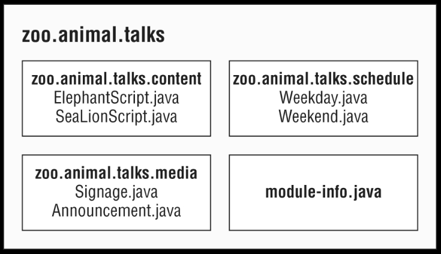

**Figure 12.2: Looking inside a module**

### Benefits of Modules

Modules look like another layer of things we need to know in order to program. While 
using modules is optional, it is important to understand the problems they are designed 
to solve:

- **Better access control**: in additional to the levels of control covered in chapter 5,
    Methods, we can have packages that are only accessible to other packages in the module.
- **Clearer dependency management**: since modules specify what the rely on, Java 
    can complain about a missing JAR when starting up the program rather than when it 
    is first accessed at runtime.
- **Custom Java builds**: we can create a Java runtime that has only the parts of the 
    JDK that our program needs rather than the full on at over 150 MB.
- **Improved security**: since we can omit parts of the JDK from our custom build, we 
    don't have to worry about vulnerabilities discovered in a part we don't use.
- **Improved performance**: another benefit of a smaller Java package is improved 
    startup time and a lower memory requirement.
- **Unique package enforcement**: since modules exposed packages, Java can ensure 
    that each package comes from only one module and avoid confusion about what is 
    being run.

[back to top](#chapter-12-modules)


## Creating and Running a Modular Program

In this section, we create, build, and run the zoo.animal.feeding module. We 
chose this on to start with because all the other modules depend on it. Figure 12.3 
show the design of this module. In addition to the module-info.java file, it has one 
package with on class inside.


**Figure 12.3: Contents of zoo.animal.feeding**

In the next sections, we create, compile, run and package the zoo.animal.feeding module.


### Creating the Files

First we have a really simples class that print on line in a `main()` method. Of 
course, that's not much of an implementation, the focus here is how to create modules, 
and not about how to solve complex business logic.
```
package zoo.animal.feeding;

public class Task {
  public static void main(String... args) {
    System.out.println("All fef!");
  }
}
```

Next comes the module-info.java file. This is the simplest possible one:
```
module zoo.animal.feeding {

}
```

There are a few key differences between a module declaration and a regular Java 
class declaration:
- The module-info.java file must be in the root directory of our module. Regular 
    Java classes should be in packages.
- The module declaration must use the keyword `module` instead of `class`, `interface`, 
    or `enum`.
- The module name follows the naming rules for package names. It often includes 
    periods (.) in its name. Regular class and packages names are not allowed to 
    have dashes (-). Module names follow the same rule.

This is just for start, the will be many more rules when we update this file 
later in the chapter.

Now let's make sure that the files are in the right directory structure. Figure 12.4 
shows the expected directory structure.

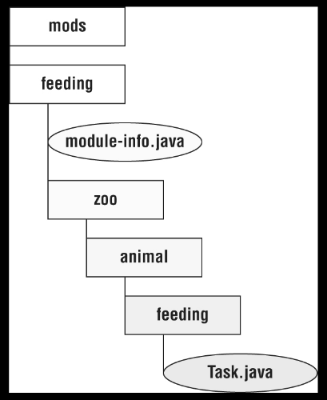

**Figure 12.4: module zoo.animal.feeding directory structure**

In particular, feeding is the module directory, and the `module-info.java` file is 
directly under it. Just as with a regular JAR file, we also have the `zoo.animal.feeding` 
package with on subfolder per portion of the name. The `Task` class is the appropriate 
subfolder for its package.

Also, note that we created a directory called `mods` at the same level as the module. 
We use it to store the module artifacts a little later in the chapter. This directory 
can be name anything, but "mods" is a common name.

### Compiling Our First Module

Before we can run modular code, we need to compile it. Other than the `module-path` 
option, this code should look familiar from Chapter 1:
```
javac --module-path mods \
  -d feeding \
  feeding/zoo/animal/feeding/*.java feeding/model-ino.java
```

As a review, the `-d` options specifies the directory to place the class files in. 
the end fo the command is a list of the `.java` files to compile. We can list the files 
individually or use a wildcard for all `.java` files in a subdirectory.

The new part is `module-path`. This option indicate the location of any custom 
module files. In this example, `module-path` could have been omitted since there are 
no dependencies. We can think of `module-path` as replacing the `classpath` option 
when we are working on a modular program.

---
**What about the _classpath_?**

The `classpath` options has three possible forms: `-cp`, `--class-path`, and 
`-classpath`. We can still use these options. In fact, it is common to do so when 
writing non-modular programs.

---

Just like `classpath`, we can use an abbreviation in the command. The syntax 
`--module-path` and `-p` are equivalent. That means we could have written many other 
command in place of the previous command. The following four command show the `-P` 
option:
```
javac -p mods -d feeding feeding/zoo/animal/feeding/*.java feeding/*.java

javac -p mods -d feeding feeding/zoo/animal/feeding/*.java feeding/module-info.java

javac -p mods -d feeding feeding/zoo/animal/feeding/Task.java feeding/module-info.java

javac -p mods -d feeding feeding/zoo/animal/feeding/Task.java feeding/*.java
```

While we can use whichever we like best, we need to make sure that we recognize all 
valid forms whenever they appear. Table 12.1 lists the options we need to know wll 
when compiling modules. There are many more options we can pass to the `javac` command, 
but these are the ones that we need never forget.

**Table 12.1: javac common options**

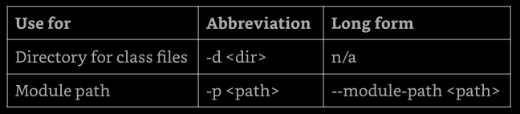

---
**Building Modules**

Even without modules, it is rare to run `javac` and `java` commands manually on a 
real project. The get long and complicated very quickly. Most developer use a build 
tool such as Maven or Gradle. These build tools suggest directories in which to place 
the class files, like `target/classes`.

It is likely that the only time we need to know the syntax of these commands is when 
we are leaning. The concepts themselves are useful, regardless.

---


### Running Our First Module

Before we package our module, we should make sure it works by running it. To do 
that, we need to learn the full syntax. Suppose there is a module named `book.module`. 
Inside that module is a package named `com.sybex`, which has a class named `OCP` with 
a `main()` method. Figure 12.5 shows the syntax for running a module. A special attention 
is required to the `boo.module/com.sybex.OCP` part. It is important to remember that we 
specify the module name followed by a slash (/), followed by the fully qualified class 
name.

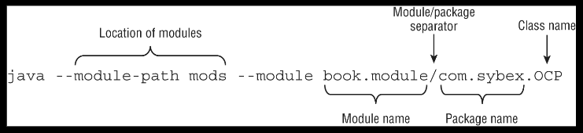

**Figure 12: running a module using java**

Now that we've seen the syntax, we can write the command to run the `Task` class in 
the `zoo.animal.feeding` package. In the following example, the package name and the 
module name are the same. It is common for the module name to match either the full 
package name or the beginning of it.
```
java --module-path feeding \
  --module zoo.animal.feeding/zoo.animal.feeding.Task
```

Since we already saw that `--module-path` uses the short form of `-p`, is not a 
surprise that there is a short form of `--module` as well. The short option is `-m`. 
That means the following command is equivalent:
```
java -p feeding \
  -m zoo.animal.feeding/zoo.animal.feeding.Task
```

In these examples, we used `feeding` as the module path because that's where we 
compiled the code. This will change once we package the module and run that.

**Table 12.2: options for using modules with java**

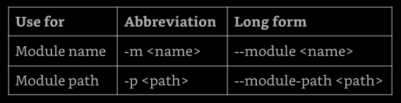


### Packaging Out First Module

A module isn't much use if we can run it only in the folder it was created in. 
Our next step is to package it. The `mods` directory must exist before the command 
is ran:
```
jar -cvf mods/zoo.animal.feeding.jar -C feeding/ .
```

There's nothing module-specific here. We are packaging everything under the `feeding` 
directory and storing it in a JAR file named `zoo.animal.feeding.jar` under the `mods` 
folder. This represents hwo the module JAR will look to other code that wants to use it.

Now let's run the program again, but this time using the `mods` directory instead of 
the loose classes:
```
java -p mods -m zoo.animal.feeding/zoo.animal.feeding.Task
```

We might notice that this command looks identical to the one in the previous section 
except for the directory. In the previous example, it was `feeding`. In this one, it 
is the module path of `mods`. Since the module path is used, a module JAR is being run.


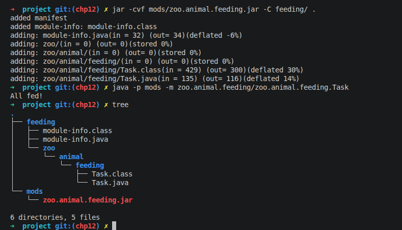

**My figure: project structure after running commands**

[back to top](#chapter-12-modules)


## Multiples Modules

Now that or `zoo.animal.feeding` module is solid, we can start thinking about our 
other modules. As we can see in the figure 12.6, all there of the other modules in 
our system depend on the `zoo.animal.feeding` module.

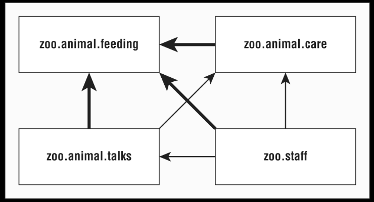

**Figure 12.6: modules depending on zoo.animal.feeding**

### Updating the Feeding Module

Since we will be having out other modules call code in the `zoo.animal.feeding` 
package, we nee to declare this intent in the module declaration. 

The `exports` directive is used to indicate that a module intends for those packages 
to be used by Java code outside the module. As we might expect, without an `exports` 
directive, the module is only available to be run from the command line on its own. 
In the following example, we export on package:
```
module zoo.animal.feeding {
  exports zoo.animal.feeding;
}
```

Recompiling and repacking the module will update the `module.info.class` inside our 
`zoo.animal.feeding.jar` file. These are the same `javac` ajd `jar` commands we ran 
previously:
```
javac -p mods \
  -d feeding \
  feeding/zoo/animal.feeding/*.java feeding/module-info.java


jar -cvf mods/zoo.animal.feeding.jar -C feeding/ .
```


### Creating a Care Module

Next, let's create the `zoo.animal.care` module. This time, we are going to have 
two packages. The `aoo.animal.care.medical` package wil have the classes and methods 
that are intended for use by other modules. The `zoo.animal.care.details` package is 
only going to be used by this module. It will not be exported form the module. Think 
of it as a healthcare privacy for the animals.

Figure 12.7 shows the contends of this module. Remembering that all modules must have 
a `module-info.java file.

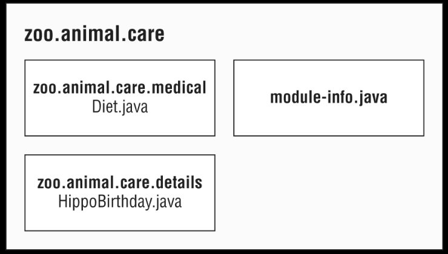

**Figure 12.7: contents of zoo.animal.care**

The module contains two basic packages and classes in addition to the `module-info.java` 
file.
```
// HippoBirthday.java
package zoo.animal.care.details;

import zoo.animal.feeding.*;

public class HippoBirthday {
  private Task task;
}

// Diet.java
package zoo.animal.care.medical;

public class Diet {}
```

This time the `module-info.java` file specifies three things:
```
1: module zoo.animal.care {
2:   exports zoo.animal.care.medical;
3:   requires zoo.animal.feeding;
4:}
```

Line 1 specifies the name of the module. Line 2 lists the package we are 
exporting so it can be used by other modules. On line 3, we see a new directive. 
The `requires` statement specifies that a module is needed. The `zoo.anima..care` 
module depends on the `zoo.animal.feeding` module.

Next we need to figure out the directory structure. We will create two packages. 
The first is `zoo.animal.care.details` and contains on class name `HippoBirthday`. 
The second is `zoo.animal.care.medical`, which contains on class named `Diet`.

Note that the packages begin with the same prefix as the module name. This is 
intentional. We can thing of it as if the module name "claims" the matching package 
and all sub-packages.

To review, we now compile and package the module:
```
java -p mods \
  -d care \
  care/zoo/animal/care/details/*.java \
  care/zoo/animal/care/medical/*.java \
  care/module-info.java
```

We compile both packages and the `module-info.java` file. In the real world, we'll 
use a build too rather than doing this by hand. When asked, we just need to list all 
the packages and/or files that we want to compile.

Now that we have compiled the code, it's time to create the module JAR:
```
jar -cvf mods/zoo.animal.care.jar -C care/ .
```


### Creating the Talks Module

So far, we've used only one `exports` and `requires` statement in a module. Now 
we'll lear how to handle exporting multiple packages or requiring multiple modules. 
In Figure 12.8, observe that the `zoo.animal.talks` module depends on two modules: 
`zoo.animal.feeding` and `zoo.animal.care`. This means that there must be two 
`requires` statements in the `module-info.java` file.

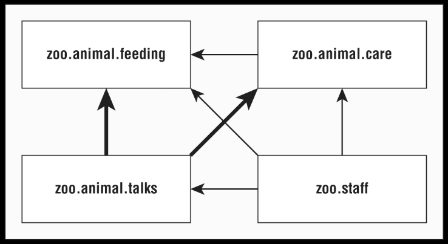

**Figure 12.9: dependencies for zoo.animal.talks**

First let's look at the `module-info.java` file for `zoo.animals.talks`:
```
1: module zoo.animal.talks {
2:   exports zoo.animal.talks.content;
3:   exports zoo.animal.talks.media;
4:   exports zoo.animal.talks.schedule;
5:
6:   requires zoo.animal.feeding;
7:   requires zoo.animal.care;
8: }
```

Line 1 shows the module name. Lines 2 to 4 allow other modules reference all three 
packages. Lines 6 and 7 specify the two modules that this module depends on. Then 
we have the six classes, as shown here.
```
// ElephantScript.java
package zoo.animal.talks.content;
public class ElephantScript { }

// SeaLionScript.java
package zoo.animal.talks.content;
public class SeaLionScript { }

// Announcement.java
package zoo.animal.talks.media;
public class Announcement {
  public static void main(String[] args) {
    System.out.println("We will be having talks");
  }
}

// Signage.java
package zoo.animal.talks.media;
public class Signage { }

// Weekday.java
package zoo.animal.talks.schedule;
public class Weekday { }

// Weekend.java
package zoo.animal.talks.schedule;
public class Weekend { }
```

The following are the command to compile and build the module:
```
javac -p mods \
  -d talks \
  talks/zoo/animal/talks/content/*.java talks/zoo/animal/talks/media/*.java \
  talks/zoo/animal/talks/schedule/*.java talks/module-info.java

jar -cvf mods/zoo.animal.talks.jar -C talks/ .
```


### Creating the Staff Module

Our final module is `zoo.staff`. Figure 12.10 shows that there is only one package 
inside. We will not be exposing this package outside the module.


**Figure 12.10: contends of zoo.staff**

Based on Figure 12.11 we should know what should go into the `module-info.java`.

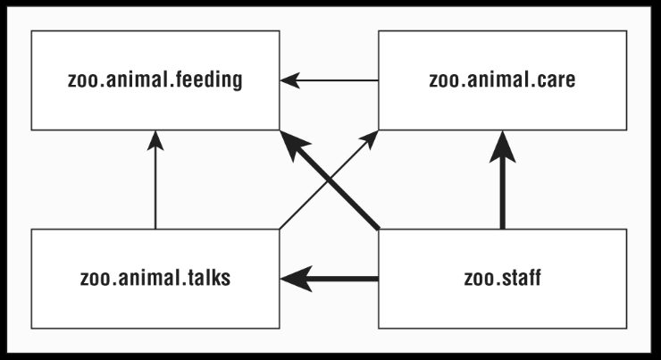

**Figure 12.11: Dependencies for zoo.staff**

There are three arrows in Figure 12.11 pointing from `zoo.staff` to other modules. 
These represent the three modules that are required. Sin no package are to be exposed 
from `zoo.staff`, there are no `exports` statements. This gives us:
```
module zoo.staff {
  requires zoo.animal.feeding;
  requires zoo.animal.care;
  requires zoo.animal.talks;
}
```

In this module, we have a single class in the `Jobs.java` file:
```
package zoo.staff;
public class Jobs { }
```

The following are the commands to compile and build the module:
```
javac -p mods \
  -d staff \
  staff/zoo/staff/*.java staff/module-info.java

jar -cvf mods/zoo.staff.jar -C staff/ .
```

[back to top](#chapter-12-modules)


## Diving into the Module Declaration

Now that we've successfully create modules, we can learn more about the module 
declaration. In these sections, we look at `exports`, `requires`, and `opens`. 
In the following section on services, we explore `provides` and `uses`. Now 
would be a good time to mention that these directives can appear in any order 
in the module declaration.


### Exporting a Package

We've already seen how `exports packageName` exports a package to other modules. 
It's also possible to export a package to a specific module. Suppose the zoo decides 
that only `staff` members should access to the `talks`. We could update the module 
declarations as follows:
```
module zoo.animal.talks {
  exports zoo.animal.talks.contents to zoo.staff;
  exports zoo.animal.talks.media;
  exports zoo.animal.talks.schedule;

  requires zoo.animal.feeding;
  requires zoo.animal.care;
}
```

FRom the `zoo.staff` module, nothing has changed. However, no other modules would 
be allowed to access that package.

We might have to notice that none of our other modules requires `zoo.animal.talks` 
in the first place.  However, we don't known what other modules will exist in the 
future.  It is important  to consider future use when designing modules. Since we 
want only the one module to have access, we only allow access for that module.

---
**Exported Type**

We've been talking about exporting a package. But what does that mean, exactly?
All public classes, interfaces, enums, and records are exported. Further, any public 
and protected fields and methods in those files are visible.

Field and methods that are private are not visible because they are not accessible 
outside the class Similarly, package fields and methods are not visible because they 
are not accessible outside the package.

---

The `exports` directive essentially gives us more levels os access control. Table 
12.3 list the full access control options.

**Table 12.3: Access control with modules**

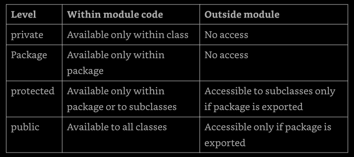


### Requiring a Module Transitively

As we saw earlier, `requires moduleName` specifies that the current module depends 
on `moduleName`. There's also a `requires transitive moduleName`, which means that 
any module that requires this module will also depend on `moduleName`.

Figure 12.12 shows the modules with dashed lines for the redundant relationships 
and solid line for "strong" relationships. This shows us how the module relationship 
would like if we were to only use transitive dependencies.

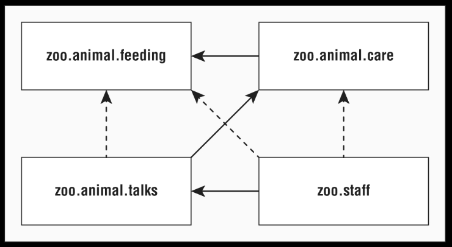

**Figure 12.12: Transitive dependency version of modules**

For example, `zoo.animal.talks` depends on `zoo.animal.care`, which depends 
on `zoo.animal.feeding`. That means the arrow between `zoo.animal.talks` and 
`zoo.animal.feeding` is not necessary.

Now let's look at the four module declarations. The first module remain unchanged. 
we are exporting on package to any packages that use the module.
```
module zoo.animal.feeding {
  exports zoo.animal.feeding;
}
```

The `zoo.animal.care` module is the first opportunity to improve things. Rather 
than forcing all remaining modules to explicitly specify `zoo.animal.feeding`, the 
code uses `requires transitive` and the other modules _automagically_ imports. 
```
module zoo.animal.care {
  exports zoo.animal.care.medical;
  requires transitive zoo.animal.feeding;
}
```

In the `zoo.animal.talks` module, we make a similar change and don't force 
others modules to specify `zoo.animal.care`. We also no longer need to specify 
`zoo.animal.feeding`, sot that line is commented out.
```
module zoo.animal.talks {
  exports zoo.animal.talks.content to zoo.staff;
  exports zoo.animal.talks.media;
  exports zoo.animal.talks.schedule;
  // requires zoo.animal.feeding;  no longer needed
  // requires zoo.animal.care;  no longer needed
  requires transitive zoo.animal.care;
}
```

Finally, in the `zoo.staff` module, we can get rid of two requires statements.
```
module zoo.staff {
  // requires zoo.animal.feeding;  no longer needed
  // requires zoo.animal.care;  no longer needed
  requires zoo.animal.talks;
}
```

The more modules we have, the greater the benefits ot the `requires transitive` 
compound. It is also more convenient for the caller. If other were trying to work with 
this zoo, they could just require `zoo.staff`, and have the remaining dependencies 
automatically inferred.


**Effects of _requires transitive_**

Applying the transitive modifiers has the following effects:
- module zoo.animal.talks can optionally declare that it requires the zoo.animal.feeding 
    module, but it is not required.
- module zoo.animal.care cannot be compiled or executed without access to the 
    zoo.animal.feeding module.
- module zoo.animal.talks cannot be compiled or executed without access to the 
    zoo.animal.feeding module

These rules hold even if the zoo.animal.care and zoo.animal.talks modules do not 
explicitly reference any packages in the zoo.animal.feeding module. On the other 
hand, without the `transitive` modifier in our module declaration of zoo.animal.care, 
the other modules would have to explicitly use `requires` in order to reference 
any packages in the zoo.animal.feeding module.


### Opening a Package

Java allows caller to inspect and call code at runtime with a technique called 
_reflection_. This is a powerful approach that allows calling code that might not 
be available at compile time. It can even be used to subvert access control! We do 
not need to know how to write code using reflection for the exam.

The `opens` directive is used to enable reflection of a package within a module. 
We only nee to be aware that the `opens` directive exists rather than understanding 
it in detail for the exam.

Since reflection can be dangerous, the module system requires developers to 
explicitly allow reflection in the module declaration if the want calling modules 
to be allowed to use it. The following shows how to enable reflection for two 
packages in the `zoo.animal.talks` module.
```
module zoo.animal.talks {
  opens zoo.animal.talks.schedule;
  opens zoo.animal.talks.media to zoo.staff;
}
```

The first example allows any module using this one to use reflection. The second 
example only fives that privilege to the `zoo.staff` module. There are two more 
directive we need to know, `provides` and `uses`, which are covered in the 
following section.

---
**Opening an Entire Module**

In the previous example, we opened two packages in the zoo.animal.talks module, 
but suppose we instead wanted to open all packages for reflection. No problem, we 
can use the `open module` modifier, rather than the `opens` directive.
```
open module zoo.animal.talks {

}
```

With this module modifier, Java knows we want all packages in the module to be open. 
What happens if we apply both together?
```
open module zoo.animal.talks {
  opens zoo.animal.talks.schedule;   // does not compile
}
```

This does not compile because a modifier that uses the `open` modifier is not 
permitted to use the `opens` directive. After all, the packages are already open!


[back to top](#chapter-12-modules)


## Creating a service

In this section, we will learn how to create a service. A _service_ is composed 
of an interface, any classes the interface references, and a way of looking up 
implementations of the interface. The implementations are not part ot the service.

We will be using a tour application in this section. It has four modules shown in 
Figure 12.13. In this example, the `zoo.tours.api` and `zoo.tours.reservations` 
modules make up the service since they consist of the interface and lookup 
functionality.

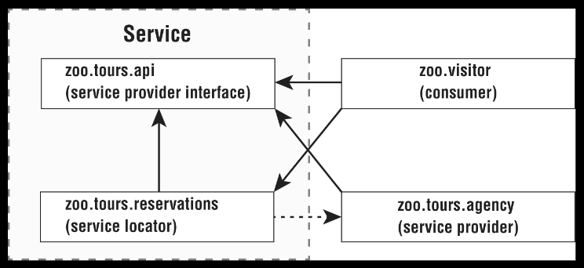

**Figure 12.13: modules in the tour application**

We are not required to have four separate modules. The separation here is just 
to illustrate the concepts. For example, the service provider interface and service 
locator could be in the same module.


### Declaring the Service Provider Interface

First, the `zoo.tours.api` module define a Java object called `Souvenir`. It is 
considered part of the service because it will be referenced by the interface.
```
// Souvenir.java
package zoo.tours.api;

public record Souvenir(String description) {}
```

Next, the module contains a Java interface type. This interface is called the 
_service provider interface_ because it specifies what behavior our service will 
have. In this case, it is a simple API with three methods.
```
// Tour.java
package zoo.tours.api;

public interface Tour {
  String name();
  int length();
  Souvenir getSouvenir();
}
```

All three methods use the implicit public modifier. Since we are working with 
modules, we also need to create a `module-info.java` file so our module definition 
export the package containing the interface.
```
// module-info.java
module zoo.tours.api {
  exports zoo.tour.api;
}
```

Now that we have both files, we can compile and package this module.
```
javac -d api \
  api/zoo/tours/api/*.java api/module-info.java


jar -cvf mods/zoo.tours.api.jar -C api/ .
```

A service provider "interface" can be an abstract class rather than an actual 
interface. The service, includes the service provider interface and supporting 
classes it references. The service al includes the lookup functionality, which 
will be defined next.


### Creating a Service Locator


