# Chapter 12: Modules

**Objectives:**
- Packaging and deploying Java code and use the Java Platform Module System
- Define modules and their dependencies, exposes module content including for 
    reflection. Define services, producers, and consumers
- Compile Java code, produce modular and non-modular jars, runtime images, and 
    implement migration using unnamed and automatic modules

Packages can be grouped int modules. In this chapter, the purpose of modules and 
how to build our own are explained. We also will see how to run them and how to 
discover existing modules. Next, we will cover strategies for migrating an application 
to use modules, running a partially modularized application, and dealing with 
dependencies. Whe then move on to discuss services and services locators. Finally, 
we show how to create a runtime image.

[Introducing Modules](#introducing-modules)

[Creating Modular Program](#creating-and-running-a-modular-program)

[Multiples Modules](#multiples-modules)

[Diving into the Module Declaration](#diving-into-the-module-declaration)

[Discovering Modules](#discovering-modules)

[Comparing Types of Modules](#comparing-types-of-modules)

[Migrating an Application](#migrating-an-application)


---


## Introducing Modules

When writing code in real life, programs tends to become bigger. A real project 
will consist of hundreds or thousands of classes grouped int packages. These packages 
are grouped into Java archive (JAR) files. A JAR is a ZIP file with some extra 
information, and the extension is .jar.

The Java Platform Module System includes the following:
- a format for module JAR files
- Partitioning of the JDK into modules
- Additional command-line options for Java tools


### Exploring a Module

In Chapter 1 we had a small Zoo application. It had only on class and just printed 
out on thing. Now imagine that we had a whole staff of programmers and were automating 
the operation of the zoo. Many things need to be coded, including the interaction with 
the animals, visitors, the public website, and outreach.

A _module_ is a group of on or more packages plus a special file called `module-info.java`. 
The contents of this file are the _module declaration_. Figure 12.1 list just a few of the 
modules a zoo might need. We decided to focus on the animal interactions in our example. 
The full zoo could easily have a dozen modules.

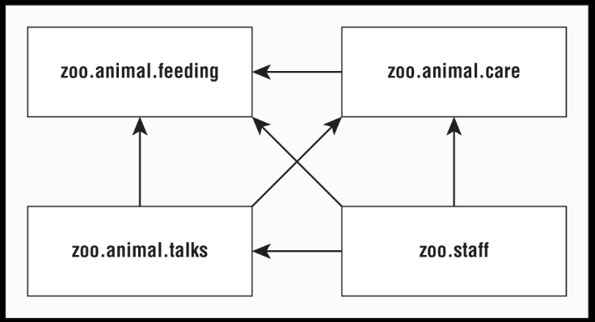

**Figure 12.1: Design of a modular system**

Now let's drill down into on of these modules. Figure 12.2 shows wht is inside the 
zoo.animal.talks module. There are three packages with two classes each. (It's a small 
zoo). There is also a strange file called module-info.java. This file is required to 
be inside all modules. More detail will be explained later in this chapter.

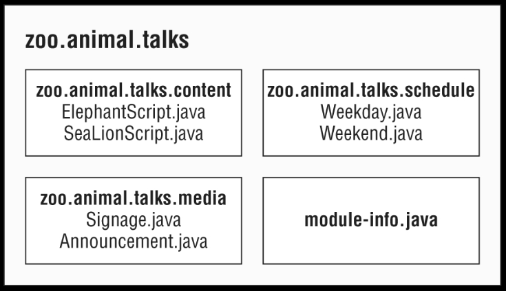

**Figure 12.2: Looking inside a module**

### Benefits of Modules

Modules look like another layer of things we need to know in order to program. While 
using modules is optional, it is important to understand the problems they are designed 
to solve:

- **Better access control**: in additional to the levels of control covered in chapter 5,
    Methods, we can have packages that are only accessible to other packages in the module.
- **Clearer dependency management**: since modules specify what the rely on, Java 
    can complain about a missing JAR when starting up the program rather than when it 
    is first accessed at runtime.
- **Custom Java builds**: we can create a Java runtime that has only the parts of the 
    JDK that our program needs rather than the full on at over 150 MB.
- **Improved security**: since we can omit parts of the JDK from our custom build, we 
    don't have to worry about vulnerabilities discovered in a part we don't use.
- **Improved performance**: another benefit of a smaller Java package is improved 
    startup time and a lower memory requirement.
- **Unique package enforcement**: since modules exposed packages, Java can ensure 
    that each package comes from only one module and avoid confusion about what is 
    being run.

[back to top](#chapter-12-modules)


## Creating and Running a Modular Program

In this section, we create, build, and run the zoo.animal.feeding module. We 
chose this on to start with because all the other modules depend on it. Figure 12.3 
show the design of this module. In addition to the module-info.java file, it has one 
package with on class inside.


**Figure 12.3: Contents of zoo.animal.feeding**

In the next sections, we create, compile, run and package the zoo.animal.feeding module.


### Creating the Files

First we have a really simples class that print on line in a `main()` method. Of 
course, that's not much of an implementation, the focus here is how to create modules, 
and not about how to solve complex business logic.
```
package zoo.animal.feeding;

public class Task {
  public static void main(String... args) {
    System.out.println("All fef!");
  }
}
```

Next comes the module-info.java file. This is the simplest possible one:
```
module zoo.animal.feeding {

}
```

There are a few key differences between a module declaration and a regular Java 
class declaration:
- The module-info.java file must be in the root directory of our module. Regular 
    Java classes should be in packages.
- The module declaration must use the keyword `module` instead of `class`, `interface`, 
    or `enum`.
- The module name follows the naming rules for package names. It often includes 
    periods (.) in its name. Regular class and packages names are not allowed to 
    have dashes (-). Module names follow the same rule.

This is just for start, the will be many more rules when we update this file 
later in the chapter.

Now let's make sure that the files are in the right directory structure. Figure 12.4 
shows the expected directory structure.

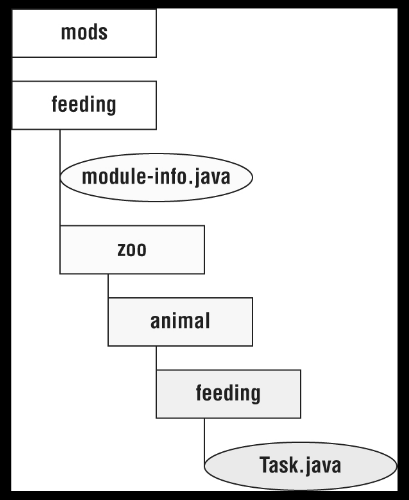

**Figure 12.4: module zoo.animal.feeding directory structure**

In particular, feeding is the module directory, and the `module-info.java` file is 
directly under it. Just as with a regular JAR file, we also have the `zoo.animal.feeding` 
package with on subfolder per portion of the name. The `Task` class is the appropriate 
subfolder for its package.

Also, note that we created a directory called `mods` at the same level as the module. 
We use it to store the module artifacts a little later in the chapter. This directory 
can be name anything, but "mods" is a common name.

### Compiling Our First Module

Before we can run modular code, we need to compile it. Other than the `module-path` 
option, this code should look familiar from Chapter 1:
```
javac --module-path mods \
  -d feeding \
  feeding/zoo/animal/feeding/*.java feeding/model-ino.java
```

As a review, the `-d` options specifies the directory to place the class files in. 
the end fo the command is a list of the `.java` files to compile. We can list the files 
individually or use a wildcard for all `.java` files in a subdirectory.

The new part is `module-path`. This option indicate the location of any custom 
module files. In this example, `module-path` could have been omitted since there are 
no dependencies. We can think of `module-path` as replacing the `classpath` option 
when we are working on a modular program.

---
**What about the _classpath_?**

The `classpath` options has three possible forms: `-cp`, `--class-path`, and 
`-classpath`. We can still use these options. In fact, it is common to do so when 
writing non-modular programs.

---

Just like `classpath`, we can use an abbreviation in the command. The syntax 
`--module-path` and `-p` are equivalent. That means we could have written many other 
command in place of the previous command. The following four command show the `-P` 
option:
```
javac -p mods -d feeding feeding/zoo/animal/feeding/*.java feeding/*.java

javac -p mods -d feeding feeding/zoo/animal/feeding/*.java feeding/module-info.java

javac -p mods -d feeding feeding/zoo/animal/feeding/Task.java feeding/module-info.java

javac -p mods -d feeding feeding/zoo/animal/feeding/Task.java feeding/*.java
```

While we can use whichever we like best, we need to make sure that we recognize all 
valid forms whenever they appear. Table 12.1 lists the options we need to know wll 
when compiling modules. There are many more options we can pass to the `javac` command, 
but these are the ones that we need never forget.

**Table 12.1: javac common options**

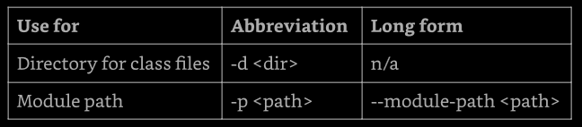

---
**Building Modules**

Even without modules, it is rare to run `javac` and `java` commands manually on a 
real project. The get long and complicated very quickly. Most developer use a build 
tool such as Maven or Gradle. These build tools suggest directories in which to place 
the class files, like `target/classes`.

It is likely that the only time we need to know the syntax of these commands is when 
we are leaning. The concepts themselves are useful, regardless.

---


### Running Our First Module

Before we package our module, we should make sure it works by running it. To do 
that, we need to learn the full syntax. Suppose there is a module named `book.module`. 
Inside that module is a package named `com.sybex`, which has a class named `OCP` with 
a `main()` method. Figure 12.5 shows the syntax for running a module. A special attention 
is required to the `boo.module/com.sybex.OCP` part. It is important to remember that we 
specify the module name followed by a slash (/), followed by the fully qualified class 
name.

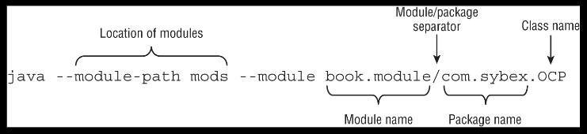

**Figure 12: running a module using java**

Now that we've seen the syntax, we can write the command to run the `Task` class in 
the `zoo.animal.feeding` package. In the following example, the package name and the 
module name are the same. It is common for the module name to match either the full 
package name or the beginning of it.
```
java --module-path feeding \
  --module zoo.animal.feeding/zoo.animal.feeding.Task
```

Since we already saw that `--module-path` uses the short form of `-p`, is not a 
surprise that there is a short form of `--module` as well. The short option is `-m`. 
That means the following command is equivalent:
```
java -p feeding \
  -m zoo.animal.feeding/zoo.animal.feeding.Task
```

In these examples, we used `feeding` as the module path because that's where we 
compiled the code. This will change once we package the module and run that.

**Table 12.2: options for using modules with java**

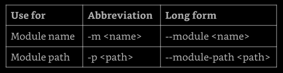


### Packaging Out First Module

A module isn't much use if we can run it only in the folder it was created in. 
Our next step is to package it. The `mods` directory must exist before the command 
is ran:
```
jar -cvf mods/zoo.animal.feeding.jar -C feeding/ .
```

There's nothing module-specific here. We are packaging everything under the `feeding` 
directory and storing it in a JAR file named `zoo.animal.feeding.jar` under the `mods` 
folder. This represents hwo the module JAR will look to other code that wants to use it.

Now let's run the program again, but this time using the `mods` directory instead of 
the loose classes:
```
java -p mods -m zoo.animal.feeding/zoo.animal.feeding.Task
```

We might notice that this command looks identical to the one in the previous section 
except for the directory. In the previous example, it was `feeding`. In this one, it 
is the module path of `mods`. Since the module path is used, a module JAR is being run.


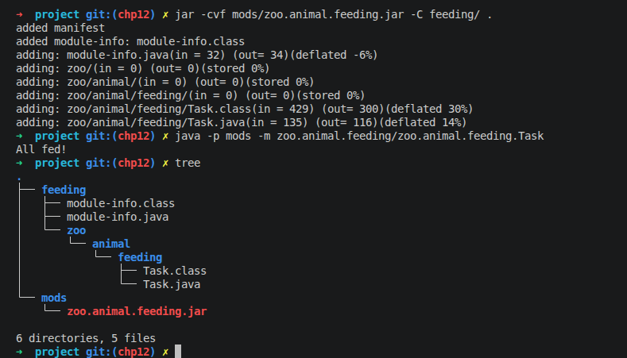

**My figure: project structure after running commands**

[back to top](#chapter-12-modules)


## Multiples Modules

Now that or `zoo.animal.feeding` module is solid, we can start thinking about our 
other modules. As we can see in the figure 12.6, all there of the other modules in 
our system depend on the `zoo.animal.feeding` module.

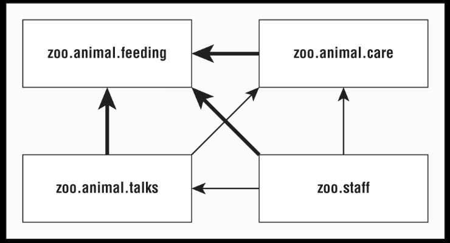

**Figure 12.6: modules depending on zoo.animal.feeding**

### Updating the Feeding Module

Since we will be having out other modules call code in the `zoo.animal.feeding` 
package, we nee to declare this intent in the module declaration. 

The `exports` directive is used to indicate that a module intends for those packages 
to be used by Java code outside the module. As we might expect, without an `exports` 
directive, the module is only available to be run from the command line on its own. 
In the following example, we export on package:
```
module zoo.animal.feeding {
  exports zoo.animal.feeding;
}
```

Recompiling and repacking the module will update the `module.info.class` inside our 
`zoo.animal.feeding.jar` file. These are the same `javac` ajd `jar` commands we ran 
previously:
```
javac -p mods \
  -d feeding \
  feeding/zoo/animal.feeding/*.java feeding/module-info.java


jar -cvf mods/zoo.animal.feeding.jar -C feeding/ .
```


### Creating a Care Module

Next, let's create the `zoo.animal.care` module. This time, we are going to have 
two packages. The `aoo.animal.care.medical` package wil have the classes and methods 
that are intended for use by other modules. The `zoo.animal.care.details` package is 
only going to be used by this module. It will not be exported form the module. Think 
of it as a healthcare privacy for the animals.

Figure 12.7 shows the contends of this module. Remembering that all modules must have 
a `module-info.java file.

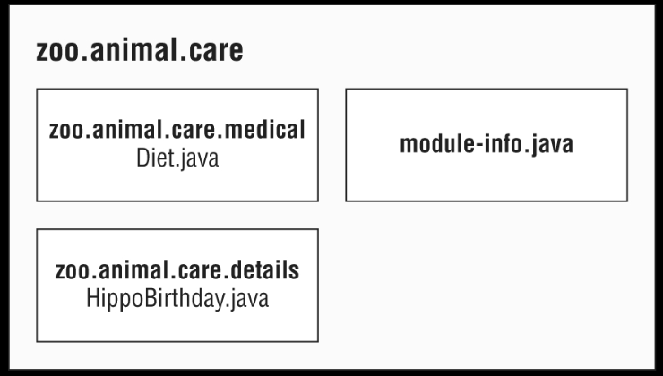

**Figure 12.7: contents of zoo.animal.care**

The module contains two basic packages and classes in addition to the `module-info.java` 
file.
```
// HippoBirthday.java
package zoo.animal.care.details;

import zoo.animal.feeding.*;

public class HippoBirthday {
  private Task task;
}

// Diet.java
package zoo.animal.care.medical;

public class Diet {}
```

This time the `module-info.java` file specifies three things:
```
1: module zoo.animal.care {
2:   exports zoo.animal.care.medical;
3:   requires zoo.animal.feeding;
4:}
```

Line 1 specifies the name of the module. Line 2 lists the package we are 
exporting so it can be used by other modules. On line 3, we see a new directive. 
The `requires` statement specifies that a module is needed. The `zoo.anima..care` 
module depends on the `zoo.animal.feeding` module.

Next we need to figure out the directory structure. We will create two packages. 
The first is `zoo.animal.care.details` and contains on class name `HippoBirthday`. 
The second is `zoo.animal.care.medical`, which contains on class named `Diet`.

Note that the packages begin with the same prefix as the module name. This is 
intentional. We can thing of it as if the module name "claims" the matching package 
and all sub-packages.

To review, we now compile and package the module:
```
java -p mods \
  -d care \
  care/zoo/animal/care/details/*.java \
  care/zoo/animal/care/medical/*.java \
  care/module-info.java
```

We compile both packages and the `module-info.java` file. In the real world, we'll 
use a build too rather than doing this by hand. When asked, we just need to list all 
the packages and/or files that we want to compile.

Now that we have compiled the code, it's time to create the module JAR:
```
jar -cvf mods/zoo.animal.care.jar -C care/ .
```


### Creating the Talks Module

So far, we've used only one `exports` and `requires` statement in a module. Now 
we'll lear how to handle exporting multiple packages or requiring multiple modules. 
In Figure 12.8, observe that the `zoo.animal.talks` module depends on two modules: 
`zoo.animal.feeding` and `zoo.animal.care`. This means that there must be two 
`requires` statements in the `module-info.java` file.

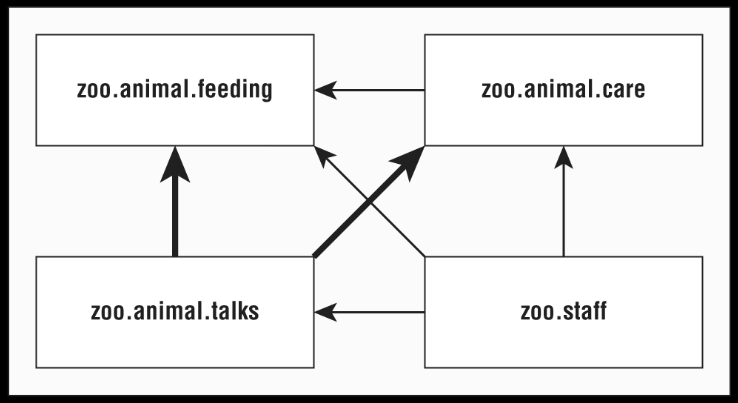

**Figure 12.9: dependencies for zoo.animal.talks**

First let's look at the `module-info.java` file for `zoo.animals.talks`:
```
1: module zoo.animal.talks {
2:   exports zoo.animal.talks.content;
3:   exports zoo.animal.talks.media;
4:   exports zoo.animal.talks.schedule;
5:
6:   requires zoo.animal.feeding;
7:   requires zoo.animal.care;
8: }
```

Line 1 shows the module name. Lines 2 to 4 allow other modules reference all three 
packages. Lines 6 and 7 specify the two modules that this module depends on. Then 
we have the six classes, as shown here.
```
// ElephantScript.java
package zoo.animal.talks.content;
public class ElephantScript { }

// SeaLionScript.java
package zoo.animal.talks.content;
public class SeaLionScript { }

// Announcement.java
package zoo.animal.talks.media;
public class Announcement {
  public static void main(String[] args) {
    System.out.println("We will be having talks");
  }
}

// Signage.java
package zoo.animal.talks.media;
public class Signage { }

// Weekday.java
package zoo.animal.talks.schedule;
public class Weekday { }

// Weekend.java
package zoo.animal.talks.schedule;
public class Weekend { }
```

The following are the command to compile and build the module:
```
javac -p mods \
  -d talks \
  talks/zoo/animal/talks/content/*.java talks/zoo/animal/talks/media/*.java \
  talks/zoo/animal/talks/schedule/*.java talks/module-info.java

jar -cvf mods/zoo.animal.talks.jar -C talks/ .
```


### Creating the Staff Module

Our final module is `zoo.staff`. Figure 12.10 shows that there is only one package 
inside. We will not be exposing this package outside the module.


**Figure 12.10: contends of zoo.staff**

Based on Figure 12.11 we should know what should go into the `module-info.java`.

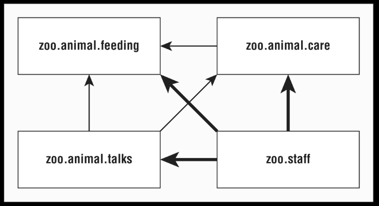

**Figure 12.11: Dependencies for zoo.staff**

There are three arrows in Figure 12.11 pointing from `zoo.staff` to other modules. 
These represent the three modules that are required. Sin no package are to be exposed 
from `zoo.staff`, there are no `exports` statements. This gives us:
```
module zoo.staff {
  requires zoo.animal.feeding;
  requires zoo.animal.care;
  requires zoo.animal.talks;
}
```

In this module, we have a single class in the `Jobs.java` file:
```
package zoo.staff;
public class Jobs { }
```

The following are the commands to compile and build the module:
```
javac -p mods \
  -d staff \
  staff/zoo/staff/*.java staff/module-info.java

jar -cvf mods/zoo.staff.jar -C staff/ .
```

[back to top](#chapter-12-modules)


## Diving into the Module Declaration

Now that we've successfully create modules, we can learn more about the module 
declaration. In these sections, we look at `exports`, `requires`, and `opens`. 
In the following section on services, we explore `provides` and `uses`. Now 
would be a good time to mention that these directives can appear in any order 
in the module declaration.


### Exporting a Package

We've already seen how `exports packageName` exports a package to other modules. 
It's also possible to export a package to a specific module. Suppose the zoo decides 
that only `staff` members should access to the `talks`. We could update the module 
declarations as follows:
```
module zoo.animal.talks {
  exports zoo.animal.talks.contents to zoo.staff;
  exports zoo.animal.talks.media;
  exports zoo.animal.talks.schedule;

  requires zoo.animal.feeding;
  requires zoo.animal.care;
}
```

FRom the `zoo.staff` module, nothing has changed. However, no other modules would 
be allowed to access that package.

We might have to notice that none of our other modules requires `zoo.animal.talks` 
in the first place.  However, we don't known what other modules will exist in the 
future.  It is important  to consider future use when designing modules. Since we 
want only the one module to have access, we only allow access for that module.

---
**Exported Type**

We've been talking about exporting a package. But what does that mean, exactly?
All public classes, interfaces, enums, and records are exported. Further, any public 
and protected fields and methods in those files are visible.

Field and methods that are private are not visible because they are not accessible 
outside the class Similarly, package fields and methods are not visible because they 
are not accessible outside the package.

---

The `exports` directive essentially gives us more levels os access control. Table 
12.3 list the full access control options.

**Table 12.3: Access control with modules**

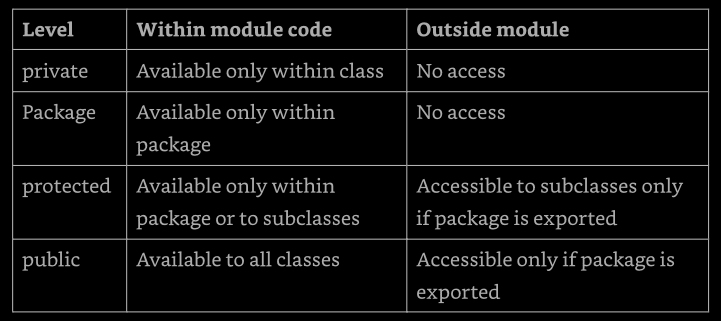


### Requiring a Module Transitively

As we saw earlier, `requires moduleName` specifies that the current module depends 
on `moduleName`. There's also a `requires transitive moduleName`, which means that 
any module that requires this module will also depend on `moduleName`.

Figure 12.12 shows the modules with dashed lines for the redundant relationships 
and solid line for "strong" relationships. This shows us how the module relationship 
would like if we were to only use transitive dependencies.

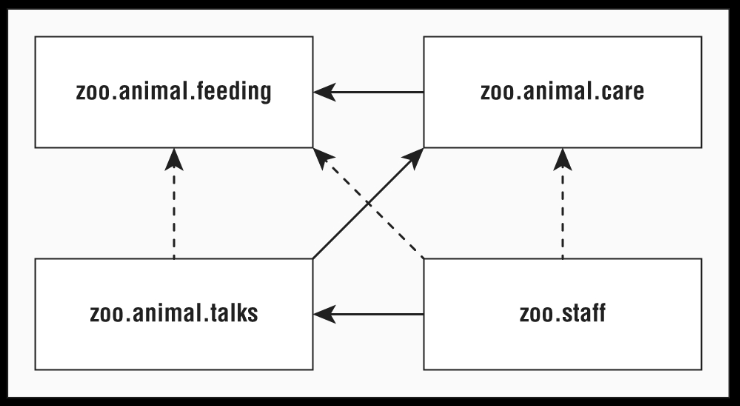

**Figure 12.12: Transitive dependency version of modules**

For example, `zoo.animal.talks` depends on `zoo.animal.care`, which depends 
on `zoo.animal.feeding`. That means the arrow between `zoo.animal.talks` and 
`zoo.animal.feeding` is not necessary.

Now let's look at the four module declarations. The first module remain unchanged. 
we are exporting on package to any packages that use the module.
```
module zoo.animal.feeding {
  exports zoo.animal.feeding;
}
```

The `zoo.animal.care` module is the first opportunity to improve things. Rather 
than forcing all remaining modules to explicitly specify `zoo.animal.feeding`, the 
code uses `requires transitive` and the other modules _automagically_ imports. 
```
module zoo.animal.care {
  exports zoo.animal.care.medical;
  requires transitive zoo.animal.feeding;
}
```

In the `zoo.animal.talks` module, we make a similar change and don't force 
others modules to specify `zoo.animal.care`. We also no longer need to specify 
`zoo.animal.feeding`, sot that line is commented out.
```
module zoo.animal.talks {
  exports zoo.animal.talks.content to zoo.staff;
  exports zoo.animal.talks.media;
  exports zoo.animal.talks.schedule;
  // requires zoo.animal.feeding;  no longer needed
  // requires zoo.animal.care;  no longer needed
  requires transitive zoo.animal.care;
}
```

Finally, in the `zoo.staff` module, we can get rid of two requires statements.
```
module zoo.staff {
  // requires zoo.animal.feeding;  no longer needed
  // requires zoo.animal.care;  no longer needed
  requires zoo.animal.talks;
}
```

The more modules we have, the greater the benefits ot the `requires transitive` 
compound. It is also more convenient for the caller. If other were trying to work with 
this zoo, they could just require `zoo.staff`, and have the remaining dependencies 
automatically inferred.


**Effects of _requires transitive_**

Applying the transitive modifiers has the following effects:
- module zoo.animal.talks can optionally declare that it requires the zoo.animal.feeding 
    module, but it is not required.
- module zoo.animal.care cannot be compiled or executed without access to the 
    zoo.animal.feeding module.
- module zoo.animal.talks cannot be compiled or executed without access to the 
    zoo.animal.feeding module

These rules hold even if the zoo.animal.care and zoo.animal.talks modules do not 
explicitly reference any packages in the zoo.animal.feeding module. On the other 
hand, without the `transitive` modifier in our module declaration of zoo.animal.care, 
the other modules would have to explicitly use `requires` in order to reference 
any packages in the zoo.animal.feeding module.


### Opening a Package

Java allows caller to inspect and call code at runtime with a technique called 
_reflection_. This is a powerful approach that allows calling code that might not 
be available at compile time. It can even be used to subvert access control! We do 
not need to know how to write code using reflection for the exam.

The `opens` directive is used to enable reflection of a package within a module. 
We only nee to be aware that the `opens` directive exists rather than understanding 
it in detail for the exam.

Since reflection can be dangerous, the module system requires developers to 
explicitly allow reflection in the module declaration if the want calling modules 
to be allowed to use it. The following shows how to enable reflection for two 
packages in the `zoo.animal.talks` module.
```
module zoo.animal.talks {
  opens zoo.animal.talks.schedule;
  opens zoo.animal.talks.media to zoo.staff;
}
```

The first example allows any module using this one to use reflection. The second 
example only fives that privilege to the `zoo.staff` module. There are two more 
directive we need to know, `provides` and `uses`, which are covered in the 
following section.

---
**Opening an Entire Module**

In the previous example, we opened two packages in the zoo.animal.talks module, 
but suppose we instead wanted to open all packages for reflection. No problem, we 
can use the `open module` modifier, rather than the `opens` directive.
```
open module zoo.animal.talks {

}
```

With this module modifier, Java knows we want all packages in the module to be open. 
What happens if we apply both together?
```
open module zoo.animal.talks {
  opens zoo.animal.talks.schedule;   // does not compile
}
```

This does not compile because a modifier that uses the `open` modifier is not 
permitted to use the `opens` directive. After all, the packages are already open!


[back to top](#chapter-12-modules)


## Creating a service

In this section, we will learn how to create a service. A _service_ is composed 
of an interface, any classes the interface references, and a way of looking up 
implementations of the interface. The implementations are not part ot the service.

We will be using a tour application in this section. It has four modules shown in 
Figure 12.13. In this example, the `zoo.tours.api` and `zoo.tours.reservations` 
modules make up the service since they consist of the interface and lookup 
functionality.

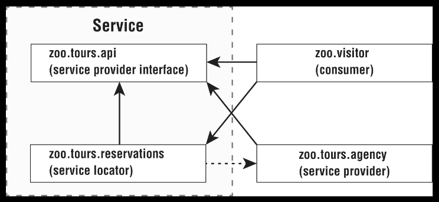

**Figure 12.13: modules in the tour application**

We are not required to have four separate modules. The separation here is just 
to illustrate the concepts. For example, the service provider interface and service 
locator could be in the same module.


### Declaring the Service Provider Interface

First, the `zoo.tours.api` module define a Java object called `Souvenir`. It is 
considered part of the service because it will be referenced by the interface.
```
// Souvenir.java
package zoo.tours.api;

public record Souvenir(String description) {}
```

Next, the module contains a Java interface type. This interface is called the 
_service provider interface_ because it specifies what behavior our service will 
have. In this case, it is a simple API with three methods.
```
// Tour.java
package zoo.tours.api;

public interface Tour {
  String name();
  int length();
  Souvenir getSouvenir();
}
```

All three methods use the implicit public modifier. Since we are working with 
modules, we also need to create a `module-info.java` file so our module definition 
export the package containing the interface.
```
// module-info.java
module zoo.tours.api {
  exports zoo.tour.api;
}
```

Now that we have both files, we can compile and package this module.
```
javac -d api \
  api/zoo/tours/api/*.java api/module-info.java


jar -cvf mods/zoo.tours.api.jar -C api/ .
```

A service provider "interface" can be an abstract class rather than an actual 
interface. The service, includes the service provider interface and supporting 
classes it references. The service al includes the lookup functionality, which 
will be defined next.


### Creating a Service Locator

To complete our service, we need a service locator. A _service locator_ can find 
any classes that implement a service provider interface.

Luckily, Java provides a `ServiceLoader` class to help with this task. We pass the 
service provider interface type to its `load()` method, and Java will return any
implementation services it can find. The following class shows it in action:
```
// TourFinder.java
package zoo.tours.reservations;

import java.util.*;
import zoo.tours.api.*;

public class TourFinder {
  public static Tour findSingleTour() {
    ServiceLoader<Tour> loader = ServiceLoader.load(Tour.class);
    four (Tour tour : loader)
      return tour;
    return null;
  }
  public static List<Tour> findAllTours() {
    List<Tour> tours = new ArrayList<>();
    ServiceLoader<Tour> loader = ServiceLoader.load(Tour.class);
    for (Tour tour : loader)
      tours.add(tour);
    return tours;
  }
}
```

As we can see, two lookup method were provided. The first is a convenience method 
if we are expecting exactly one `Tour` to be returned. The other returns a `List`, 
which accommodate any number of service providers. At runtime, there may be many 
service provider (or none) that are found by the service locator. The `ServiceLoader` 
call is a relatively expensive, so, in real applications it is best to cache the 
results.

Our module definition export the package with the lookup class `TourFinder`. It 
requires the service provider interface package. It also has the `uses` directive 
since it will be looking up a service.
```
// module-info.java
module zoo.tours.reservations {
  exports zoo.tours.reservations;
  requires zoo.tours.api;
  uses zoo.tours.api.Tour;
}
```

Here `requires` and `uses` are needed, once for compilation and one for lookup. 
Finally, we compile and package the module.
```
javac -p mods -d reservations \
  reservations/zoo/tours/reservations/*.java
  reservations/module-info.java


jar -cvf mods/zoo.tours.reservations.jac -C reservations/ .
```

Now that we have the interface and lookup logic, we have completed our service.

---
**Using _ServiceLoader_**

There are two common methods in `ServiceLoader` that we need to know. The 
declaration is as follows, _sans_ the full implementation:
```
public final class ServiceLoader<S> implements Iterable<S> {
  
  public static<S> ServiceLoader<S> load(Class<S> service) { ... }

  public Stream<Provider<S>> stream() { ... }

  // additional methods
}
```

As we already saw, calling `ServiceLoader.load()` returns an object that we can 
loop through normally. However, requesting a `Stream` gives us a different type. 
The reason for this is that a `Stream` controls when elements are evaluated. 
Therefore, a `ServiceLoader` returns a `Stream` of `Provider` objects. We have 
to call `get()` to retrieve the value we wanted out of each `Provider`, such as 
in the example:
```
ServiceLoader.load(Tour.class)
  .stream()
  .map(Provider::get)
  .mapToInt(Tour::length)
  .max()
  .ifPresent(System.out::println);
```

---


### Invoking from a Consumer

Next up is to call the service locator by a consumer. A _consumer_ (or _client_) 
refers to a module that obtains adn uses a service. Once the consumer has acquired 
a service via the service locator, it is able to invoke the methods provided by 
the service provider interface.
```
// Tourist.java
package zoo.visitor;

import java.util.*;
import zoo.tours.api.*;
import zoo.tours.reservations.*;

public class Tourist {
  public static void main(String[] args) {
    Tour tour = TourFinder.findSingleTour();
    System.out.println("Single tour: " + tour);

    List<Tour> tours = TourFinder.findAllTours();
    System.out.println("# tours: " + tours.size());
  }
}
```

Our module definition doesn't need to know anything about the implementations 
since the `zoo.tours.reservations` module is handling the lookup.
```
// module-info.java
module zoo.visitor {
  requires zoo.tours.api;
  requires zoo.tours.reservations;
}
```

This time, we get to run a program after compiling an packaging.
```
javac -p mods -d visitor \
  visitor/zoo/visitor/*.java visitor/module-info.java

jar -cvf mods/zoo/visitor.jar -C visitor/ .

java -p mods -m zoo.visitor/zoo.visitor.Tourist
```

The program outputs the following:
```
Single tour: null
# tour: 0
```

We haven't written a class that implements the interface yet, so we don't have 
a service to consume.


### Adding a Service Provider

A _service provider_ is the implementation of a service provider interface. As 
we saw earlier, at runtime is is possible to have multiple implementation classes 
or modules. We will stick to one here for simplicity.

Our service provider is the `zoo.tours.agency` package because we've outsourced 
the running of tours to a third party.
```
// TourImple.java
package zoo.tours.agency;

import zoo.tours.api.*;

public class TourImpl implements Tour {
  public String name() {
    return "Behind the Scenes";
  }
  public int length() {
    return 120;
  }
  public Souvenir getSouvenir() {
    return new Souvenir("stuffed animal");
  }
}
```

We need a module-info.java file to create a module:
```
module zoo.tours.agency {
  requires zoo.tours.api;
  provides zoo.tours.api.Tour with zoo.tours.agency.TourImpl;
}
```

The module declaration requires the module containing the interface as a dependency. 
We don't export the packages that implements the interface since we don't want callers 
referring to it directly. Instead, we use the provides directive. This allows us to 
specify that we provide an implementation of the interface with a specific 
implementation class. The syntax looks like this:
```
provides interfaceName with className;
```

We have not exported the package containing the implementation. Instead we have 
made the implementation available to a service provider using the interface. 

Finally, we compile it and package it up.
```
javac -p mods -d serviceProvider \
  serviceProvider/zoo/tours/agency/*.java serviceProvider/module-info.java
```

Now comes the cool part. We can run the Java program again.
```
java -p mods -m zoo.visitor/zoo.visitor.Tourist
```

This time, we see the an output like this:
```
Single tour: zoo.tours.agency.TourImpl@1936f0f5
# tours: 1
```

Notice how e didn't recompile the `zoo.tours.reservations` or `zoo.visitor` 
package. The service locator was able to observe that there was now a service 
provider implementation available and find it for us.

This is useful when we have functionality that changes independently of the 
rest of the code base. For example, we might have custom reports or logging.


### Reviewing Directives and Services

Table 12.4 summarizes what we've covered in this section. We need to learn very 
well what is needed when each artifact is in a separate module and grasp firmly 
the concepts.

**Table 12.4: services and respective directives** 

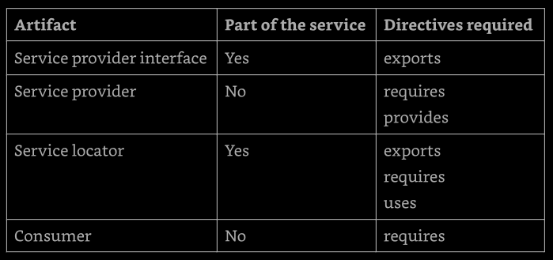


Table 12.5 list all the directives we need to know.

**Table 12.5: directives usage for packages**

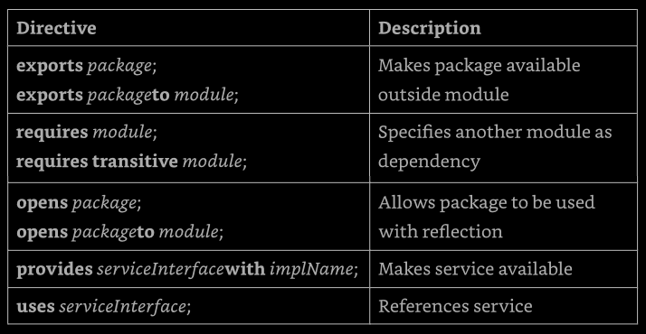


[back to top](#chapter-12-modules)


## Discovering modules

Until now, we've been working with modules that we wrote. Even the classes built 
int the JDK are modularized. In this section, we will known how to use commands 
to learn about modules.

We do not need to known the output of the commands, we need to know the syntax of 
the commands and what they do. The output is included only when it is necessary for 
a better understanding of the command, otherwise, it is omitted.


### Identifying Built-in Modules

The most important module to known is `java.base`. It contains most of the 
packages we have been learning about in this book. In fact, it is so important 
that we don't even have to use the `requires` directive; it is available to all 
modular applications. Our `module-info.java` file will still compile if we 
explicitly require `java.base`. However, it is redundant, so is better to omit.
Table 12.6 lists some common modules and what they contain.

**Table 12.6: Common modules**

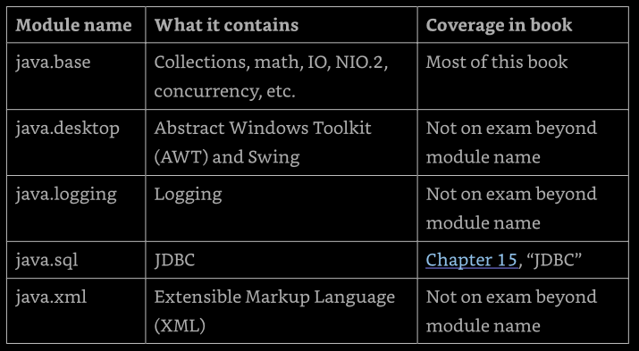

It is important to recognize the names of modules supplied by the JDK. We don't 
need to know the names by heart, but we need to be able to pick them out of a lineup.

For our daily life, we need to know that modules names beginning with `java` are 
for API's that will use most, and beginning with `jdk` for APIs that are specific 
to the JDK. Table 12.7 lists all the modules that bigint with `java`.

**Table 12.7: modules prefixed with 'java'**

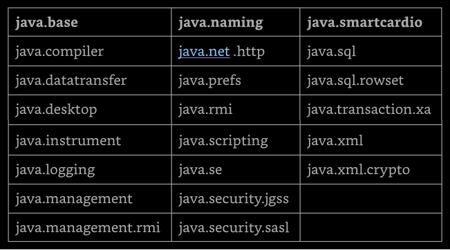


Table 12.8 lists all the modules that begin with `jdk`. We don't have to memorize 
them, but is good to recognize them.

**Table 12.8: modules prefixed with 'jdk'**

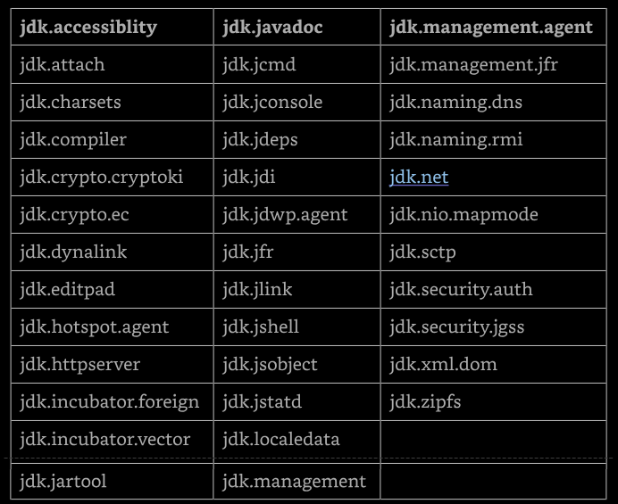


### Getting Details with _java_

The `java` command has three module-related options. One describes a module, 
another list the available modules, and the third shows the module resolution logic.

#### Describing a Module

Suppose we are give the `zoo.animal.feeding` module JAR file and want to know 
about its module structure. We could "unjar" it and open the `module-info.file`. 
This would show us that the module export one package and doesn't explicitly 
require any modules.
```
module zoo.animal.feeding {
  exports zoo.animal.feeding;
}
```

However, there is an easier way. The `java` command has an option to describe 
a module. The following two commands are equivalent:
```
java -p mods -d zoo.animal.feeding

java -p mods --describe-module zoo.animal.feeding
```

Each prints information about the module. For example, it might print this:
```
zoo.animal.feeding file:///absolutePath/mods/zoo.animal.feeding.jar
exports zoo.animal.feeding
requires java.base mandated
```

The first line is the module we asked about: `zoo.animal.feeding`. The second 
line starts with information about the module. In our case, it is the same package 
exports statement we had in the module declaration file.

On the third line, we see `requires java.base mandated`. Since the `base` module 
is special, it is automatically added as a dependency to all modules. This module 
has frequently used packages like `java.util`. That's what the `mandated` is about. 
We get `java.base` regardless of whether we asked for it.

In classes, the `java.lang` package is automatically imported whether we type it 
or not. The `java.base` module works the same way. It is automatically available 
to all other modules.

---
**More about Describing Modules**

We only need to know how to run `--describe-module` for the exam rather than 
interpret the output. However, we might encounter some surprises whe experimenting 
with this feature, so it's important to go a little deeper here.

Assuming the following are the contents of `module-info.java` in `zoo.animal.care`:
```
module zoo.animal.care {
  export zoo.animal.care.medical to zoo.staff;
  requires transitive zoo.animal.feeding;
}
```

Now we have the command to describe the module and the output.
```
java -p mods -d zoo.animal.care


zoo.animal.care file:///absolutePath/mods/zoo.animal.care.jar
requires zoo.animal.feeding transitive
requires java.base mandated
qualified exports zoo.animal.care.medical to zoo.staff
contains zoo.animal.care.details
```

The first line of the output is the absolute path of the module. The two 
requires lines should look familiar as well. The first is the module-info, and 
the other is to all modules. Next comes something new. The `qualified exports` 
is the full name of the package we are exporting to a specific module.

Finally, the `contains` means that there is a package in the module that is not 
exported at all. This is true. Our module has two packages, and one is available 
on to code inside the module.

---

#### Listing Available Modules

In addition to describing modules, we can use the `java` command to list the 
modules that are available. The simplest form lists the modules thar are part 
of the JDK.
```
java --list-modules
```

When we ran int, the output went on for 70 lines and looked like this:
```
java.base@17
java.compile@17
java.datatransfer@17
...
```

This s a listing of all the modules that came with Java and their version 
numbers. We can tell that we were using Java 17 when testing this example.

We can use this command with custom code. Let's try again with the directory 
containing our zoo modules.
```
java -p mods --list-modules
```

This time 78 lines are displayed. 70 for the built-in modules plus the 8 we've 
created in this chapter. Two of the custom lines look like this:
```
zoo.animal.care file:///absolutePath/mods/zoo.animal.care.jar
zoo.animal.feeding file:///abasolutePath/mods/zoo.animal.feeding.jar
```

Since these are custom modules, we get a location on the file system. If the 
project had a module version number, it would have both the version number 
and the file system path.

**java --list-modules exits as soon as it prints the observable modules.**
**It does not run the program.**


#### Showing Module Resolution

If listing the modules doesn't give us enough information, we can also use 
the `--show-module-resolution` option. We can think of it as a way of debugging 
modules. It spits out a lot of output when the program starts up. Then it runs 
the program.
```
java --show-module-resolution
  -p feeding
  -m zoo.animal.feeding/zoo.animal.feeding.Task
```

Luckily, we don't need to understand this output. But, having seen it will 
make it easier to remember. Here's a snippet of the output.
```
root zoo.animal.feeding file:///absolutePath/feeding/
java.base binds java.desktop jrt:/java.desktop
java.base binds jdk.jartool jrt:/jdk.jartool
...
jdk.security.auth requires java.naming jrt:/java.naming
jdk.security.auth requires java.security.jgss jrt:/java.security.jgss
---
All fed!
```

It starts by listing the root module. That's the one we are running: 
`zoo.animal.feeding`. Then it lists many lines of packages included by the 
mandatory `java.base` module. After a while, it lists modules that have 
dependencies. Finally, it outputs the result of the program: All fed!.


### Describing with _jar_

Like the `java` command, the `jar` command can describe a module. These commands 
are equivalent:
```
jar -f mods/zoo.animal.feeding.jad -d

jar --file mods/zoo.animal.feeding.jar --describe-module
```

The output is slightly different from when we used the `java` command to describe 
the modules. With `jar`, it outputs the following:
```
zoo.animal.feeding.jar:file:///absolutePath/mods/zoo.animal.feeding.jar
/!module-info.class
export zoo.animal.feeding
requires java.base mandated
```

The JAR version includes the `module-info.class` in the filename, which is not 
a particularly significant difference in the scheme of things. We do not know 
this difference, we just need to know that both commands can describe a module.


### Learning about Dependencies with _jdeps_

The `jdeps` command gives us information about dependencies within a module. Unlike 
describing a module, it looks at the code in addition to the module declaration. This 
tell us what dependencies are actually used rather than simple declared. Luckily, we 
do need to memorize all the options, we are expected to understand how to use `jdeps` 
with projects that have not yer been modularized to assist in identifying dependencies 
and problems.
```
// Animatronic.java
package zoo.dinos;

import java.time.*;
import java.util.*;
import sun.misc.Unsafe;

public class Animatronic {
  private List<String> names;
  private LocalDate visitDate;

  public Animatronic(List<String> names, LocalDate visitDate) {
    this.names = names;
    this.visitDate = visitDate;
  }
  public void unsafeMethod() {
    Unsafe unsafe = Unsafe.getUnsafe();
  }
}
```

This example is silly. It uses a number of unrelated classes. The idea of having 
dinosaurs in a zoo ins't beyond the realm of possibility, the Bronx Zoo did have 
electronic moving dinosaurs for a while.

Now we can compile this file. We have to notice that there is no `module-info.java` 
file. That is because we aren't creating a module. We are looking into what dependencies 
we will need when we do modularize this JAR.
```
javac zoo/dinos/*.java
```

Compiling works, but it gives us some warnings about `Unsafe` being an internal API. 
We do not have to worry now, it will be discussed in a shortly. Next we create a JAR file:
```
jar -cvf zoo.dino.jar .
```

We can run the `jdeps` command against this JAR to learn about its dependencies. 
First, let's run the command without any options. On the first two lines, the command 
prints the modules that we would need to add with a _requires_ directive to migrate 
to the module system. It also prints a table showing what packages are used and what 
modules they correspond to.
```
jdeps zoo.dino.jar

zoo.dino.jar -> java.base
zoo.dina.jar -> jdk.unsupported
  zoo.dinos  -> java.lang  java.base
  zoo.dinos  -> java.time  java.base
  zoo.dinos  -> java.util  java.base
  zoo.dinos  -> sun.misc   JDK internal API (jdk.unsupported)
```

Notice that `java.base` is always included. It also says which models contain classes 
used by the JAR. If we run in `summary` mode, we only see just the first part where 
`jdeps`list the modules. Thre are two formats for the `summary` flag:
```
jdeps -s zoo.dino.jar
jdeps --summary zoo.dino.jar

zoo.dino.jar -> java.base
zoo.dino.jar -> jdk.unsupported
```

For a real project, the dependency list could include dozens or even hundreds of 
packages. It's useful to see the summary of just the modules. This approach also 
makes it easier to see whether `jdk.unsupported` is in the list.

There is also a `--module-path` option that we can use to look for modules outside 
the JDK. Unlike other commands, there is no short form for this option on `jdeps`.

---

the `jdk.unsupported` module contains internal libraries that developers in previous 
version of Java were discourage from using, although many people ignored this warning 
and used. We should not reference it, as it may disappear in future versions of Java.

---


### Using the _--jdk-internals_ Flag

The `jdeps` command has an options to provide details about these unsupported APIs. 
The output look something like this:
```
jdeps --jdk-internals zoo.dino.jar

zoo.dino.jar -> jdk.unsupported
  zoo.dinos.Animatronic -> sun.misc.Unsafe
    JDK internal API (jdk.unsupported)

Warning: <omitted warning>

JDK Internal AP    Suggested Replacement
_______________    _____________________

sun.misc.Unsafe    See http://openjdk.java.net/jeps/260
```

The `--jdk-internals` options list any class we are using that call an internal 
API along with which API. At th end, it provides a table suggesting what we should 
do about it. Iw we wrote the code calling the inter API, the message is useful. If 
not, the message would be useful to the team that did write the code. We, on the 
other hand, might need to update or replace that JAR file entirely with one that 
fixes the issue. 


### Using Module Files with _jmod_ 

We might think a JMOD file as a Java module file. Although Oracle don't recommend 
this. JMOD files are recommend only when we have native libraries or something that 
can't go inside a JAR file. This is unlikely to affect us in the real world.

The most important thing to remember is that `jmod` is only for working with the 
JMOD files. We don't have to memorize the syntax for `jmod`. Table 12.9 lists the 
common modes.

**Table 12.9: Modes using jmod**

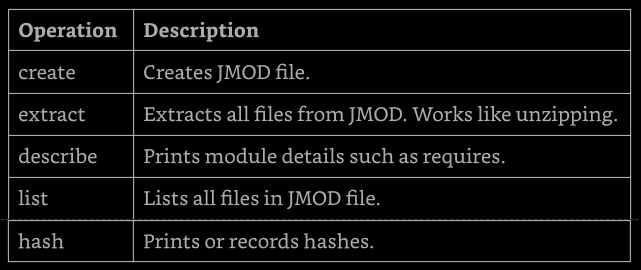


### Creating Java Runtimes with _jlink_

One of the benefits of modules is being able to supply just the parts of Java we 
need. Our `zoo` example from the beginning of the chapter doesn't have many dependencies. 
If the user already doesn't have Java or is on device without much memory, downloading 
a JDK that is over 150 MB is a big task. Let's see how big the package actually needs 
to be. This command create our smaller distribution.
```
jlink --module-path mods --add-modules zoo.animal.talks --output zooApp
```

First we specify where to find the custom modules with `-p` or `--module-path`. Then 
we specify out module name with `--add-modules`. This will include the dependencies it 
requires as long as they can be found. Finally, we specify the folder name of our 
smaller JDK with `--output`.

The output directory contains the `bin`, `conf`, `include`, `legal`, `lib`, and `man` 
directories along with a release file. These should look familiar as we find them in 
the full JDK as well.

When we run this command and zip up the `zooApp` directory, the file is only 15 MB. 
This is an order of magnitude smaller than the full JDK. Where did this space savings 
come from? There are many modules in the JDK we don't need. Additionally, development 
tool like `javac` don't need to be in a runtime distribution.


### Reviewing Command-Line Options


**Table 12.10: command line operations comparing**

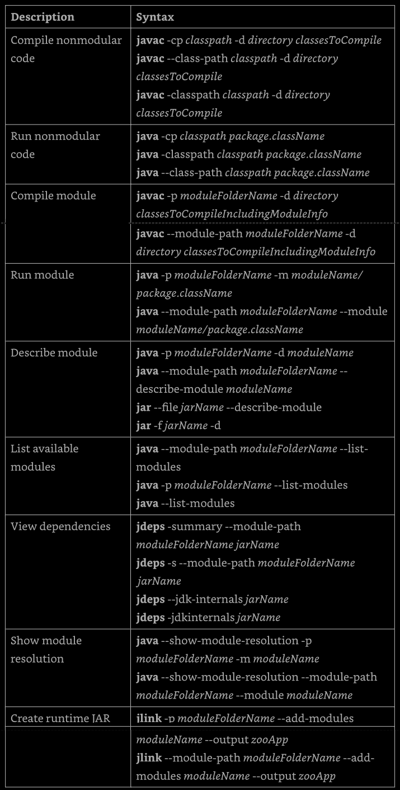


**Table 12.11: javac, main options**

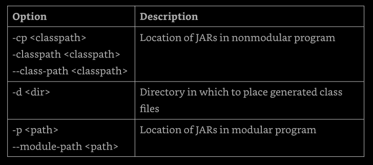


**Table 12.12: java, main options**

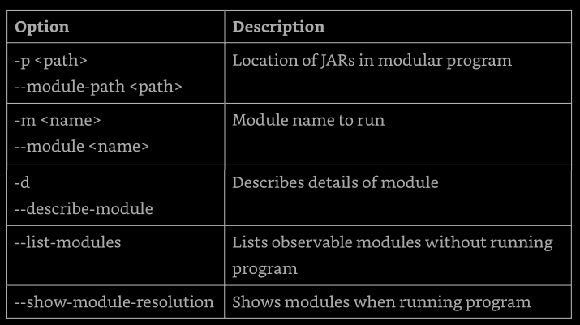


**Table 12.13: jar, main options**

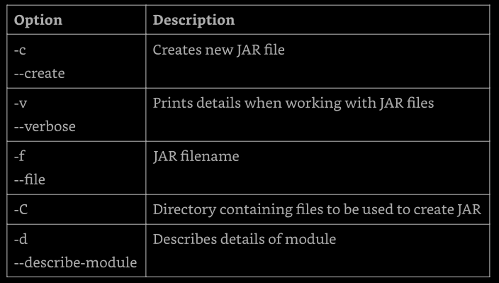


[back to top](#chapter-12-modules)


## Comparing Types of Modules

All the modules we're used so far in this chapter are called _named modules_. There 
are two other types of modules: _automatic modules_, and _unnamed modules_. In this 
section, we describe these three types of modules. We are expected to be able to 
compare them.


### Named Modules

A _named module_ is on containing a `module-info.java` file. To review, this file 
appears in the roo of the JAR alongside one or more packages. Unless otherwise specified, 
a module is a named module. Named modules appear on the module path rather than the class-
path. Later, we will learn what happens if a JAR containing a `module-info.jar` file is 
on the classpath. For now, just know it is no considered a named module because it is not 
on the module path.

As a short definition, a named module has the _name_ inside the `module-info.jar` file 
and is on the module path.


### Automatic Modules

An _automatic module_ appear on the module path but dos not contain a `module-info.java` 
file. It is simple a regular JAR file that is places on the module path and gets treated 
as a module.

AS a way of remembering this, Java _automatically_ determines the module name. The code 
referencing an automatic module treats it as if there is a module-info.java file present. 
It automatically exports all packages. It also determines the module name.

To determine the module name it search inside the META-INF/MANIFEST.MF of the JAR file, 
if Java found a property called `Automatic-Module-Name` it uses this value as module name.
Specifying this single property int the manifest allowed library provider to make things
easier for applications that wanted to use their library in a modular application. We 
cant think of it as a promise that when the library becomes a named module, it will use 
the specified module name.

If the JAR file does not specify an "automatic module name", Java will still allow 
us to use itn in the module path. In this case, Java will determine the module name by 
basing itn on the filename of the JAR file. Here are the rules combined with the name 
coming from the manifest:
- If the MANIFEST.MF specifies an "Automatic-Module-Name" property, use that.
- Remove teh file extension from the JAR name.
- Remove any version information from the end of the name.
- Replace any remaining character other than letters an numbers with dots.
- Replace any sequences of dots with a single dot.
- Remove the dot if it is the first or last character of the result.

Table 12.16 show how to apply these rules to two examples where there is no automatic 
module name specified in the manifest.

**Table 12.16: practicing with automatic module names**

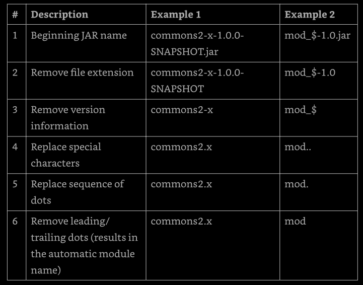


While the algorithm for creating automatic module names does its best, it can't 
always come up with a good name. For example, `1.2.0-calendar-1.2.2-good-1.jar` 
conducive. Luckily, such names are rare and out of scope for the exam.


### Unnamed Modules

An _unnamed module_ appears on the classpath. Like an automatic module, it is 
a regular JAR. Unlike an automatic module, it is on the `classpath` rather than 
`module path`. This means an unnamed module is treated like old code an a second-
class citizen to modules.

An unnamed module does not usually contain a `module-info.java` file. If it happens 
to contain one, that file will be ignored since it is on the `classpath`.

Unnamed modules do not export any packages to named or automatic modules. The unnamed 
module can read from any JARs on the `classpath` or `module path`. We can think of an 
unnamed module as code that works the way Java worked before modules. It is a confusing 
thing that something that isn't really a module to have the word _module_ in its name.


### Reviewing Module Types

We can expect to get questions about comparing the three types of modules. A good 
understanding of the Table 12.17 is a must. A key point to remember is that code on 
the `classpath` can access the `module path`. By contrast, cond on the `module path` 
is unable to read form the `classpath`.

**Table 12.17: properties of module types**

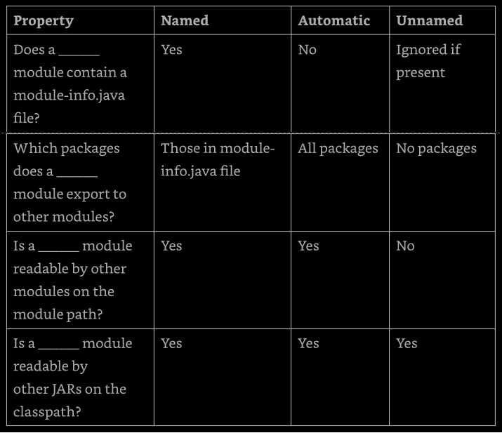


[back to top](#chapter-12-modules)


## Migrating an Application

Many application were not designed to use the Java Platform Module System because 
the wre written before it was created or chose not to use it. Ideally, they were at 
least designed with projects instead of as a big ball of mud. This section gives us 
an overview of strategies for migrating an existing application to use modules. We 
cover ordering modules, bottom-up migration, top-down migration, and how to split 
up an existing project.


### Determining the Order

Before we can migrate our application to use modules, we need to know how the 
packages and libraries in the existing application are structured. Suppose we have 
a simple application with three JAR files, as show in figure 12.14.

The dependencies between projects from a graph. Both of the representations in the 
figure are equivalent. The arrows show the dependencies by pointing from the project 
that will require the the dependency to the one that makes it available. In the 
language of modules, the arrow will go from requires to exports.

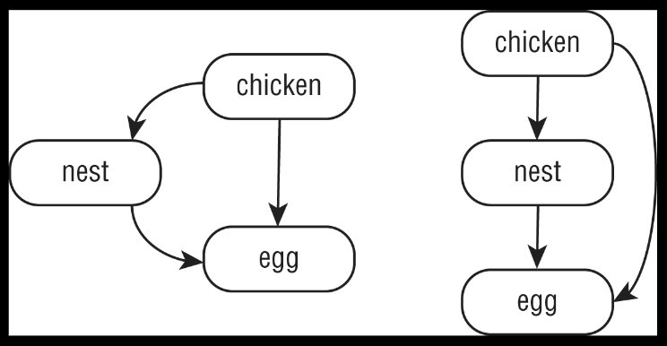

**Figure 12.14: Determining the order**

The right side of the diagram makes it easier to identify the top and bottom that 
top-down and bottom-up migration refer to. Projects that do not have any dependencies 
are at the bottom. Projects that do have dependencies are at the top.

In this example, there is only one order from top to bottom that honors all the 
dependencies. Figure 12.15 show that the order is no always unique. Since two of 
the project do no have an arrow between them, either order is allowed when deciding 
migration order.

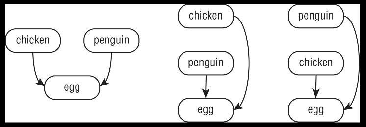

**Figure 12.15: determining order when not unique**


### Exploring a Bottom-Up Migration Strategy

The easiest approach to migration is a bottom-up migration. This approach works 
best wen we have the power to convert any JAR files that aren't already modules. 
For a bottom-up migration, we follow these steps:
1. Pick the lowest-level project that has not yes been migrated.
2. Add a `module-info.java` file to that project. Be sure to add any `exports` to 
    expose any package used by higher-level JAR files. Also, add a `requires` 
    directive for any modules this modules depends on.
3. Move this newly migrated named module from the `classpath` to the `module path`.
4. Ensure that ny projects that have not yes been migrated stay as `unnamed module`
    on the `classpath`
5. Repeat with the next-lowest-level project until are done.


We can see this procedure applied to migrate three project in Figure 12.16. We have 
to notice that each project is converted to a module in turn. 

With a bottom-up migration, we are getting the lower-level project in good shape. 
this makes it easier to migrate the top-level projects at the en. It also encourages 
care in what is exposed.

During migration, we have a mix of named modules and unnamed modules. The named 
modules are the lower-level ones that have been migrated. They are on the module 
path and not allowed to access any unnamed modules.

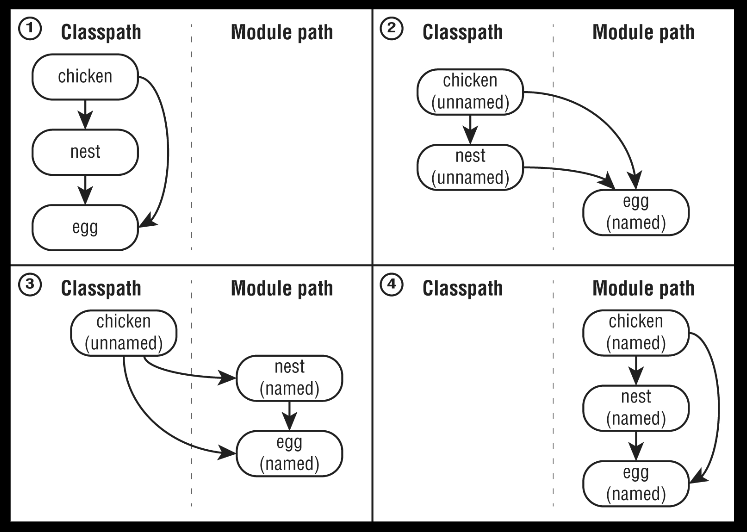

**Figure 12.16: bottom-up migration**

The unnamed modules are on the `classpath` The can access JAR files on both the 
`classpath` and the `module path`.


### Exploring a Top-Down Migration Strategy

A top-down migration strategy is most useful when we don't have control of every 
JAR file used by our application. For example, suppose another team owns one project. 
The are just too busy to migrate. We wouldn't want this situation to hold up our 
entire migration.

To a top-down migration, we follow these steps:

1. Place all projects on the module path.
2. Pick the highest-level project that has not yet been migrated.
3. Add a `module-info.java` file to that project to convert the automatic module 
    into a named module (not forgetting to add any `exports` or `requires` directives).
    We can use the automatic module name of the other modules when writing the 
    requires directive since most of the projects on the module path do not have 
    names yes.
4. Repeat with the next-highest-level project until we are done.

We can see this procedure applied in order to migrate three projects in Figure 12.17. 
Notice that each project is converted to a module in turn.

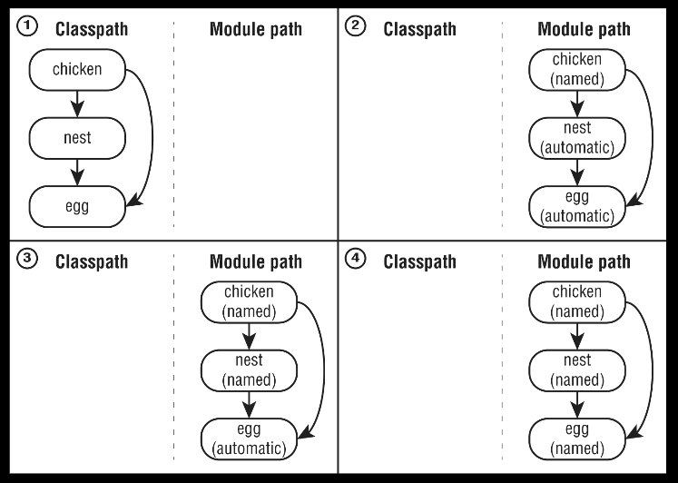

**Figure 12.17: Top-down migration**

With a top-down migration, we are conceding that all of the lower-level dependencies 
are no ready but that we want to make the application itself a module.

During migration, we have a mix of named modules an automatic modules. The named modules 
are the higher-level ones that have been migrated. They are on the `module path` and 
have access to the automatic modules. The automatic modules are all on the `module path`. 

Table 12.18 reviews what we need to know about the two main migration strategies. Is a 
must to know both very well.

**Table 12.18: Comparing migration strategies**

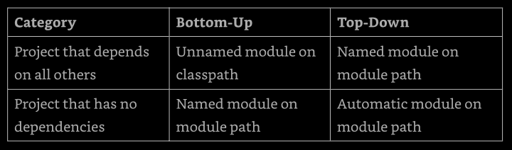


### Splitting a Big Project into Modules

Suppose we start with an application that has a number of packages. The first 
step is to break them into logical grouping and draw the dependencies between them. 
Figure 12.18 shows an imaginary systems's decomposition. Notice that there are seven 
packages on both, the left and right sides. There are fewer modules because some 
packages share a module.

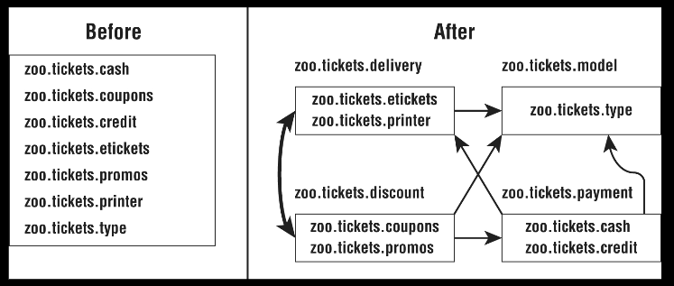

**Figure 12.18: Fist attempt decomposition**

There's a problem with this decomposition. Do you see it? The Java Platform 
Module System does now allow for _cyclic dependencies_. A cyclic dependency, or 
_circular dependency_, is when two things directly or indirectly depend on each 
other. If the `zoo.tickets.delivery` module requires the `zoo.tickets.discount` 
module, `zoo.tickets.discount` is not allowed to require the `zoo.ticket.delivery` 
module.

Now that we know that the decomposition in Figure 12.18 won't work, what can we 
do about it? A common technique is to introduce another module. That module will 
contains the code that the other two modules share. Figure 12.19 shows the new 
modules without any cyclic dependencies. Notice the new module `zoo.tickets.etech`. 
We created new packages to put in that module. This allows the developers to put 
the common code in there and break the dependency. Mo more cyclic dependencies!

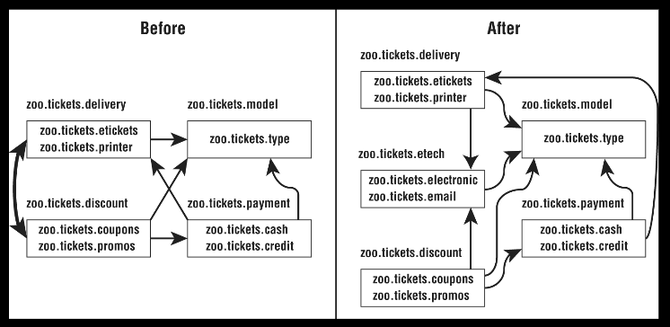

**Figure 12.19: removing cyclic dependencies**


### Failing to Compile with a Cyclic Dependency

It is extremely important to understand that Java will not allow us to compile 
modules that have circular dependencies. In this section, we look at an example 
leading to ghat compile error.

Consider the `zoo.butterfly` module described here:
```
// Butterfly.java
package zoo.butterfly;

public class Butterfly {
  private Caterpillar caterpillar;
}

// module-info.java
module zoo.butterfly {
  exports zoo.butterfly;
  requires zoo.caterpillar;
}
```

We can't compile this yet as we need to build `zoo.caterpillar` first. After all, 
our butterfly requires it. Now we look at `zoo.caterpillar`:
```
// Caterpillar.java
package zoo.caterpillar;

public class Caterpillar {
  Butterfly emergeCocoon() {
    // logic omitted
  }
}

// module-info.java
module zoo.caterpillar {
  exports zoo.caterpillar;
  requires zoo.butterfly;
}
```

We can't compile this yet as we need to build `zoo.butterfly` fist. Now we have 
a stalemate. Neither module can be compiled. This is our circular dependency problem 
at work. This is on of the advantage of the module system. It prevents us from writing 
code that has a cyclic dependency. Such code won't even compile! 

We might be wondering what happens if three modules are involved. Suppose module 
`ballA` requires module `ballB` and `ballB` requires module `ballC`. Can module `ballC` 
require module `ballA`?. No. This would create a cyclic dependency. Draw it and see. 
We can follow our pencil around the circle from `ballA` to `ballB` to `ballC`to 
`ballA`to ..., you get the idea. There are just too many balls in the air!

Java will still allow us to have a cyclic dependency between packages with a module. 
It enforces that do not have cyclic dependency between modules.

[back to to](#chapter-12-modules)


## Summary

The Java Platform Module System organizes code at a higher level than packages. 
Each module contains one or more packages and a `module-info.java file.` The `java.base` 
module is most common and is automatically supplied to all modules as dependency.

The process of compiling and running modules uses the `--module-path`, also known as 
`-p`. Running a modules uses the `--module` options, also known as `-m`. The class 
to run is specified in the format `moduleName/className`.

The module declaration file supports a number of directives. The `exports` 
directive specifies that a package should be accessible outside the module. I can 
optionally restrict that with an `export to` directive to export to a specific package. 
The `requires` directive is used when a module depends on code in another module. 
Additionally, `requires transitive` can be used when all modules that require on module 
should always require another. The `provides` and `uses` directives are use when 
sharing and consuming a service. Finally, the `opens` directive is used to allow 
access via reflection.

Both the `java` and `jar` commands can be used to describe the contents of a module. 
The `java` command can additionally list available modules and show module resolution.
The `jdeps` command prints information about packages used in addition to module-level 
information. The `jmod` command is used when dealing with files that don't meet the 
requirements for a JAR. The `jlink` command creates a smaller Java runtime image.

There are three types of modules. _Named_  modules contain a `module-info.java` file 
and are on the `module path`. The can read only from the `module path`. _Automatic_  
modules are also on the `module path` but have not yet been modularized. They might 
have an automatic module name set in the `manifest`. _Unnamed_  modules are on the 
`classpath`.

The two most common migration strategies are top-down and bottom-up migration. Top-
down migration starts migrating the module with the most dependencies and places all 
other modules on the `module path`. Bottom-up migration starts migrating a module with 
no dependencies and moves on module to the `module path at a time. Both of these 
strategies requires ensuring that we do no have any cyclic dependencies since the Java 
Platform Module System will not allow cyclic dependencies to compile.


[back to to](#chapter-12-modules)
