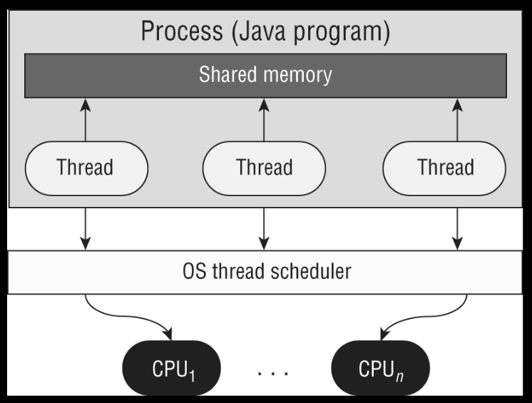
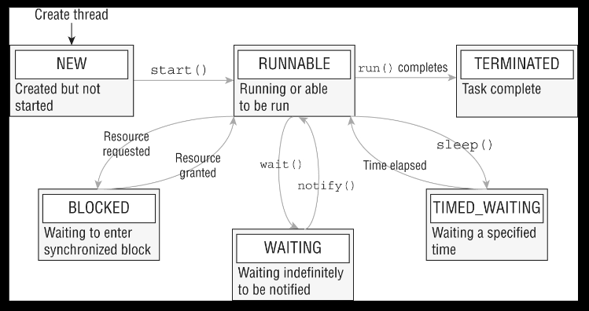

# Chapter 13: Concurrency

* Managing concurrent code execution
  - Create worker threads using `Runnable` and `Callable`, manage the thread lifecycle, 
      including automations provided by different `Executor` services and concurrent API
  - Develop thread-safe code, using different locking mechanisms and concurrent API
  - Process Java collection concurrently including the use of parallel stream.
* Working with Stream and Lambda expressions
  - Perform decomposition, concatenation, and reduction an grouping and partitioning 
      on sequential and parallel streams.

As we will see in Chapter 14, I/O, and Chapter 15, JDBC, computers are capable of 
reading and writing data to external resources. Unfortunately, as compared to CPU 
operations, these disk/network operation tend to be extremely slow. In fact, it is 
so slow that, if our computer's operating system were to stop and wait for every 
disk or network operation to finish, our computer would appear freeze constantly.

Luckily, all operation systems support what is known as _multithreaded processing_. 
The idea behind multithreaded processing is to allow an application or group of 
applications to execute multiple tasks at the same time. This allows tasks waiting 
for other resources to give way to other processing requests.

In this chapter, we will see the concept of threads and numerous way to manage 
threads using the Concurrency API. Threads and concurrency are challenging topics 
for many programmers to grasp, as problems with threads can be frustrating even 
for veteran developers. In practice, concurrency issues are among the most 
difficult problems to diagnose and resolve.


## Introducing Threads

We begin this chapter by reviewing common terminology associated with threads. A 
_thread_ is the smallest unit of execution that can be scheduled by the operation 
system. A _process__ is a group of associated threads that execute in the same 
shared environment. It follows, then, that a _single-threaded process_ is one that 
contains exactly on thread, whereas a _multithreaded process_ supports more than 
one thread.

By _shared environment_, we mean that the threads in the same process share the 
same memory space and can communicate directly with one another. Refer to Figure 13.1 
for an overview of thread and their shared environment within a process.

This figure shows a single process with three threads. It also shows how they are 
mapped to an arbitrary number of _n CPUs_ available within the system.



**Figure 13.1: Process model**

By _shared memory_ in Figure 13.1, we are generally referring to static variables 
as well as instance and local variables passed to a thread. Yes, we will finally see 
how static variables can be useful for performing complex, multithreaded tasks!. From 
Chapter %, Methods, we see that static methods and variables are defined on a single 
class object that all instances share. For example, if on thread updates the value of 
a static object, this information is immediately available for other threads within 
the process to read.


### Understanding Thread Concurrency

The property of executing multiple threads and process at the same time is referred 
to as _concurrency_. How does the system decide what to execute when there are more 
threads available than CPUs? Operating systems use a _thread schedule_ to determine 
which threads should be currently executing, as shown in Figure 13.1. For example, a 
thread schedules may employ a _round-robin scheduler_ in which each available thread 
receives an equal number of CPU cycles with which to execute, with threads visited 
in a circular order.

When a thread's alloted time is complete but the thread has not finished processing, 
a context switch occurs. A _context switch_ is the process of storing a thread's current 
state and later restoring the state of the thread to continue execution. Be aware that a 
cost is often associated with a context switch due to lost time and having to reload a 
thread's state. Intelligent thread schedulers do their best to minimize the number of 
context switches while keeping an application running smoothly.

Finally, a thread can interrupt or supersede another thread if it has a higher thread 
priority than the other thread. A _thread priority_ is a numeric value associated with 
a thread that is taken into consideration by the thread scheduler when determining 
which threads should currently be executing. In java, thread priorities are specified 
as integer values.


### Creating a Thread

One of the most common ways to define a task for a thread is by using the `Runnable` 
instance. `Runnable` is a functional interface that takes no arguments and returns no data.
```
@FunctionalInterface
public interface Runnable {
  void run();
}
```

With this, it's easy to create and start a thread. In fact, we can do so in one line of
code using the `Thread` class:
```
new Thread( () -> System.out.print("Hello") ).start();
System.out.println("Word");
```

The first line create a new `Thread` object and then starts it with the `start()` 
method. Does this code print "HelloWord" or "WordHello"? The answer is that we don't 
know. Depending on the thread priority/scheduler, either is possible. Remember that 
order of thread execution is no often guaranteed.

let's take a look at a more complex example:
```
Runnable printInventory = () -> System.out.println("Printing zoo inventory");
Runnable printRecords = () -> {
  for (int i = 0; i < 3; i++)
    System.out.println("Printing record: " + i)
};
```

Given these instances, what is the output of this block of code? 
```
1: main(String... args){
2:   System.out.println("begin");
3:   new Thread(printInventory).start();
4:   new Thread(printRecord).start();
5:   new Thread(printInventory).start();
6:   System.out.println("end")
7: }
```

The answer is that it is unknown until runtime. The following is just one possible output:
```
begin
Print record: 0
Printing zoo inventory 
end
Printing record: 1
Printing zoo inventory
Printing record: 2
```

This sample uses a total of four thread: the `main()` user thread and three addition 
thread created on lines 3, 4 and 5. Each thread created on these lines is executed as 
an asynchronous task. By _asynchronous_, we men that the thread executing the `main()` 
method does not wait for the results of each newly created thread before continuing. For 
example, lines 4 and 5 may be executed before the thread created on line 3 finishes. The 
opposite of this behavior is a _synchronous_ task in which the program waits (or blocks) 
on line 3 for the thread to finish executing before moving on the next line. The vast
majority of method call used in this book have been synchronous up until this chapter.

While the order of thread execution is indeterminate once the threads have been started, 
the order within a single thread is still linear. In particular, the `for() loop` is 
ordered. Also, "begin" always appears before "end" on the program above.

More generally, we can create a `Tread`and its associated task one of two ways in Java:
- Provide a `Runnable` object or lambda expression to the `Tread` constructor
- Create a class that extends `Thread` and overrides the `run()` method

Throughout this book, we prefer creating tasks with lambda expression. After all, 
it's a lot easier, especially when we get to the Concurrency API. Creating a class that 
extends `Tread` is relatively uncommon and should only be done under certain circumstances, 
such as if we need to overwrite other threads methods.

---
**Calling _run()_ Instead of _start()_**

Sometime we could see code that attempts to start a thread by calling `run()` instead 
of `start()`. Calling `run()` on a `Thread` or a `Runnable` _does not start a new thread_. 
While the following code snippets will compile, none will execute a task on a separate 
thread.
```
{
  System.out.println("begin");
  new Thread(printInventory).run();
  new Thread(printRecords).run();
  new Thread(printInventory).run();
  System.out.println("end");
}
```

Unlike the previous example, each line ot this code will wait until the `run()` method 
is complete before moving on the next line. Also unlike the previous program, the output 
for this code sample wil be the same every time it is executed.

---


### Distinguishing Thread Types

It might be a surprise that all Java applications, including all of the ones that we 
have presented in this book, are multithreaded because the include system threads. A 
_system thread_ is created by the JVM and runs in the background of the application. 
For example, garbage collection is managed by a system thread created by the JVM.

Alternatively, a _user defined thread_ is on created by the application developer to 
accomplish a specific task. The majority of the programs we've presented so far have 
contained only on user-defined thread, which calls the `main()` method. For simplicity, 
we commonly refer to programs that contain only a single user-defined thread as 
_single-threaded applications_.

System and user-defined threads can both be created as daemon threads. A _daemon thread_ 
is on that will no prevent the JVM from exiting when the program finishes. A Java application 
terminates when the only threads that are running are daemon threads. For example, if 
garbage collection is the only thread left running, the JVM will automatically shut down.

Let's take a look at an example. What this program outputs?
```
01: public class Zoo {
02:   public static void pause() {     // defines a thread task
03:     try {
04:       Thread.sleep(10_000);       // wait for 10 seconds
05:     } catch (InterruptedException e) {}
06:     System.out.println("Thread finished");
07:   }
08:   
09:   public static void main(String[] args) {
10:     var job = new Thread( () -> pause() );     // create tread
11:   
12:     job.start();      // start thread
13:     System.out.println("Main method finished");
14:   }
15: }
```

The program will output two statements roughly 10 seconds apart:
```
Main method finished!
--- 10 second wait ---
Thread finished!
```

That's right. Even though the `main()` method is done, the JVM will wait for the 
user thread to be done before ending the program. What if we change `job` to be a 
daemon thread by adding this to line 11?
```
11:     job.setDaemon(true);
```

The program will print the first statement and terminate without ever printing the 
second line.
```
Main method finished
```

We just need to remember that by default, user-defined threads are not daemons, and 
the program will wait for them to finish.


### Managing a Thread's Life Cycle

After a thread has been created, it is in one of six states, shown in Figure 13.2. 
We can query a thread's state by calling `getState()` on the thread object.



**Figure 13.2: Thread states**

Every thread is initialized with a `NEW` state. As soon as `start()` is called, 
the thread is moved to a `RUNNABLE` state. Does that mean it is actually running? Not 
exactly: it may be running, or it may no be. The `RUNNABLE` state just means the thread 
is able to be run. Once the work for the thread is completed or an uncaught exception 
is thrown, the thread state becomes `TERMINATED`, and no more work is performed.

While in a `RUNNABLE` state, the thread may transition to one of three states where it 
pauses its work: `BLOCKED`, `WAITING`, or `TIMED_WAITING`. This figure includes common 
transition between thread states, but there are other possibilities. For example, a 
thread that is interrupted by another thread will exit `TIMED_WAITING` and go straight 
back into `RUNNABLE`.

We cover some (but not all) of these transition in this chapter, Some thread-related 
methods -- such as `wait()`, `notify()`, and `join()` -- are beyond the scope of this 
book and are difficult to use. We should avoid them and use the Concurrency API as much 
as possible. It takes a large amount of skill (and some luck!) to use these methods.


### Polling with Sleep

Even though multithreaded programming allows us to execute multiple tasks at the 
same time, oe thread often needs to wait for the result of another thread to proceed. One 
solution is to use polling. _Polling_ is the the process of intermittently checking data 
at some fixed interval.

Let's say we have a thread that modifies a shared static counter value, and our `main()` 
thread is waiting for the thread to reach 1 million:
```
public class CheckResults {
  private static int counter = 0;
  public static void main(String[] args) {
    new Thread( () -> {
      for (int i = 0; i < 1_000_000; I++) counter++;
    }).start();
    while (counter < 1_000_000) {
      System.out.println("Not reached yet");
    }
    System.out.println("Reached: " + counter);
  }
}
```

How many times does this program print "Not reached yet"? The answer is, we don't 
know! It could output 0, 10, or a million times. Using a `while()` loop to check for 
data without some kind of delay is considered a bad coding practice as it ties up CPU 
resources for no reason.

We can improve this result by using the `Thread.sleep()` method to implement polling 
and sleep for 1000 milliseconds, aks 1 second:
```
public class CheckResultsWithSleep{
  private static int counter = 0;
  public static void main(String[] args) {
    new Thread( () -> {
      for (int i = 0; i < 1_000_000; i++) counter++;
    }).start();
    while (counter < 1_000_000) {
      System.out.println("Not reached yet");
      try {
        Thread.sleep(1_000);     // 1 second
      } catch (InterruptedExecution e) {
        System.out.println("Interrupted");
      }
    }
    System.out.println("Reached: " + counter);
  }
}
```

While one second may seem like a small amount, we have now freed the CPU to do other 
work instead of checking the counter variable infinitely within a loop. Notice that the 
`main()` tread alternated between `TIMED_WAITING` and `RUNNABLE` when `sleep()` is 
entered and exited, respectively.

How many times does the `while()` loop execute in this revised class? Still unknown! 
While polling does prevent the CPU from being overwhelmed with a potentially infinite 
loop, id does not guarantee when the loop will terminate. For example, the separate thread 
could be losing CPU time to a higher-priority process, result in multiple executions 
of the `while()` loop before it finishes.

Another issue to be concerned about is the shared `counter` variable. What if one thread 
is reading the `counter` variable while another thread is writing it? The thread reading 
the shared variable may end up with an invalid or unexpected value. We discuss these 
issues in detail in the upcoming section on writing thread-safe code.


### Interrupting a Thread

While our previous solution prevented the CPU from waiting endlessly on a `while()` loop, 
it did come at the cost of inserting one-second delays into our program. If the task takes 
2.1 seconds to run, the program will use full 3 seconds, wasting 0.9 seconds. 

One way to improve this program is to allow the thread to interrupt the `main()` thread 
when it's done:
```
public class CheckResultsWithSleepAndInterrupt {
  private static int counter = 0;
  public static void main(String[] args) {
    final var mainThread = Thread.currentTread();
    new Thread( () -> {
      for (int i = 0; i < 1_000_000; i++) counter++;
      mainThread.interrupt();     // new
    }).start();
    while (counter < 1_000_000) {
      System.out.println("Not reached yet");
      try {
        Thread.sleep(1_000);     // 1 second
      } catch (InterruptedExecution e) {
        System.out.println("Interrupted");
      }
    }
    System.out.println("Reached: " + counter);
  }
}
```

This improved version includes both `sleep()`, to avoid tying up the CPU, and 
`interrupt()`, so the thread's work ends without delaying the program. As before, 
our `main()` thread's state alternates between `TIMED_WAITING` and `RUNNABLE`. Calling 
`interrupt()`on a thread in the `TIMED_WAITING` or `WAITING` state causes the `main()` 
thread to become `RUNNABLE` again, triggering an `InterruptedException`. The thread may 
also move to a `BLOCKED` state if it needs to reacquire resources when it wakes up.

Calling `interrupt()` on a thread already in a `RUNNABLE` state doesn't change the 
state. In fact, it only changes the behavior if the thread is periodically checking 
the `Thread.isInterrupted()` value state.

[back to top](#chapter-13-concurrency)


## Creating Threads with the Concurrency API
